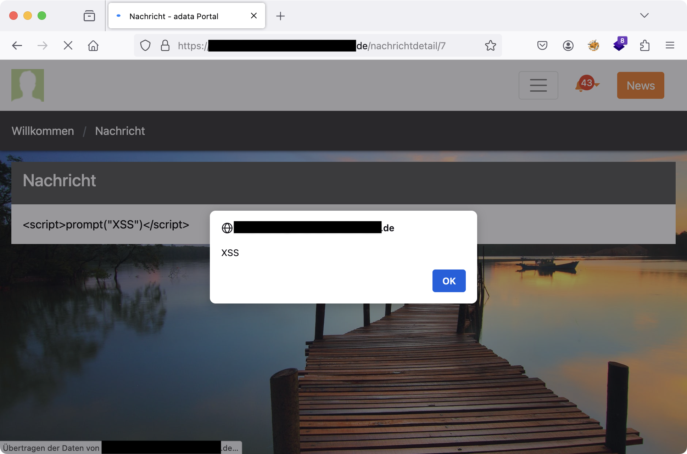

## Abstract

A stored cross site scripting vulnerability in the bulletin board component in adata's Employee Portal versions prior to 2.16.1 allows remote authenticated users to execute arbitrary JavaScript code in other authenticated user's web browsers.

## Attack Vector

A stored cross site scripting (XSS) vulnerability in adata's Employee Portal versions prior to 2.16.1 allows remote authenticated users with restricted privileges to execute arbitrary JavaScript code in the web browsers of other authenticated users when they access the details page of a maliciously crafted news post in the bulletin board. The bulletin board is accessible to all authenticated users and can be edited by those with the appropriate privileges.

The following endpoints are affected:

- `/SchwarzeBrett/Nachrichten/CreateNachricht`
- `/SchwarzeBrett/Nachrichten/EditNachricht/<id>`
- `/nachrichtdetail/<id>`

## Proof of Concept

1. Send a malicious request to one of the API endpoints `/SchwarzeBrett/Nachrichten/CreateNachricht` or `/SchwarzeBrett/Nachrichten/EditNachricht/<id>` with following payload for the `Inhalt` parameter:

  ```text
  POST /SchwarzeBrett/Nachrichten/EditNachricht/7 HTTP/2

  [...]

  ------WebKitFormBoundaryGYLTnlYkTdgm8qgI

  Content-Disposition: form-data; name="Inhalt"

  <script>alert("XSS")</script>
  ------WebKitFormBoundaryGYLTnlYkTdgm8qgI
  [...]
  ```

1. Any authenticated user viewing the message, by visiting the bulletin board message's details page (`/nachrichtdetail/<id>`), will be affected by the XSS vulnerability.



## Timeline

- 2025-08-07: The vulnerabilities have been identified and reported to adata Software GmbH under responsible disclosure.
- 2025-08-25: Vendor agreed to check the vulnerabilities and promised an update as soon as possible.
- 2025-09-29: Vendor informed us that an update (2.16.1) has been pushed, which adresses the findings.
- 2025-10-10: The vulnerabilities have been registered at MITRE.
- 2025-11-15: The disclosure embargo deadline has ended.
- 2025-11-28: A retest has confirmed the mitigation of the vulnerabilities.
- 2025-12-02: The vulnerability writeup has been published.
- 2025-12-09: CVE has been published by MITRE.
