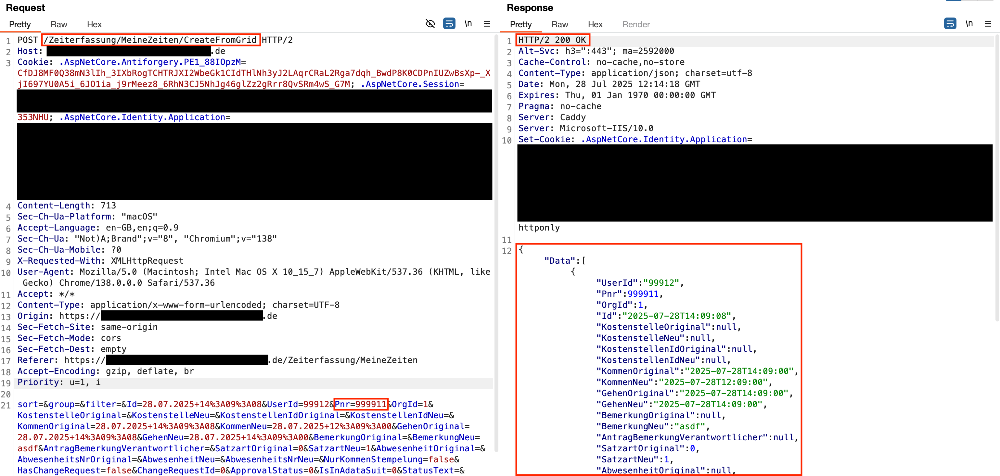
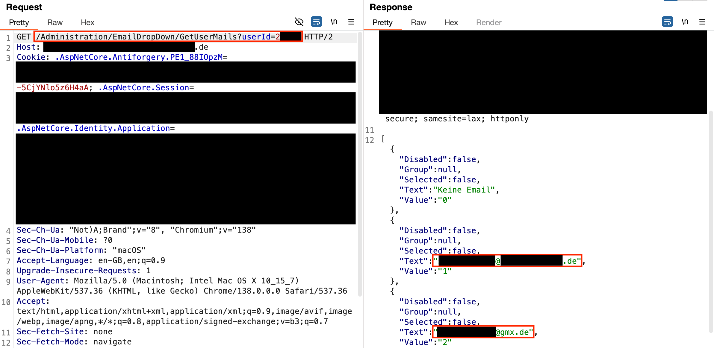
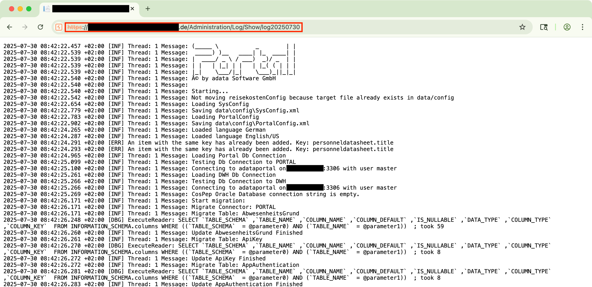

## Abstract

Incorrect Access Controls in multiple modules in adata's Employee Portal versions prior to 2.16.1 allow remote authenticated users to call API endpoints without proper authorization checks leading to access to confidential data including sensitive data of other employees and also allows the manipulation of workflows.

## Attack Vector

Multiple insecure direct object references in adata's Employee Portal versions prior to 2.16.1 allow remote authenticated users with restricted privileges to access sensitive employee data and manipulation of workflows. By modifying web request parameters, such as user ids, or directly interacting with web APIs, standard users can access files or workflows without proper authorization. Parameters such as user ids or dates are straightforward to guess and can easily be enumerated, making the exploitation of this vulnerability very easy.

These API requests enable users to perform unauthorized actions, such as approving or denying holiday approval requests, deleting user data, sending emails on behalf of other users, accessing arbitrary employee files, and retrieving administrative log files.

Affected components include, but are not limited to following API endpoints:

- /Zeiterfassung/MeineZeiten/CreateFromGrid
- /Abwesenheit/AbwesenheitManager/ApproveAbsenceFromCalendar
- /nachrichtdetail/id
- /Administration/Benutzer/BatchWelcomeMail
- /Administration/EmailDropDown/GetUserMails?userId=id
- /Mail/MailTextEditor/EditText?mailTypeName=TypeName
- /Mail/MailTextEditor/SaveText
- /Administration/Log/Show/logYYYYMMDD
- /SchwarzeBrett/UmfragenVerwaltung/GetPolls
- /SchwarzeBrett/UmfragenVerwaltung/UpdatePoll
- /SchwarzeBrett/UmfragenVerwaltung/DeletePoll
- /Abwesenheit/Sperrzeiten/AddOffTime
- /Abwesenheit/Sperrzeiten/UpdateOffTime
- /Abwesenheit/Sperrzeiten/DeleteOffTime
- /Abwesenheit/AbwesenheitenKonfigurieren/AbsenceReasonDropdownChanged
- /Administration/TravelExpenseConfig/SaveConfig
- /Administration/CovetoConfig/AddCovetoMapping
- /Administration/CovetoConfig/UpdateCovetoMapping
- /Administration/CovetoConfig/DeleteCovetoMapping

## Proof of Concepts

Since all affected APIs share the same underlying vulnerability and can be exploited using identical methods, we have opted not to provide individual write-ups for each impacted component. Instead, we present three proof-of-concept examples that demonstrate the various exploitation techniques for those issues.

### PoC 1: Employee time recording

**Affected component:** `/Zeiterfassung/MeineZeiten/CreateFromGrid`

Manipulating a request for creating an employee time record, e.g. by using an intercepting web proxy, allows an attacker to impersonate any registered user by modifying the Pnr parameter, which represents the user id.

The following screenshot shows the output of Burp Suite, an intercepting web proxy, after executing this attack. In this example, the employee id parameter `Pnr` was modified to correspond to the id of a manager. The server responded successfully, confirming that the request was accepted and the time record was created for the manager.

### PoC 2: Scraping of confidential data

**Affected component:** `/Administration/EmailDropDown/GetUserMails?userId=<userId>`

By directly interacting with the affected API endpoint, such as through cURL or an API testing tool, it is possible to bypass proper authorization checks and gain access to other employees' data.

The following screenshot shows the output of Burp Suite, an intercepting web proxy, capturing a web request for employee user data. In this example, the employee id (`userId`) in the GET request was deliberately altered. The corresponding response reveals confidential employee data, including the private email address of that employee.

### PoC 3: Access to admin log files

**Affected component:** `/Administration/Log/Show/log<date>`

By default, any authenticated user is permitted to access admin log files by requesting a logfile from the URL `/Administration/Log/Show/log<date>`, where date is provided in the format `YYYYMMDD`.

The following screenshot shows the response from a web request to the affected component, exposing administrative log files to any authenticated user. The log file rendered in the browser reveals sensitive server details, including database names, SQL queries, server paths, and file names.

## Timeline

- 2025-08-07: The vulnerabilities have been identified and reported to adata Software GmbH under responsible disclosure.
- 2025-08-25: Vendor agreed to check the vulnerabilities and promised an update as soon as possible.
- 2025-09-29: Vendor informed us that an update (2.16.1) has been pushed, which adresses the findings.
- 2025-10-10: The vulnerabilities have been registered at MITRE.
- 2025-11-15: The disclosure embargo deadline has ended.
- 2025-11-28: A retest has confirmed the mitigation of the vulnerabilities.
- 2025-12-02: The vulnerability writeup has been published.
- 2025-12-09: CVE has been published by MITRE.
