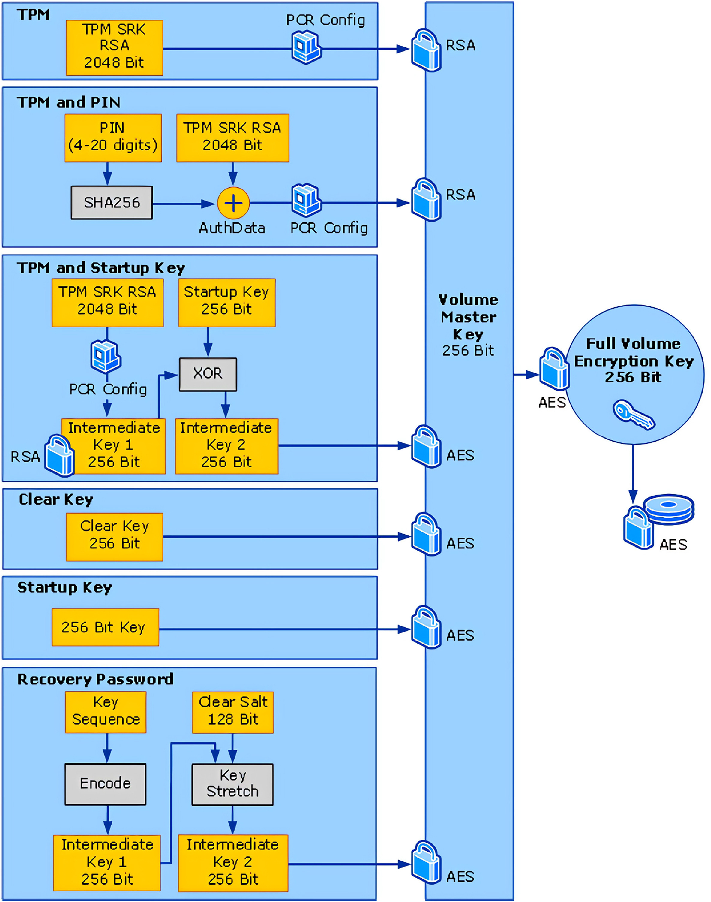
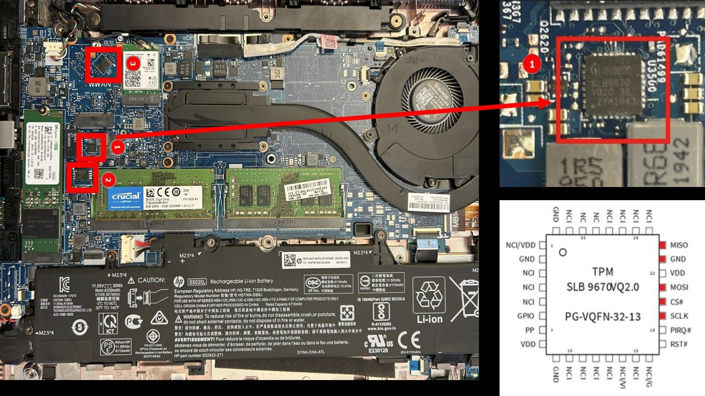
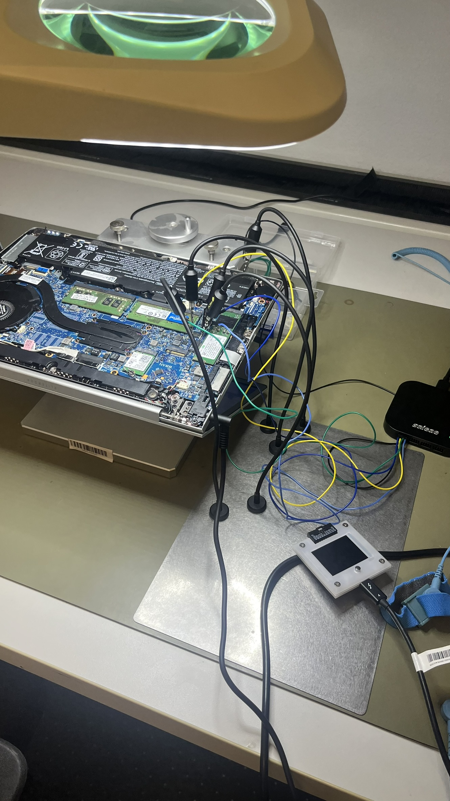
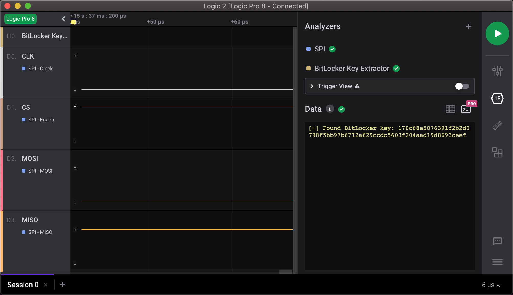

## Abstract

This article presents a hardware-based attack that exploits a vulnerability in the default configuration of Microsoft BitLocker.
The attack enables an adversary to extract the BitLocker master key directly from the **Trusted Platform Module** (TPM), allowing unauthorized access to encrypted drives with only brief physical access to the device.

## Background

BitLocker is Microsoft's full-volume encryption solution that provides at-rest protection for users' data. It supports multiple methods for unsealing the Volume Master Key (VMK), which is then used to decrypt the Full Volume Encryption Key (FVEK). The FVEK, in turn, is used to decrypt the volume itself.

By default, the BitLocker system volume is unlocked during the boot process by the computer's Trusted Platform Module (TPM). The TPM is a dedicated security coprocessor—typically a separate chip on the motherboard—whose primary functions are to (a) validate the integrity of the system and (b) securely store cryptographic secrets in a tamper-resistant manner.

While additional authentication options such as PINs or startup keys are available to enhance security, they are not enabled by default, likely due to concerns about system stability and user convenience.


> [Image Source](https://www.sciencedirect.com/science/article/pii/S266628172300015X)

## Attack Vector

Consider a typical, up-to-date Windows computer, freshly out-of-the-box with default settings, secure boot enabled, and BitLocker active.

By observing the communication between CPU and TPM during boot up, it is possible to extract the plain VMK without any prior knowledge of secret credentials.
Using the VMK an attacker could access and even modify the contents of the hard drive, and everything with nothing more than a screwdriver, a logic analyzer, and some cables.

---

## Proof of Concept

### 1. Preparation

To get started, we first need to identify the type of TPM chip, the exact communication protocol it is using and which physical pins.
By opening the device up and googling the printing on the chips, we can quickly find and identify the TPM.



In this case, its Infineon's *SLB 9670* using the [SPI](https://en.wikipedia.org/wiki/Serial_Peripheral_Interface) protocol marked as (1) in the image above.
We can also identify chips (2) and (3), which are both attached to the same SPI bus, which will come in handy later.

### 2. Operating the Target

To monitor and analyze the communication between the TPM chip and the CPU, we need to probe the SPI-specific lines:

- *SCLK* (Clock)
- *MISO* (Master In, Slave Out)
- *MOSI* (Master Out, Slave In)
- *CS* (Chip Select)
- *GND* (Ground Reference)

For this task, we used a [PCBite kit](https://sensepeek.com/pcbite-20) with a [Saleae](https://saleae.com/logic) logic analyzer.
Depending on your setup, you could get away with using a more basic logic analyzer (>=4 channels) and a hand full of simple IC clamps or even a SOP8 test clamp.

The sample rate of your logic analyzer must be at least twice as high as the highest frequency you intend to sample.
In this case, the TPM uses a SCLK of up to 43MHz so we need to sample at least 100 MSamples/s to be safe.



This specific TPM chip uses a **QFN32** socket, making the pads we need to probe way to tiny to reliably reach with our test probes.
Lucky for us, SPI uses shared data lines between all participants. This allows us to connect to the much bigger **SOP8** pads of the BIOS flash chip (2), while receiving the same signals.

The only required signal we that is missing from the BIOS chip is Chip-Select, as each chip uses its dedicated *CS* signal.
We solved this issue by repurposing the *CS* signal of the BIOS chip and inverting it in software.
This solution seems a bit hacky, but nevertheless proved effective, at least in our case.
For a cleaner setup you could try to probe the real *CS* pin of the TPM directly.

### 3. Retrieving the Key

Not we should be ready to give the extraction a try:

1. Configure a [SPI protocol analyzer](https://support.saleae.com/product/user-guide/protocol-analyzers/analyzer-user-guides/using-spi)
    - This is allows your logic analyzer to read the raw bytes transmitted via the SPI bus.
2. Install the [Bitlocker SPI Toolkit](https://github.com/ReversecLabs/bitlocker-spi-toolkit) extension
    - This extensions converts the raw SPI data packets into [TIS](https://trustedcomputinggroup.org/wp-content/uploads/TCG_PCClientTPMInterfaceSpecification_TIS__1-3_27_03212013.pdf)-compliant TPM commands, including the revealing of the VMK.
3. Fire up the capture of your logic analyzer
4. Start up the computer and wait until windows is booted into the login screen.



If you have set up everything correctly, the extension should spit out the Volume Master Key.

### 4. Unlocking the Disk

Now that we've obtained the VMK, its only a matter of using a tool like [Dislocker](https://github.com/Aorimn/dislocker) to decrypt the disk.

> You can try to boot into a live Linux right on the target machine, or remove the disk and attach it to a separate Linux machine.

```bash
mkdir -p /mnt/bitlocked /mnt/bitunlocked

# use your VMK instead
echo "6347786c59584e6c4947786c59585a6c4947316c494746736232356c49513d3d" > VMK.txt

# we need the VMK in binary format
sed -e 's/0/0000/g;s/1/0001/g;s/2/0010/g;s/3/0011/g;s/4/0100/g;s/5/0101/g;s/6/0110/g;s/7/0111/g;s/8/1000/g;s/9/1001/g;s/A/1010/g;s/B/1011/g;s/C/1100/g;s/D/1101/g;s/E/1110/g;s/F/1111/g' VMK.txt | xxd -r -p > VMK.bin

# unlock disk with VMK
# replace sda3 with your bitlocker partition
sudo dislocker /dev/sda3 --vmk ./VMK.bin -- /mnt/dislocker

# mount "unlocked" disk
sudo mount -o loop /mnt/dislocker/dislocker-file /mnt/bitunlocked

ls /mnt/bitunlocked
*stonks*
```

---

## Mitigations

### Additional PBA

If the device can boot without user input, the unlock key must per necessity be unsealed from the TPM.
This is a documented flaw - or rather trade-off between security and usability.

Microsoft recommends to configure some additional form of [preboot authentication](https://learn.microsoft.com/en-us/windows/security/operating-system-security/data-protection/bitlocker/countermeasures#protection-before-startup), like a pin or startupkey, before unsealing the key from the TPM.
This countermeasure would entirely eliminate the possibility of extracting the key without knowledge of these secrets.

### Tamper Protection

Some business laptops include a tamper protection feature that prompts for bios or bitlocker password on the next reboot.
Lenovo's [Bottom Cover Tamper Detection](https://docs.lenovocdrt.com/ref/bios/settings/thinkpad/internaldeviceaccess/) or HP's [TamperLock](https://h10032.www1.hp.com/ctg/Manual/c07055601.pdf) both use physical switches to detect if the case is opened.
The Laptop should prompt for additional authentication during the next boot, preventing the unattended revealing of the VMK on modified hardware.
