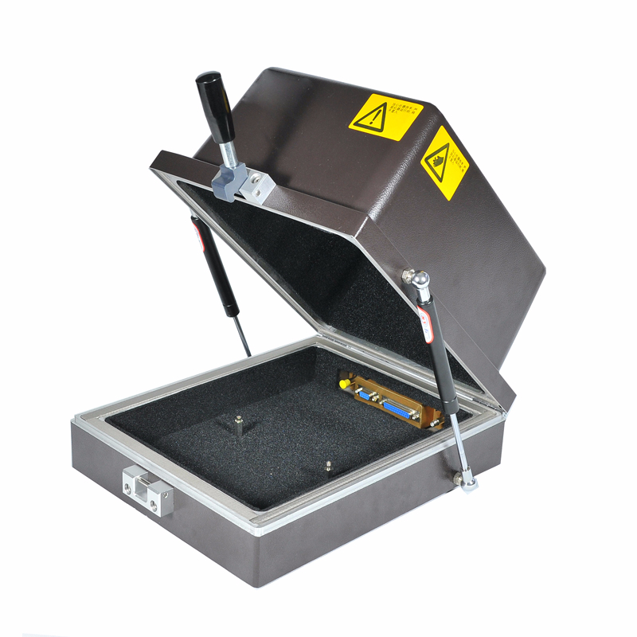
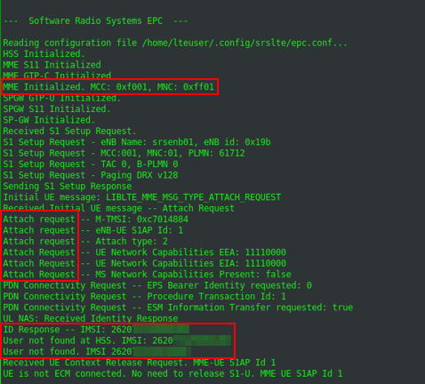

# Building a Cellular Man-in-the-Middle Setup for 4G


With the ongoing rise of the Internet of Things (IoT) and current 4G/5G
technologies, testing connected devices and mobile communcation in terms
of security is more important than ever before. Approriate testing
enviromnents are required in order to examine devices that transmit data
over cellular networks.

With this 4G test setup, it is possible to redirect the internet
traffic, normally sent over the mobile network, through a dedicated test
network. This enables testers to intercept, redirect and modify the
traffic with tools like `mitmproxy` or `mitm_relay`.

In this article, a suitable way to build a MitM setup for 4G devices
will be described. Furthermore, some test cases as well as technical
limitations will be covered.

At the time of writing this article, no open source software that could
be used to set up a fully functional 5G testing network is available.
However, there are some 4G software suites which implement more and more
5G features over time. So this article focuses mainly on 4G only, but
there is a chance that the shown software suite will eventually support
5G, too.

## The Requirements

In order to build a 4G test setup, the following operating system, soft-
and hardware tools are required:

### Operating System

- Ubuntu – 16.04 LTS, 18.04 LTS or 20.04 LTS
- Arch Linux
- openSuse
- other Debian-based distributions

### Software

- [Wireshark](https://www.wireshark.org/) network analyzer
- [mitmproxy](https://mitmproxy.org/) intercepting proxy
- [mitm_relay](https://github.com/jrmdev/mitm_relay) intercepting relay
- [pysim](https://github.com/osmocom/pysim) for programming SIM cards

### Hardware

- RF-shielding box **(VERY IMPORTANT TO COMPLY WITH LEGAL
  REGULATIONS!)**
- Software-Defined Radio (SDR)
  - Ettus B200 or B210
  - BladeRF (using the BladeRF 2.0 Micro xA4)
  - LimeSDR
- 2 Antenna cables
- two antennas
- programmable SIM cards (using the sysmoISIM-SJA2 from
  [Sysmocom](https://shop.sysmocom.de/sysmoISIM-SJA2-SIM-USIM-ISIM-Card-10-pack-with-ADM-keys/sysmoISIM-SJA2-10p-adm))
- a smart card writer
- [SIM breakout board](https://www.sparkfun.com/products/573)

## The Basics

### The 4G Infrastructure

This is only a rough overview of the LTE infrastructure. A more detailed
explanation can be found
[here](https://www.rfwireless-world.com/Tutorials/LTE-network-architecture.html)
and
[here](https://www.rohde-schwarz.com/au/technologies/cellular/lte/lte-technology/lte_information_52292.html?change_c=true).


4G LTE Infrastructure – Source: https://www.researchgate.net/

#### User Equipment – UE

The UE is the device which connects to the mobile network. In most
cases, it is a mobile device, like a smart phone, but it could also be
an IoT device as well. Inside the UE, there is a Universal Integrated
Circuit Card, in short UICC, also known as (U)SIM. This smartcard
enables the UE to establish a connection to the LTE network and is
essential for successful communication.

#### Evolved universal Terrestrial radio access network – e-utran

The E-UTRAN is mainly responsible for the radio communication. It only
has one element, the evolved Node Base Station, or eNB in short.

#### The Evolved Packet Core – EPC

The EPC is the core network and heart of the LTE technology. Within the
EPC, the UEs are authenticated, the communication will be established
and the data traffic is redirected to other multimedia networks, like
the Internet. The EPC consists of many different elements:

- MME – Mobility Management Entity: ensures that the connection to the
  network is kept alive when changing from one radio cell to another
- HSS – Home Subscriber Server: database with all IMSIs and their keys,
  which are required to identify SIM cards and establish encrypted
  connections
- P-GW – Packet Data Network Gateway: connects the EPC to networks such
  as the Internet

#### The SIM Card and its Identity

The IMSI is a unique identification number that every SIM card has. It
identifies the UE within the LTE network and has a maximum length of 15
digits. The first few digits of every IMSI represent the MCC and the
MNC. The MCC is the Mobile Country Code and identifies the country, the
mobile network operator resides in. The MNC (Mobile Network Code)
identifies the mobile network operator. For example, the German mobile
network operator Telekom has the following MCC and MNC: `262` `01`,
where `262` means Germany and `01` means Telekom. A list of all global
MCCs and MNCs can be found [here](https://cellidfinder.com/mcc-mnc).

## The Test Setup

The core of the test setup is the
[srsRAN](https://docs.srsran.com/en/latest/index.html) suite from
[Software Radio Systems](https://www.srs.io/).

*Featuring both UE and eNodeB/gNodeB applications, srsRAN can be used
with third-party core network solutions to build complete end-to-end
mobile wireless networks. For more information, see
[www.srsran.com](https://www.srsran.com).*

Currently, the srsRAN suite includes the following parts:

- **srsUE**
  - a full-stack 4G UE application
  - it also implements a 5G Standalone and Non-Standalone UE
    - not needed in this setup
- **srsENB**
  - a full stack 4G eNodeB
  - it also implements 5G Standalone and Non-Standalone gNodeB
    capabilities
- **srsEPC**
  - a light-weight 4G EPC implementation with MME, HSS and S-/P-GW

The **srsRAN** suite can be installed either from source or by using the
third-party repository provided by Software Radio Systems. This depends
on the used operating system as well as the used SDR hardware.  
For more information and detailed installation instructions, please
check out the official
[documentation](https://docs.srsran.com/en/latest/index.html).

After **srsRAN** is successfully installed, everything is ready to go.
Please note that the other resources mentioned above are considered as
already installed.

## Running The 4G Network

**Warning: Before executing any of the following commands**, **please
note that the used frequencies for mobile communication are licensed. In
other words, it is illegal to transmit on these frequencies without
proper permission! And trust me, you don’t have that…**  
**In order to stay on the right side of the law, all of the upcoming
actions have to be performed with the SDR inside an *RF-shielding
box*.**



Shiedling Box – Source:
http://www.szcitech.com/en/html/Manual-shielding-box/32.html

### Configure the Network

**srsRAN** comes with some default configuration files. We will take a
closer look at them in a minute, but for now we have all we need. As a
test client, we use a standard smartphone with a swappable SIM card. The
phone must be put inside the RF-shielding box.

First, we run the **srsEPC** from the terminal. This is the 4G core
network with components like the MME, the HSS and the gateways P-GW and
S-GW. You can learn more about the basic 4G architecture
[here](https://www.tutorialspoint.com/lte/lte_network_architecture.htm).

``` brush:
$ sudo srsepc
```

After the **srsEPC** started successfully, we launch the **srsENB**, the
4G base station, which is responsible for radio communication, in
another terminal.

``` brush:
$ sudo srsenb
```

If **srsEPC** and **srsENB** are both running successfully, the mobile
network is available inside the shielding box. Whether or not the mobile
device tries to connect to the test network depends on the used SIM
card. The default configuration of srsENB and srsEPC sets the MCC to
`001` and the MNC to `01`, which are the IDs for a test network.
However, within the two configuration files *enb.conf* and *epc.conf*,
the values can be changed to `mcc=262` and `mnc=01`,which are the IDs
for a German Telekom network.

If the UE recognizes the mobile network, it will try to connect to it.
This can be seen in the output of the terminals where srsEPC and srsENB
are running. However the attach request will fail because of an “User
not found in HSS” error. This behavior is expected. Unlike the 2G
standard, 4G requires mutual authentication, meaning that the UE and the
EPC must authenticate each other. Because of this, a malicious base
station cannot easily be used in 4G, as it was possible in 2G.



The attach request is rejected by the EPC, because of an unknown IMSI.

### Programming the SIM Cards

In order to get a valid communication between the UE and the 4G test
network, the SIM card must be known to the 4G network. This means, the
HSS must have an entry of the SIM cards IMSI, together with different
keys for the traffic encryption. The bad news are, it is nearly
impossible to get these values from an ordinary SIM card, for security
reasons.  
The good news are, it is not essential for this setup, because of the
programmable SIM cards. I recommend the **sysmoISIM-SJA2** cards from
Sysmocom. I also tried some so called Green Cards from China, but
without any success.  
When ordering the sysmoISIM-SJA2 cards, you’ll also get a file with all
the values you need. This includes, among other, the IMSIs and the
private keys. There is also the ADM PIN, which is required to program
the SIM card, the ICCID, another id of the SIM card and the OPc value.
The OPc value is an already encrypted value, used as key for transport
encryption.

At this point it would be enough to just enter the values, Sysmocom
delivered into the *user_db.csv* file, as shown below:

``` brush:
# name,
# auth algorithm (xor|mil)
# imsi
# key
# opc tpe (op|opc)
# op/opc
# amf  
# sqn
# qci
# ip address, either a static IP or the value dynamic to get the IP from DHCP
ue1,xor,001010123456789,00112233445566778899aabbccddeeff,opc,63bfa50ee6523365ff14c1f45f88737d,9001,000000001234,7,dynamic
```

In some scenarios, the UE is not a smart phone but an IoT device. It
might be possible that the device uses a specific SIM card and checks
the used IMSI. In this case, it is necessary to program the SIM card to
the specific IMSI. This can be done with the suite *pysim*.  
Let’s assume the IMSI must be set to the value 26201987654321. The card
can be reprogrammed like this:

``` brush:
$ ./pySim-prog.py -p 0 -t sysmoUSIM-SJS2 -a 58001006  -x 262 -y 01 -i 26201987654321 -s <ICCID> -o 63bfa50ee6523365ff14c1f45f88737d -k 00112233445566778899aabbccddeeff
```

Please note, if programming the SIM without the -o and -k values, pysim
set random values for them. You may want to keep track of the current
key and OPc values of you SIM card in order to avoid future problems
;-).

Now the self programmed SIM card must be inserted into the UE.

It is also possible to change the MCC and MNC of the LTE network.
Through this, the setup mocks a real mobile network. As mentioned above,
the combination `262 01` represents the German telecommunication
provider Telekom. In order to change the configuration of the testsetup,
the two configuration files *enb.conf* and *epc.conf* must be edited.
Please note, when changing the MCC and MNC, both configurations need to
be identical. A `MNC=262` inside the *enb.conf* and a `MNC =001` inside
the *epc.conf* won’t work.

### Reaching the Internet

After the IMSI and the corresponding keys are set within the HSS of the
test network, the UE is able to start a successful attach request and
build up a connection to the 4G test network.  
At this point the UE is still not able to connect to the Internet over
the mobile network. In order to achieve this, two configurations are
required. First, IP masquerading must be set on the notebook, where the
4G test setup is running on. The easiest way to do this, is by using the
script `srsepc_if_masq`. See
[here](https://docs.srsran.com/en/latest/usermanuals/source/srsepc/source/2_epc_getstarted.html#observing-results)
for more information.  
Second, an access point must be set within UE. The procedure is highly
depends on the UE you are working with. On an Android/iOS smart phone
this setting can be found in the network settings. Other devices might
be configurable via AT commands or a proprietary interface. An example
for Android is shown below. An IoT device has it’s pre-configured APN,
which might not be changeable. The name of the devices APN can be found
inside the `/tmp/epc.pcap` file.  
In this case, the APN of the test network can be set in the *epc.conf*
file: `apn = myapn`.

### Getting a Connection with(out) eSIM’s

When it comes to IoT devices connecting to their corporate back-end over
4G, it is often the case, they use an electronic SIM card, or eSIM in
short.  
If that’s the case, the eSIM must be de-soldered and replaced by a SIM
breakout board, so the self programmed SIM card can be used.

The eSIM pinout is standardized in the [TSI 102
221](https://www.etsi.org/deliver/etsi_TS/102600_102699/102671/11.00.00_60/ts_102671v110000p.pdf)
and is therefor “easy” to de-solder as soon as it’s located. An eSIM has
8 pins, but only 5 of them are of interest.

| Description Left | Pin Left | Pin Right | Description Right |
|------------------|----------|-----------|-------------------|
| **GND**          | 1        | 8         | **VCC**           |
| No Connection    | 2        | 7         | **RESET**         |
| **I/O**          | 3        | 6         | **CLK**           |
| No Connection    | 4        | 5         | No Connection     |

Pinout of an eSIM chip

The SIM breakout board has also 8 pins and again, the following 5 pins
are required and needs to be soldered on the PCB, the eSIM was soldered:

| Pin Breakout Board | Pin PCB   |
|--------------------|-----------|
| VCC                | 8 – VCC   |
| RST                | 7 – RESET |
| CLK                | 6 – CLK   |
| I/O                | 3 – I/O   |
| GND                | 1 – GND   |

Connection of eSIM slot and the breakout board

Once the breakout board is soldered on the IoT devices PCB, the self
programmed SIM card can be used.


SIM Breakout Borad – Source:
https://m.media-amazon.com/images/I/61vW3Um7yKL.*AC_SX679*.jpg

## Accessing Data

Once the enb and the epc are running, the network interface
`srs_spgw_sgi` is created. Now it is possible to listen to this
interface with tools like *Wireshark* to eavesdrop the data traffic the
UE is sending and receiving.  
With the tool *mitm_relay* it is also possible to relay the traffic over
a local web server and intercept it with proxies like *ZAP*, *Burp* or
*mitmproxy*.  
As long as there is no end to end encryption, the eavesdropped data is
in plain text.

## Limitations

There are some limitations to this setup, which should also be mentioned
here.

### We don’t hack LTE, we use it

One of the major misconception about this setup might be its purpose.
Hacking a 4G LTE device or even an infrastructure, would mean to exploit
existing vulnerabilities or misconfigurations of the LTE infrastructure,
its network stack or basic functionalities. There are known attacks
against the LTE technology, but non of them come to action in this
setup.  
This setup is only to gain access to the data transferred from the UE to
the back-end and vice versa. A possible scenario could be an IoT device,
communicating with a back-end API by using LTE. With this setup, it is
possible to actually intercept and even modify the data, as long as it
is not end to end encrypted.

### There are different types of LTE

This setup only applies to 4G, meaning LTE Advanced, also known as LTE-A
or LTE+. There are some derivations of LTE, to better suit the
requirements for an IoT infrastructure. Those are Narrowband IoT, Nb-IoT
and LTE for Machines, LTE-M. Those two technologies are not compatible
with this setup, because of their variational use of the LTE stack.

### The SIM card is essential

Back in the days of 2G. It was possible to setup a rouge 2G basestation,
and get a working connection with the victims UE just by sending the
right signals at the right time. The reason this works so easily was the
fact that the 2G basestation does not need to authenticate itself to the
UE. With the development of 3G, this behavior changed. Since then, both
communication partners need to authenticate to each other.  
This makes it impossible to simply build up a rouge basestation, or
stingray and intercept the mobile traffic if the victim.

