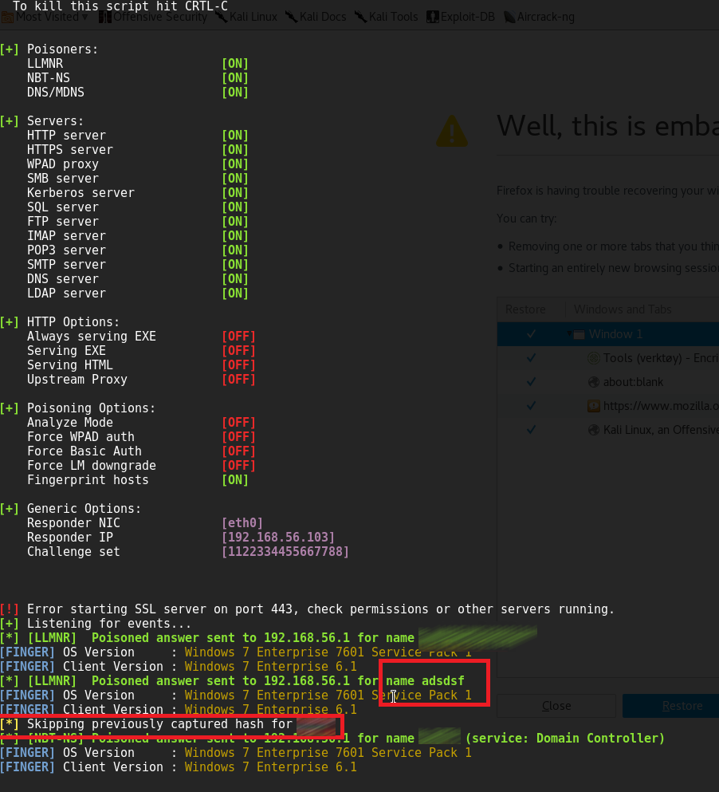
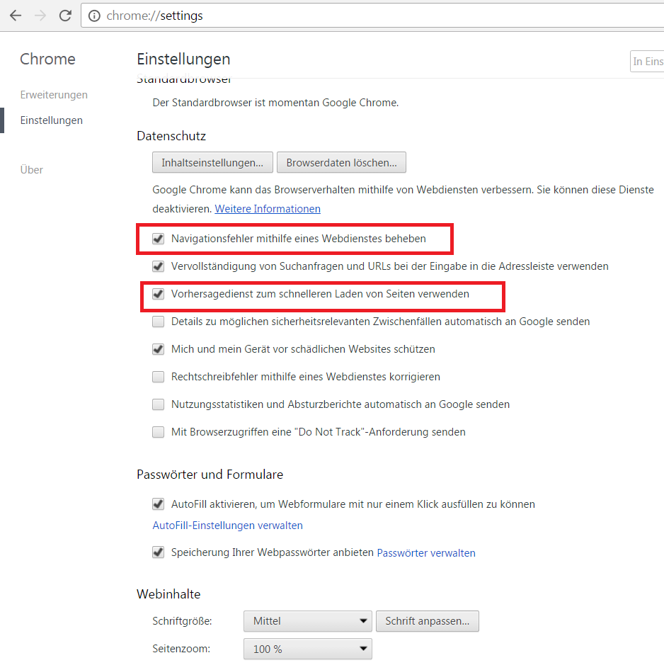

# Chrome Information Leakage – Prediction Service & Preload

Last year in February, I found a vulnerability at google chrome and
submitted it[(Bug
Report)](https://bugs.chromium.org/p/chromium/issues/detail?id=693991).
So far nothing has happened and now the vulnerability  has been
published on twitter:
<https://twitter.com/zerosum0x0/status/958890437837692928>

In some cases a default Chrome installation makes an unintended LLMNR
broadcast in the internal network. An internal attacker can use this
behavior to steal windows credentials. Google Chrome helps to resolve
navigation errors and offers a service to load pages more quickly. Per
default these two options are active after an installation. If an user
types a word in the chrome address bar, sometimes Chrome asks to resolve
this word as a hostname, e.g.: [http://SEARCHWORD/](http://searchword/).
Without user interaction Chrome tries to resolve this hostname. If the
DNS server has no match, an LLMNR broadcast will be sent out over the
internal network. Most of these mistyped words are not a valid hostname.
An attacker in the internal network can use this misbehavior from Chrome
to steal valid windows credentials (username and hash). A famous tool to
make a poisoned answer to the victim is the software *Responder*.

**
**

**VERSION  **

- Chrome Version:  56.0.2924.87 (64-bit) + stable
- Operating System: Windows 7 Enterprise 7601 Service Pack 1

SETTINGS

Attacker Machine:

- IP-Address: 192.168.56.103
- Software: <https://github.com/SpiderLabs/Responder>
- Command to start
- Responder: python Responder.py -I eth0 -wrf
- Operating System: Kali 2016.2

Victim Machine:

- IP-Address: 192.168.56.1
- Chrome Version:  56.0.2924.87 (64-bit) + stable
- Operating System: Windows 7 Enterprise 7601 Service Pack 1

