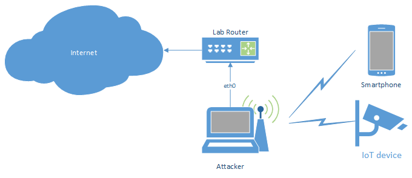
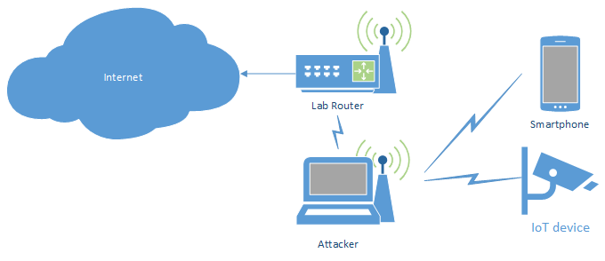
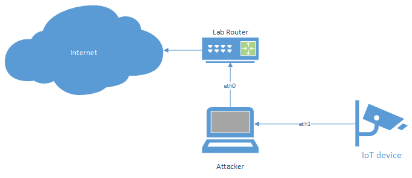
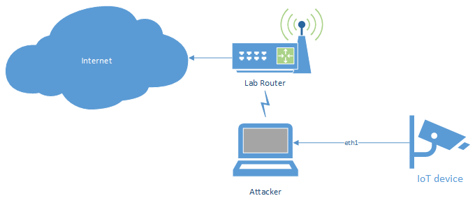
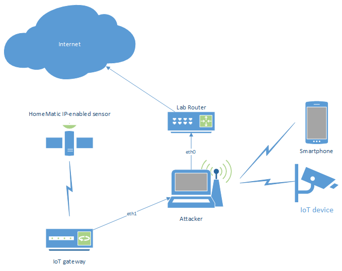
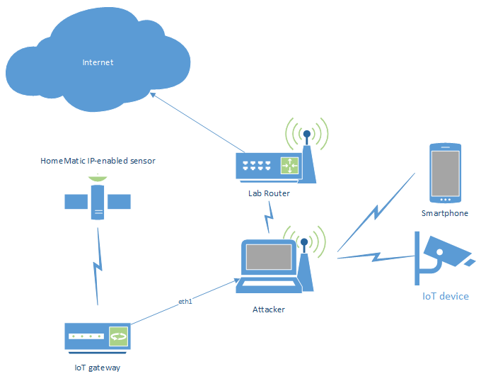

# Creating evil WiFi hotspots, network bridges and complex hybrids

Intercepting traffic between devices and the internet is part of the day
to day work of an IoT pentester. More often than not, those devices only
support one type of connectivity, and it’s usually the one you don’t
have at hand, at that moment (well, at least sort of 😉 ). So, this
guide will show code snippets for creating (evil) access points and
network bridges (under Linux) for:

- providing a rogue WiFi network to devices that support wireless
  connections
- connect a wired device to a wireless network
- bridge wireless and wired devices, while also being the central
  communication node that connects both to the internet

Since the “attacker machine” is always the central communication point,
it is always possible to intercept and/or redirect, and potentially
modify selected traffic (e.g. through Burp
Suite, `mitm-proxy` or `mitm_relay.py`).

## Starting point

Throughout this article, several configuration files will be used over
and over again, so they are shown and explained, once, at the beginning.
Some scenarios will require you to create a `wpa_supplicant` client
configuration file in order to provide an internet upstream through a
WiFi network. The scripts later down the article will require a few
tools that are not always installed on the system:

- net-tools
- bridge-utils
- hostapd
- dnsmasq

Usually, those can be easily installed from the Linux distribution’s
software repository (e. g. via `apt`, `yum`, `yast`, etc.).

Yes, I know `ifconfig`, `route` and `brctl` are deprecated and shouldn’t
be used anymore. But I’m way too old to get used to using the “almighty”
`ip` tool ;P

### hostapd.conf (2.4 GHz network, only)

The tool `hostapd` is used for creating a wireless access point. Since
operating a 5 GHz WiFi network comes with a lot restrictions and extra
things to do (at least in some countries), we will concentrate on 2.4
GHz radio frequencies, only. For all setups, the following configuration
will be used:

``` brush:
# Interface - Probably wlan0 (will be adjusted by the according scripts automatically, though)
interface=wlan0
driver=nl80211
wmm_enabled=1
 
# Enable 802.11n, if supported by interface (Otherwise, hostapd will simply abort with an according error message. In that case, comment out the following line.)
ieee80211n=1
 
# The WiFi name
ssid=Testing
# The channel to use
channel=1
# Hardware mode is set to 802.11g but will also provide 802.11n, if enabled above
hw_mode=g
 
# Enforce WPA2 with CCMP
wpa=2
rsn_pairwise=CCMP
wpa_pairwise=CCMP
# WPA2 password
wpa_passphrase=Test1337
 
# Explicitly disable 802.1x Options
ieee8021x=0
```

As mentioned in the comment above, the `interface` variable will be
automatically adjusted by the according scripts. So, there is no need
for doing that manually, each time another interface should be used.

### dnsmasq.conf

The tool `dnsmasq` provides a DNS, as well as a DHCP server. Thus, both
services can be easily configured in a single file and provided to the
future client network. Additionally, we can poison DNS by returning
malicious IP addresses for DNS requests coming from clients.

``` brush:
# Log file path
log_facility=/var/log/dnsmasq.log
# DHCP address range for leases
dhcp-range=172.16.254.100,172.16.254.154,1h
# Default gateway, pushed by DHCP
dhcp-option=3,172.16.254.1
# DNS server, pushed by DHCP
dhcp-option=6,172.16.254.1
dhcp-authoritative
# Log DNS queries
log-queries
 
# For redirecting requests to the local system, custom DNS entries can be added, similar to the following
#address=/google.com/172.16.254.1
# For redirecting ALL requests to the local system, set a wildcard for the domain name
#address=/#/172.16.254.1
```

Should you feel the need to use a different IP subnet, make sure to
adjust all settings and also the according scripts.

### wpa_supplicant.conf

In order to connect to a wireless network (e. g. when using a wireless
connection for the internet uplink), an according client configuration
for `wpa_supplicant` has to be created. For this purpose, the
`wpa_passphrase` tool can be used:

``` brush:
wpa_passphrase lab_wifi | tee wpa_supplicant.conf
# reading passphrase from stdin
SecretWifiPassword123!
 
network={
        ssid="lab_wifi"
        #psk="SecretWifiPassword123!"
        psk=29bb3a808e36f8da3ac6b096467320aa5ccbea527785098754177f7e4fe388d6
}
```

The first parameter to the `wpa_passphrase` command is the name of the
WiFi network. The WiFi password can either be supplied as a second
parameter or, when omitted, via standard input (which is usually the
preferred method, in order to not expose the password to any history
files 😉 )

## WiFi access points

We will start with creating wireless access points which can then be
used by smartphones and other (smart) wireless devices. The attacker
machine will route the wireless client’s network traffic to the internet
uplink. For redirecting traffic, `iptables` rules can be used (refer to
the comment inside the scripts for instructions)

### WiFi access point with wired upstream

The simplest setup will provide a wireless access point and route all
traffic to the wired upstream connection (with the option to redirect
selected traffic through, e. g. an intercepting proxy).



``` brush:
#!/bin/bash
 
# The "internet interface"
upstream=eth0
# The access point interface
phy=wlan0
# Access point configuration
conf=hostapd-wpa2.conf
hostapd=/usr/sbin/hostapd
 
# Kill network manager and unblock WiFi connection
service NetworkManager stop
rfkill unblock wlan
 
ifconfig $phy up
 
# Bring up access point
sed -i "s/^interface=.*$/interface=$phy/" $conf
$hostapd $conf&
sleep 5
ifconfig $phy 172.16.254.1 netmask 255.255.255.0
# sometimes, the network route isn't added properly, so check if it exists
netstat -rn | grep '172.16.254.0' > /dev/null || route add -net 172.16.254.0 netmask 255.255.255.0 gw 172.16.254.1
 
# Bring up DHCP and DNS server
dnsmasq -z -C ./dnsmasq.conf -i $phy -I lo
 
# Enable routing
echo '1' > /proc/sys/net/ipv4/ip_forward
iptables --policy INPUT ACCEPT
iptables --policy FORWARD ACCEPT
iptables --policy OUTPUT ACCEPT
iptables -F
iptables -t nat -F
iptables -t nat -A POSTROUTING -o $upstream -j MASQUERADE
iptables -A FORWARD -i $phy -o $upstream -j ACCEPT
 
# Redirect all HTTPS traffic from 172.16.254.100 to Burp on port 8080 (remove "-s 172.16.254.100" to redirect all HTTPS traffic)
#iptables -t nat -A PREROUTING -p tcp -s 172.16.254.100 --dport 443 -j REDIRECT --to-port 8080
 
echo "Hit enter to kill me"
read
 
# Kill DHCP and DNS server
pkill dnsmasq
# Kill access point
pkill `basename $hostapd`
echo '0' > /proc/sys/net/ipv4/ip_forward
iptables -t nat -F
 
# Start network manager, again
service NetworkManager start
```

The `upstream` and `phy` variables need to be set with the appropriate
interface names.

### WiFi access point with wireless upstream

This setup is similar to the above one, but uses a wireless upstream
connection and thus requires some additional setup work: the wireless
connection needs to be established by the script, since all scripts
temporarily stop the network manager service (and thus potentially
disconnect the existing WiFi connection to the internet router).



``` brush:
#!/bin/bash
 
# The "internet interface"
upstream=wlan0
# The access point interface
phy=wlan1
# WiFi client configuration
client_conf=wpa_supplicant.conf
# Access point configuration
conf=hostapd-wpa2.conf
hostapd=/usr/sbin/hostapd
 
# Kill network manager and unblock WiFi connection
service NetworkManager stop
rfkill unblock wlan
 
# Connect to upstream WiFi (comment out the wpa_supplicant-related stuff, when using wired upstream interface)
killall wpa_supplicant
wpa_supplicant -c $client_conf -i $upstream -B
sleep 1
dhclient -r $upstream
dhclient $upstream
 
# Bring up access point
sed -i "s/^interface=.*$/interface=$phy/" $conf
$hostapd $conf&
sleep 5
ifconfig $phy 172.16.254.1 netmask 255.255.255.0
# sometimes, the network route isn't added properly, so check if it exists
netstat -rn | grep '172.16.254.0' > /dev/null || route add -net 172.16.254.0 netmask 255.255.255.0 gw 172.16.254.1
 
# Bring up DHCP and DNS server
dnsmasq -z -C ./dnsmasq.conf -i $phy -I lo
 
# Enable routing
echo '1' > /proc/sys/net/ipv4/ip_forward
iptables --policy INPUT ACCEPT
iptables --policy FORWARD ACCEPT
iptables --policy OUTPUT ACCEPT
iptables -F
iptables -t nat -F
iptables -t nat -A POSTROUTING -o $upstream -j MASQUERADE
iptables -A FORWARD -i $phy -o $upstream -j ACCEPT
 
# Redirect all HTTPS traffic from 172.16.254.100 to Burp on port 8080 (remove "-s 172.16.254.100" to redirect all HTTPS traffic)
#iptables -t nat -A PREROUTING -p tcp -s 172.16.254.100 --dport 443 -j REDIRECT --to-port 8080
 
echo "Hit enter to kill me"
read
 
# Kill DHCP and DNS server
pkill dnsmasq
# Kill access point
pkill `basename $hostapd`
echo '0' > /proc/sys/net/ipv4/ip_forward
iptables -t nat -F
# Kill WiFi client connection
pkill wpa_supplicant
 
# Start network manager, again
service NetworkManager start
```

The `upstream` and `phy` variables need to be set with the appropriate
interface names.

## Wired network router/bridge

More often than not, a wired device’s network traffic needs to be
inspected (and potentially also intercepted/modified). The following
scripts will allow to connect and route a wired device (or more, e. g.
by using a switch on the “input” side) to another network.

### Wire to wire router/bridge

The simplest setup will provide a wired connection and route all traffic
to the wired upstream connection (with the option to redirect selected
traffic through, e. g. an intercepting proxy).



``` brush:
#!/bin/bash
 
# The "internet interface"
upstream=eth0
# The "router interface"
phy=eth1
 
# Kill network manager
service NetworkManager stop
 
ifconfig $phy up
ifconfig $phy 172.16.254.1 netmask 255.255.255.0
# sometimes, the network route isn't added properly, so check if it exists
netstat -rn | grep '172.16.254.0' > /dev/null || route add -net 172.16.254.0 netmask 255.255.255.0 gw 172.16.254.1
 
# Bring up DHCP and DNS server
dnsmasq -z -C ./dnsmasq.conf -i $phy -I lo
 
# Enable routing
echo '1' > /proc/sys/net/ipv4/ip_forward
iptables --policy INPUT ACCEPT
iptables --policy FORWARD ACCEPT
iptables --policy OUTPUT ACCEPT
iptables -F
iptables -t nat -F
iptables -t nat -A POSTROUTING -o $upstream -j MASQUERADE
iptables -A FORWARD -i $phy -o $upstream -j ACCEPT
 
# Redirect all HTTPS traffic from 172.16.254.100 to Burp on port 8080 (remove "-s 172.16.254.100" to redirect all HTTPS traffic)
#iptables -t nat -A PREROUTING -p tcp -s 172.16.254.100 --dport 443 -j REDIRECT --to-port 8080
 
echo "Hit enter to kill me"
read
 
# Kill DHCP and DNS server
pkill dnsmasq
# Kill access point
echo '0' > /proc/sys/net/ipv4/ip_forward
iptables -t nat -F
 
# Start network manager, again
service NetworkManager start
```

As always the `upstream` and `phy` variables need to be set with the
appropriate interface names.

### Wire to wireless bridge

This setup is similar to the above one, but uses a wireless upstream
connection and thus requires some additional setup work: the wireless
connection needs to be established by the script, since all scripts
temporarily stop the network manager service (and thus potentially
disconnect the existing WiFi connection to the internet router).



``` brush:
#!/bin/bash
 
# The "internet interface"
upstream=wlan0
# The "router interface"
phy=eth1
# WiFi client configuration
client_conf=wpa_supplicant.conf
 
# Kill network manager and unblock WiFi connection
service NetworkManager stop
rfkill unblock wlan
 
# Connect to upstream WiFi
killall wpa_supplicant
wpa_supplicant -c $client_conf -i $upstream -B
sleep 1
dhclient -r $upstream
dhclient $upstream
 
ifconfig $phy 172.16.254.1 netmask 255.255.255.0
# sometimes, the network route isn't added properly, so check if it exists
netstat -rn | grep '172.16.254.0' > /dev/null || route add -net 172.16.254.0 netmask 255.255.255.0 gw 172.16.254.1
 
# Bring up DHCP and DNS server
dnsmasq -z -C ./dnsmasq.conf -i $phy -I lo
 
# Enable routing
echo '1' > /proc/sys/net/ipv4/ip_forward
iptables --policy INPUT ACCEPT
iptables --policy FORWARD ACCEPT
iptables --policy OUTPUT ACCEPT
iptables -F
iptables -t nat -F
iptables -t nat -A POSTROUTING -o $upstream -j MASQUERADE
iptables -A FORWARD -i $phy -o $upstream -j ACCEPT
 
# Redirect all HTTPS traffic from 172.16.254.100 to Burp on port 8080 (remove "-s 172.16.254.100" to redirect all HTTPS traffic)
#iptables -t nat -A PREROUTING -p tcp -s 172.16.254.100 --dport 443 -j REDIRECT --to-port 8080
 
echo "Hit enter to kill me"
read
 
# Kill DHCP and DNS server
pkill dnsmasq
# Kill access point
echo '0' > /proc/sys/net/ipv4/ip_forward
iptables -t nat -F
# Kill WiFi client connection
pkill wpa_supplicant
 
# Start network manager, again
service NetworkManager start
```

Again, the `upstream` and `phy` variables need to be set with the
appropriate interface names.

## Bridging wired and wireless devices

Just like with SOHO routers, wired bridges and WiFi access points can be
combined for crafting an all-in-one Machine-in-the-Middle setup. This
will allow connecting wired and wireless devices into a single network,
where all network traffic flows through the attacker machine. With such
a setup, complex IoT ecosystems with smart devices, accompanying
smartphone app, IoT gateway (that might support further radio protocols,
like e. g. HomeMatic IP, ZigBee, 6LowPAN, etc.) and backend services can
be tested. That way, not only communication between a device and the
(cloud) backend can be intercepted, but also between devices and IoT
gateways.

``` wp-block-verse
In order to interconnect wired and wireless devices, a bridging interface has to be created. This sounds pretty simple, but usually gets denied by newer Linux kernels with the message:
can't add wlan0 to bridge evil0: Operation not supported
Searching for that error yields many results with people complaining about not getting this to work. Most of the times, the answer then was: "This is not possible since Linux Kernel version 3.something" or "You need to change the WiFi adapter capabilities to xyz" which also didn't work.
In the end, the solution (at least for my scenario) was dead simple: bring up the WiFi hotspot via hostapd, first. Afterwards, brctl allows adding the WiFi interface to a bridge device.
```

When connecting several wired devices, it may be necessary to either use
several wired interfaces, or a switch with “monitoring port” (that would
only allow sniffing, but not modifying the traffic, though), since
otherwise direct traffic between 2 wired nodes would not pass the
attacker machine (when using a switch).

### Bridge with wired uplink

As with the previous scripts, the simplest way would be building a
bridge between a wired interface and an access point, and then route the
traffic through a second wired interface to the upstream connection
(with the option to redirect selected traffic through, e. g. an
intercepting proxy):



``` brush:
#!/bin/bash
 
# The "internet interface"
upstream=eth0
# The "router interface"
bridge=br0
# The bridge nodes
phy=wlan1
phy2=eth1
 # Access point configuration
conf=hostapd-wpa2.conf
hostapd=/usr/sbin/hostapd-wpe
 
# Kill network manager and unblock WiFi connection
service NetworkManager stop
rfkill unblock wlan
 
# Bring up access point (required to start before creating bridge, otherwise adding wireless interfaces to the bridge will fail)
sed -i "s/^interface=.*$/interface=$wiphy/" $conf
$hostapd $conf&
sleep 2
 
# Setup bridge between access point and wired device
brctl addbr $bridge
brctl addif $bridge $phy
brctl addif $bridge $phy2
ifconfig $bridge up
ifconfig $bridge 172.16.254.1 netmask 255.255.255.0
# sometimes, the network route isn't added properly, so check if it exists
netstat -rn | grep '172.16.254.0' > /dev/null || route add -net 172.16.254.0 netmask 255.255.255.0 gw 172.16.254.1
 
# Bring up DHCP and DNS server
dnsmasq -z -C ./dnsmasq-dhcpd.conf -i $bridge -I lo
 
# Enable routing
echo '1' > /proc/sys/net/ipv4/ip_forward
iptables --policy INPUT ACCEPT
iptables --policy FORWARD ACCEPT
iptables --policy OUTPUT ACCEPT
iptables -F
iptables -t nat -F
iptables -t nat -A POSTROUTING -o $upstream -j MASQUERADE
iptables -A FORWARD -i $bridge -o $upstream -j ACCEPT
 
# Redirect all HTTPS traffic from 172.16.254.100 to Burp on port 8080 (remove "-s 172.16.254.100" to redirect all HTTPS traffic)
#iptables -t nat -A PREROUTING -p tcp -s 172.16.254.100 --dport 443 -j REDIRECT --to-port 8080
 
echo "Hit enter to kill me"
read
# Kill DHCP and DNS server
pkill dnsmasq
 
# Bring down bridge
brctl delif $bridge $phy
brctl delif $bridge $phy2
brctl delbr $bridge
 
# Kill access point
pkill `basename $hostapd`
echo '0' > /proc/sys/net/ipv4/ip_forward
iptables -t nat -F
 
service NetworkManager start
```

Adjust the `upstream`, `phy` and `phy2` variables with the appropriate
interface names. When adding more wired interfaces, add
a `phyX` variable for each new interface, as well as an
according `brctl addif` command to the script.

### Bridge with wireless uplink

The same setup as above, but routing all traffic to the wireless
upstream connection (with the option to redirect selected traffic
through, e. g. an intercepting proxy):



``` brush:
#!/bin/bash
 
# The "internet interface"
upstream=wlan0
# The "router interface"
bridge=br0
# The bridge nodes
phy=wlan1
phy2=eth1
 # Access point configuration
conf=hostapd-wpa2.conf
hostapd=/usr/sbin/hostapd-wpe
# WiFi client configuration
client_conf=wpa_supplicant.conf
 
# Kill network manager and unblock WiFi connection
service NetworkManager stop
rfkill unblock wlan
 
# Connect to upstream WiFi
killall wpa_supplicant
wpa_supplicant -c $client_conf -i $upstream -B
sleep 1
dhclient -r $upstream
dhclient $upstream
 
# Bring up access point (required to start before creating bridge, otherwise adding wireless interfaces to the bridge will fail)
sed -i "s/^interface=.*$/interface=$wiphy/" $conf
$hostapd $conf&
sleep 2
 
# Setup bridge between access point and wired device
brctl addbr $bridge
brctl addif $bridge $phy
brctl addif $bridge $phy2
ifconfig $bridge up
ifconfig $bridge 172.16.254.1 netmask 255.255.255.0
# sometimes, the network route isn't added properly, so check if it exists
netstat -rn | grep '172.16.254.0' > /dev/null || route add -net 172.16.254.0 netmask 255.255.255.0 gw 172.16.254.1
 
# Bring up DHCP and DNS server
dnsmasq -z -C ./dnsmasq-dhcpd.conf -i $bridge -I lo
 
# Enable routing
echo '1' > /proc/sys/net/ipv4/ip_forward
iptables --policy INPUT ACCEPT
iptables --policy FORWARD ACCEPT
iptables --policy OUTPUT ACCEPT
iptables -F
iptables -t nat -F
iptables -t nat -A POSTROUTING -o $upstream -j MASQUERADE
iptables -A FORWARD -i $bridge -o $upstream -j ACCEPT
 
# Redirect all HTTPS traffic from 172.16.254.100 to Burp on port 8080 (remove "-s 172.16.254.100" to redirect all HTTPS traffic)
#iptables -t nat -A PREROUTING -p tcp -s 172.16.254.100 --dport 443 -j REDIRECT --to-port 8080
 
echo "Hit enter to kill me"
read
# Kill DHCP and DNS server
pkill dnsmasq
 
# Bring down bridge
brctl delif $bridge $phy
brctl delif $bridge $phy2
brctl delbr $bridge
 
# Kill access point
pkill `basename $hostapd`
echo '0' > /proc/sys/net/ipv4/ip_forward
iptables -t nat -F
 
service NetworkManager start
```

As mentioned several times before, adjust
the `upstream`, `phy` and `phy2` variables with the appropriate
interface names. When adding more wired interfaces, add
a `phyX` variable for each new interface, as well as an
according `brctl addif` command to the script.
