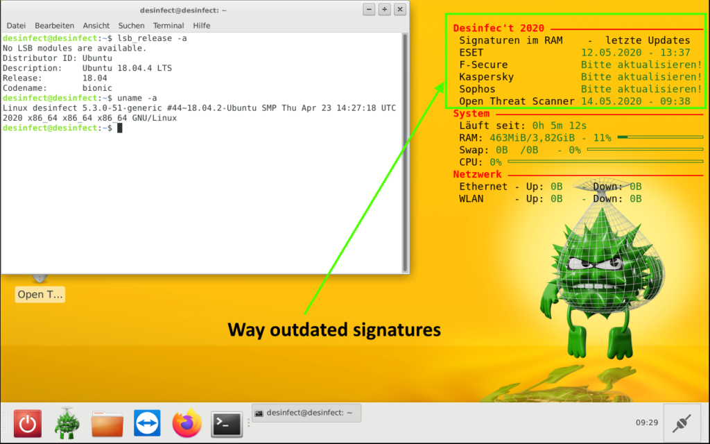
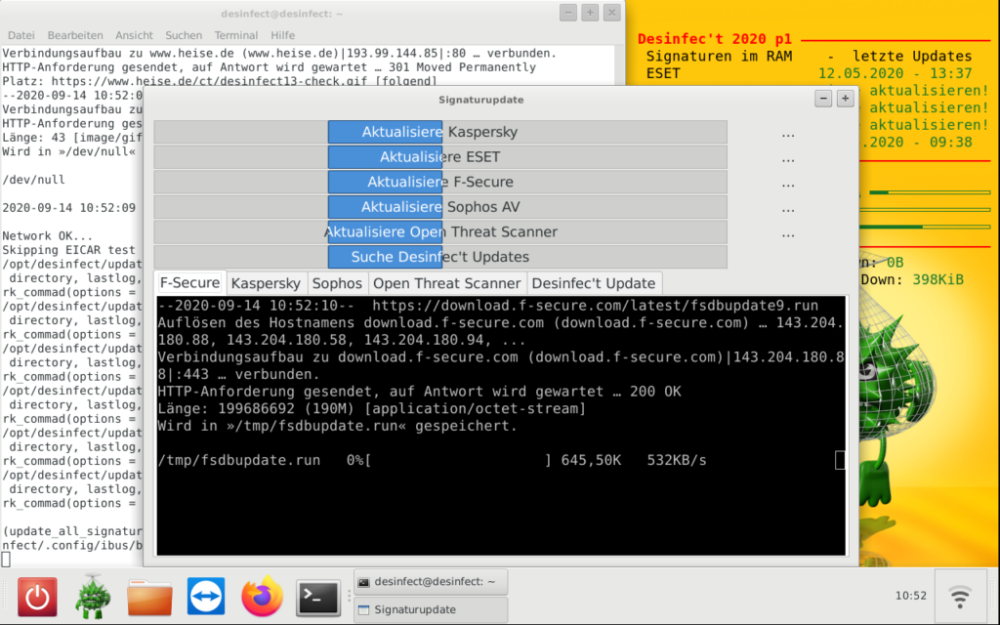
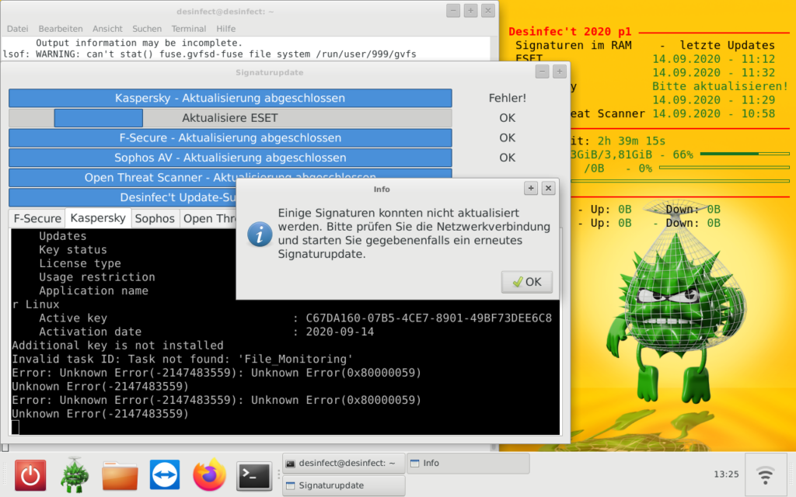
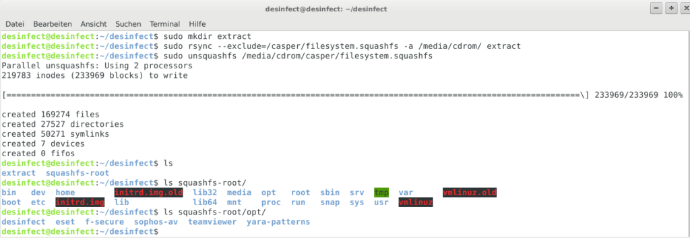
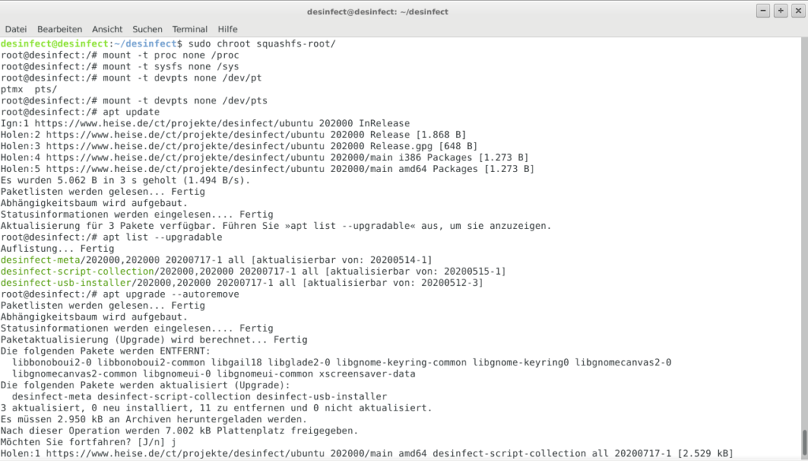
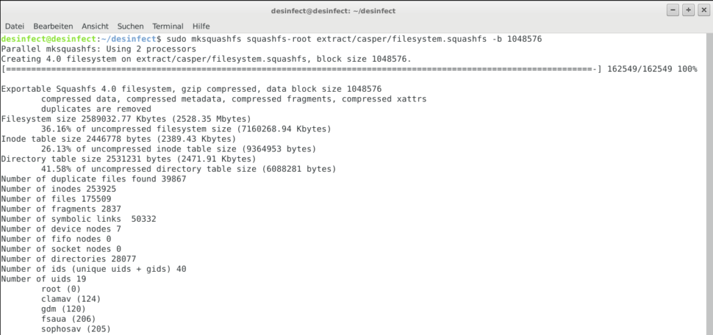
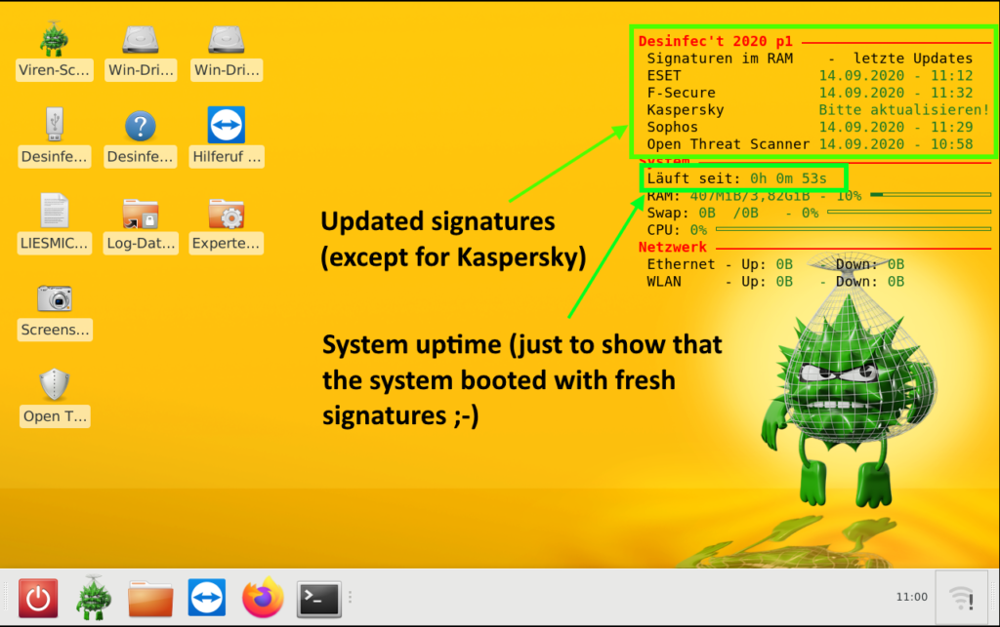

# Customizing Desinfec’t (and other Linux Live disks)

[Desinfec’t](https://de.wikipedia.org/wiki/Desinfec%E2%80%99t), formerly
known as Knoppicillin, is a Ubuntu-based Linux distribution that was
created by the c’t Magazine for Computer Technology. It contains several
anti-virus engines (currently ESET, F-Secure, Kaspersky and Sophos), as
well as several tools for recovering systems from malware incidents.

Some time ago, a colleague and I were called to a ransomware incident.
Despite clarifying how the malware got into the network, we were asked
to support with containment and rebuilding the infrastructure from
scratch. The customer themselves already had purchased a copy of
Desinfec’t, in order to scan their systems. But since the signatures had
already been “a few days old” and Desinfec’t being a live Linux, each
system scan was heavily delayed by an initial update. For bare-metal
systems, it is possible to generate a bootable thumb-drive with a
persistence partition that will keep the updates. But for virtualized
servers this isn’t an option. The customer had also disconnect
everything from their main router and internet connection, so only a
16MBit/s backup internet connection was available. And with more systems
being scanned in parallel, the connection was clogged in no time.

[](./desinfect_00.png)

At that point, I suggested generating a new live ISO from the existing
one that would also contain the latest signatures. The customer agreed,
and after a few hours a fresh ISO with up-to-date signatures was ready
to be used on many physical and virtual systems, without a need for
internet connectivity. This blog post is meant to mainly be a
brain-dump, so I don’t have to search the whole internet about it. The
general approach is applicable to all Ubuntu-based distributions, and
can be adapted to other distributions’ Linux live disks too.

After booting the ISO image, open a terminal window and start the
signature update via `sudo /opt/desinfect/update_all_signatures.sh`:

[](./desinfect_02.png)

Depending on the actual internet connection, this might take some time,
and in case of Kaspersky might even fail (don’t ask me why, but I see it
regularly that even the official Kaspersky live disk fails to update):

[](./desinfect_03.png)

Once the live system is up to date, it’s time to extract the ISO to a
temporary location. Ideally, this should be on a dedicated ext4
partition (I used a fresh VM with an empty virtual disk for that
purpose). In order to preserve file permissions and ownerships of the
files, it is advised to `sudo rsync` the ISO/cdrom content. The
`filesystem.squashfs` (containing the live system’s filesystem) should
be excluded from rsync, since it will be replaced with an updated
version, anyways. Instead, the squashfs will be extracted to another
folder inside the working directory:

``` brush:
mkdir desinfect
sudo mount /dev/sda1 desinfect
cd desinfect
sudo mkdir extract
sudo rsync --exclude=/casper/filesystem.squashfs -a /media/cdrom/ extract
sudo unsquashfs /media/cdrom/casper/filesystem.squashfs
```

[](./desinfect_04.png)

It is now possible to `chroot` into the extracted squashfs folder for
updating installed or installing new packages (for older Desinfec’t
releases, this could be used to install Yara, which is only part of the
system since the 2020 release):

``` brush:
sudo cp /etc/resolv.conf squashfs-root/etc/
sudo mount --bind /dev/ squashfs-root/dev
sudo chroot squashfs-root
mount -t proc none /proc
mount -t sysfs none /sys
mount -t devpts none /dev/pts
```

[](./desinfect_05.png)

Once done with the system modifications, the chroot environment can be
left, again:

``` brush:
umount /proc
umount /sys
umount /dev/pts
exit
umount squashfs-root/dev
```

All Desinfec’t internal and anti-virus data (e.g. signatures), are
stored under `/opt` and `/var/opt`, so those need to be synced into the
extracted squashfs folder:

``` brush:
sudo rsync -rlogtv /var/opt/ squashfs-root/var/opt/
sudo rsync -rlogtv /opt/ squashfs-root/opt/
```

Finally, the `filesystem.squashfs` needs to be recreated with the
updated content and a new ISO image can be generated:

``` brush:
sudo chmod +w extract/casper/filesystem.manifest
sudo chroot squashfs-root dpkg-query -W --showformat='${Package} ${Version}\n' | sudo tee extract/casper/filesystem.manifest
sudo mksquashfs edit extract/casper/filesystem.squashfs -b 1048576
printf $(sudo du -sx --block-size=1 squashfs-root | cut -f1) | sudo tee extract/casper/filesystem.size
cd extract
sudo rm desinfect.md5.txt
find -type f -print0 | sudo xargs -0 md5sum | grep -v isolinux/boot.cat | sudo tee desinfect.md5.txt
sudo genisoimage -D -r -V "$IMAGE_NAME" -cache-inodes -J -l -b isolinux/isolinux.bin -c isolinux/boot.cat -no-emul-boot -boot-load-size 4 -boot-info-table -o ../desinfect_2020-09-14.iso .
```

[](./desinfect_06.png)

The final ISO can then be booted, and the scanner signatures will be
“up-to-date” right from the start:

[](./desinfect_08.png)
