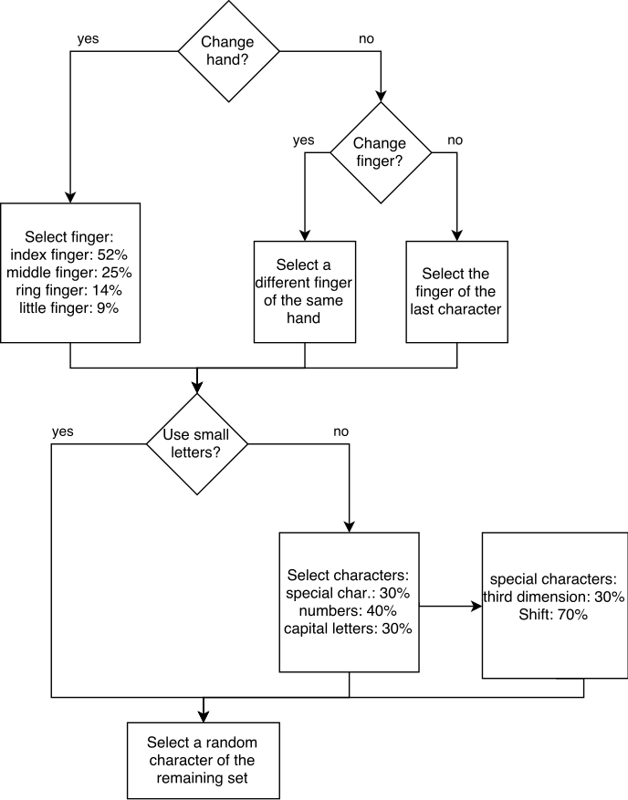

# Ergonomic Password Generator

To secure applications it is often necessary to verify the identity of
the user, this process is called authentication. There are several
methods to authenticate a user, with passwords being the most common
one. Passwords are usually chosen by the user. Those user passwords are
often not strong enough and can be easily guessed by brute forcing or
simple deduction (e.g.  pet names etc.).

Password generators utilize pseudo random numbers to create passwords
that are not prone to those attacks. Programs like KeePass2\[0\] have
built-in password generators that can be parameterized to create
passwords with different length and characters. Although available for
free, it is still necessary to download and install KeePass2 before it
can be used. Better availability is provided by online password
generators, which only require you to browse to a specific website.

The problem with online password generators is that they are often not
secure. Most of them generate the passwords on the server, which makes
it impossible to check the password generation process and also allows
the operator of the website to see the password and save it. Examples
for this kind of generator are the ones from Codepad\[1\], Norton\[2\]
and Dinopass\[3\]. The Passwordsgenerator website\[3\] allows to
generate a password locally using JavaScript. Even though the password
cannot be seen by the operator of the website it is still not secure,
because it uses the Math.random() function as only source for
randomness. Math.random() **does not** return good cryptographic pseudo
random numbers, which makes the generator prone to statistics attacks.
The XKCD password generator\[4\] utilizes a combined approach by
combining Math.random(), a server generated SHA-1 Hash and some window
properties to create a random number. Although better than only using
Math.random(), it is still not secure, because none of these sources
provides good randomness.

With the release of the crypto JavaScript API \[5\] it is no longer
necessary to use tricks and server side methods to generate a secure
password.  All mayor browsers support this API. The following example
code shows a simple password generator:
```
    function generateRandomPassword(length, chars) {
        var password = '';
        for (var i = 0; i < length; i++) {
            var index = getRandomNumber() % chars.length;
            password += chars.charAt(index);
        }
        return password;
    }

    function getRandomNumber() {
        var array = new Uint32Array(1);
        window.crypto.getRandomValues(array);
        return array[0];
    }
```
Although this password is secure, under the assumption that the length
and charset are big enough, it most likely will be difficult to type and
memorize. The lack of ergonomics in password generators was the
motivation for “Reduktion von Fehlerraten mittels ergonomischer
Passwörter”\[6\] by Weich , Herres and Knorr. The authors discuss
password generation and identify security, memorability and ergonomics
as main criteria. They continue by studying writing behavior on the
German “qwertz” keyboard layout and derive an ergonomic password
generation algorithm (shown in fig. 1) from their observations. An
implementation of the algorithm was given in EPT (Ergonomic Password
Tool), a Java command line tool.



The lack of secure and ergonomic password generators in the web was the
motivation for implementing my own version of EPT. The entire
application works locally and no server communication is required after
the initial page request. The random values are delivered by the browser
via the JavaScript Crypto API and the application can be exported as
single file. Through a minimal options field the length and used
character set can be specified, as well as the used algorithm for the
password generation (ergonomic or random).

To verify their approach, Weich , Herres and Knorr calculated the
entropy\[7\] of 4 character ergonomic passwords, which was 25% lower
than the entropy of random passwords. The entropy is a measure for
information and is maximized if the values are evenly distributed. I
made my own calculations and experiments with the password generator and
found that the calculations seem to be correct.  The author suggest that
by increasing the length of the password by 20% a nearly equal level of
security can be reached, than using random passwords.

Even though the entropy for small password lengths is high enough, it is
not clear if the entropy scales well with increased length. Since it is
challenging to calculate the entropy for longer passwords, a better
measure for password strength is still required. Even though, I still
consider the ergonomic password generator secure.

\[0\] <http://keepass.info/>

\[1\]
<http://www.codepad.de/en/software/online-tools/password-generator.html>

\[2\] <https://identitysafe.norton.com/de/password-generator>

\[3\] <http://www.dinopass.com/>

\[4\] <http://preshing.com/20110811/xkcd-password-generator/>

\[5\] <https://developer.mozilla.org/en-US/docs/Web/API/Window/crypto>

\[6\]
<http://www.hochschule-trier.de/fileadmin/users/229/DACH_Herres_Weich-1.8.pdf>

\[7\] <https://en.wikipedia.org/wiki/Entropy_(information_theory)>

 
