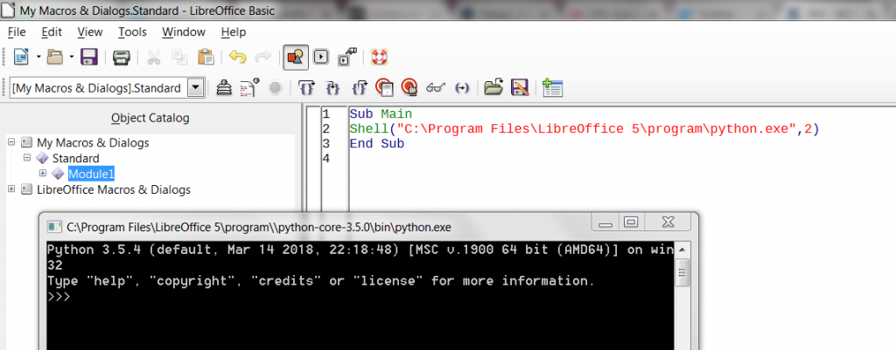
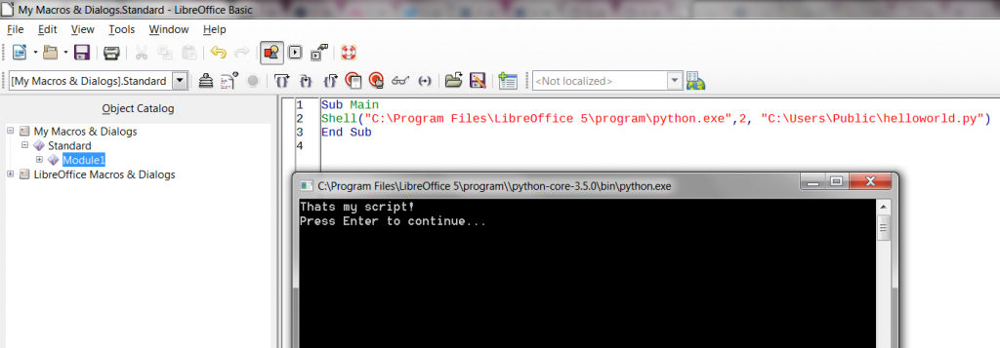

# Bypass Kiosk Mode with Libre/Open Office

Given you have restricted access to a computer and can only open certain
programs. Usually this is caused by the Kiosk Mode that has a white list
which contains only trusted programs. Libre/Open Office is a widely
used/unlocked program on such Kiosk Modes. Some vendors unlock the whole
Libre/Open Office folder: “C:\Program Files\LibreOffice 5\program” or
“C:\Program Files (x86)\OpenOffice 4\program” including all other binary
files. Python version 3.5.4 (Libre Office) / 2.7.13 (Open Office) is
automatically included in the default installation of Libre/Open Office.
Now a user can create a Libre/Open Office macro to run a python shell:

- Open LibreOffice/OpenOffice
- Tools -\> Macro -\> Organize Macros -\> LibreOffice Basic… -\> Edit
- Input the following macro code and execute:

```
Sub Main
Shell("C:\Program Files\LibreOffice 5\program\python.exe",2)
End Sub
```

 



Now you can interact with a Python Shell.

If you have read / write permission for a location on your kiosk mode
computer, you can create your own python scripts. An “Hello World”
example on the public path “C:\Users\Public\helloworld.py”:

```
print("Thats my script!")
input("Press Enter to continue...")
```

Run your python script with the macro:

```
Sub Main
Shell("C:\Program Files\LibreOffice 5\program\python.exe",2, "C:\Users\Public\helloworld.py")
End Sub
```

Or run it directly in the python shell:

```
exec(open("C:\\Users\\Public\\helloworld.py").read())
```

 



A user can start more complex attacks against the computer or the
internal network with a readable and writable location and the python
shell. Python is a very powerful script language and there exist a huge
amount of libraries to import new functions. For example:

- Service scan in the internal network
- Open a RDP session to other servers
- Brute force attack to web login mask on other services
