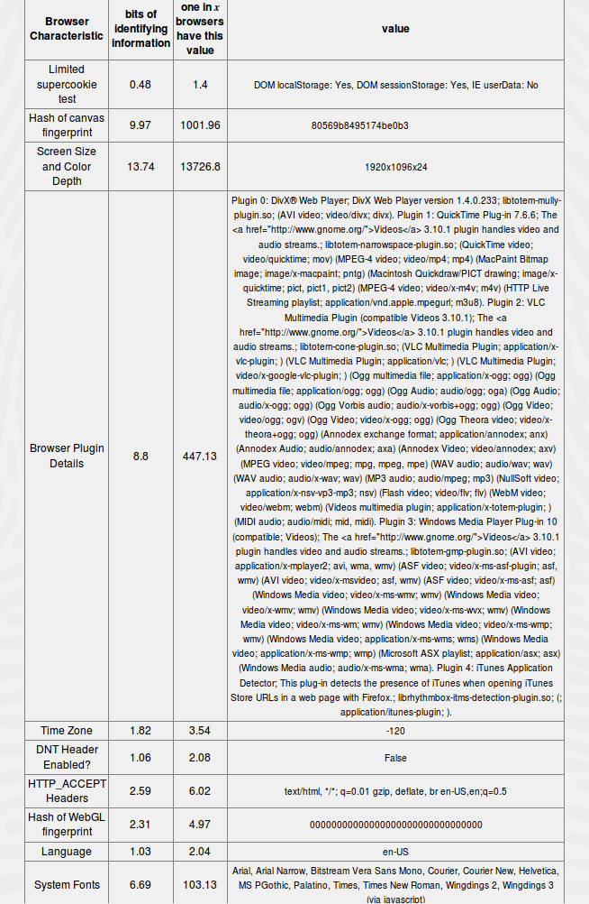
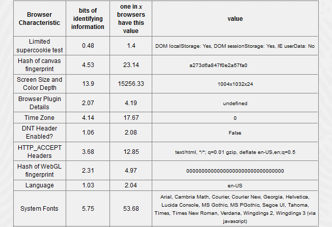
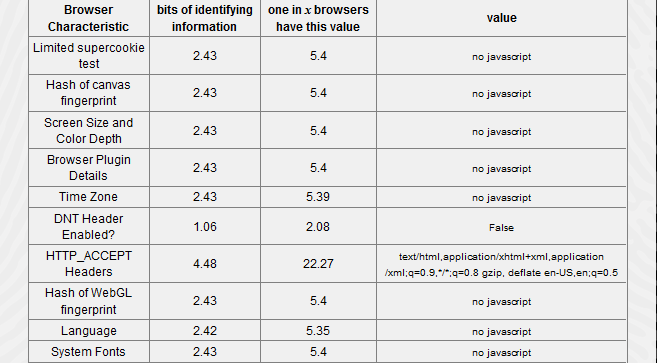

# Fingerprinting of web browsers and the consequences for privacy

## Introduction

Fingerprinting of web browsers is a known technique to identify website
users. This enables to track users and their habits across websites
without the use of cookies. Approximately 93 percent of Web browsers
have a unique fingerprint. Particularly meaningful are lists of
installed plugins, screen resolution, time zone, language and fonts. In
this case a unique hash for the user’s browsers is created. This hash
can be used to (re-)identify visitors over different sessions and IP
addresses. Sharing this hash and associated personal information with
external organizations then allows tracking users over the boundaries of
websites and creating a detailed personal profile of interests and
habits. The actual problems for the users arise with the consequences
for their privacy in connection with fingerprinting.

## Types and Vulnerabilities

Fingerprinting is distinguished in two types, the active and passive
one. Passive characteristics (IP header, TCP header, HTTP header,
User-Agent, supported languages) are sent implicitly to the server every
time a browser loads a website. Active characteristics have to be
received actively over client-side script languages (e.g. Flash or
JavaScript). To recognize clients about her fingerprint it is necessary
to have rare characteristics e.g.  Rarely Browser Plugins or barely used
fonts. Using browsers (like Chrome, Firefox or Internet Explorer) in
combination with a desktop pc it’s almost impossible to be not unique.
Especially the personalization of the computer e.g. background colors
and rare fonts makes it moreover unique. Due to the mass of
characteristics a fingerprint can often clearly be associated with one
unique browser. Even if in a longer period of time smaller changes have
occurred (new plugins have been added or older were deleted) the
fingerprint will be unique.

## Fingerprinting as Useful Feature

A browser’s fingerprint can be used as a feature as well. For quite some
time software vendors use the possibility to create fingerprints from
devices to protect against unlawful dissemination of their software. In
this process the software vendors create a fingerprint from the hardware
of the device. The safety for the user can also be increased. Website
operators can regularly check which user is logged in from which
browser, so they can react to the case if one account is used by a
different browser which might be the case if an account was hijacked. An
online banking site can record fingerprints over the last logins and
react on different fingerprints by requiring the user to perform an
additional security step (e.g. security question, CAPTCHA). This feature
can protect the users against foreign accesses on his user accounts.

## Impact on user’s privacy

Which privacy impact is expected for the users? As user tracking is been
done, the most asked question is: Does a browser fingerprint count as
personal data and is it in need of protection? In fact a fingerprint can
be assigned to a particular person in a large number of cases and thus
identifies a user. Using efficient algorithms it would be possible to
(re-)identify users and thus track them over a long period of time. If
this data is stored and evaluated, it would be possible to create a
profile for a particular user. Correlating a fingerprint with personal
data (e. g. first name, last name, address) by using popular social
media sites the fingerprint is no longer anonymous. It would be
conceivable that website providers, advertisement distributors and
secret services use this method to track users and their habits.

## Mitigate browser fingerprinting

There are some mitigation techniques to prevent users from being
identified through unique browser fingerprints. However a lot of these
techniques have their downsides. The most effective way of mitigating
browser fingerprinting is to disable JavaScript. Multiple of features
within a browser fingerprint can be made unavailable by turning off
JavaScript.  The problem in this mitigation is that a lot of websites
require client-side scripting techniques to render content correctly. So
although this measure is very effective it is very impractical. So the
most practical advice is that a user should not change default settings
like fonts, colors and use as very little plugins as possible.
Unfortunately this method is not sufficient enough to be not unique and
brings only a conditional success.

## Conclusion 

Summing up it’s to say that even for an experienced user it’s very
difficult to not having a unique browser fingerprint. Only with very
large efforts and limitations it’s possible to protect effectively from
Browser fingerprinting. Especially for a regular user there is no easy
mitigation given but usually those users are not bothered enough by this
topic to take actions. Possibilities like the Tor-Browser can help but
it solves the problem only partially. In a test a browser, a fingerprint
of a clean installed Ubuntu Linux without any changes was created. Even
in this case, a unique browser fingerprint could be discovered. If you
want to test your browser fingerprint, Panopticlick has developed a
great tool which is available at
([Panopticlick](https://panopticlick.eff.org/)).

*Fingerprint of a clean installed Ubuntu Linux
([Panopticlick](https://panopticlick.eff.org/))  
*

 

*Fingerprint of a Tor Browser
([Panopticlick](https://panopticlick.eff.org/))  
*

 

*Fingerprint without JavaScript
([Panopticlick](https://panopticlick.eff.org/))  
*
