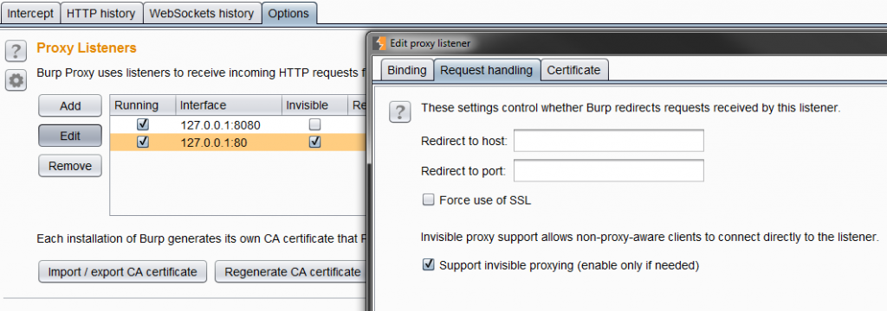
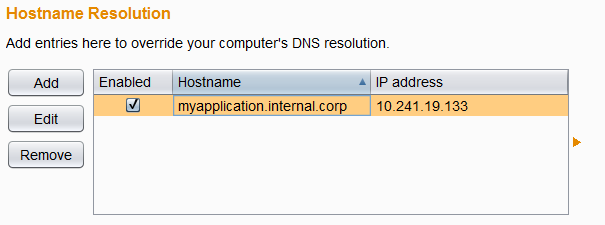

# Hooking Burp Suite in Client Software Communication

Ever came across the issue to redirect HTTP(S) traffic to Burp Suite
originating from client software that is not supporting to configure a
proxy? Well there are tools like
[proxychains](https://www.backtrack-linux.org/wiki/index.php/Proxychains)
to do this. But there might be situations were those tools are not
suitable. Another way is using the hosts file combined with Burp Suite’s
built-in features.  
So let‘s assume there is a generic client software not being able to
allow the configuration of a proxy server and that does not make use of
the system’s proxy configuration. The following guide was tested on
Windows 7, but should be adaptable to other operating systems as well.

## Manipulate hostname resolution

Usually the client is communicating with one or at least a limited
amount of domains. Inspecting the configuration of the client can reveal
those domains. Another way would be to run the Linux command **strings**
on all the files of the client an try to find suitable domain names in
all the resulting strings.

Having all the domains we should resolve these to the corresponding IP
addresses, as we need them later:

    ping <domain1>

Please store the domains and the IP addresses.

Now we will change the local hostname resolution to point all the
domains to **localhost**.

/etc/hosts or %windir%\System32\drivers\etc\hosts

    127.0.0.1         <domain1>
    127.0.0.1         <domain2>

After saving the file, any calls to the above domains will point to
127.0.0.1 instead of the original IP address.

## Listen Burp Suite Proxy correctly

Now start Burp Suite if not already done and switch to the Proxy
Options. Here one should add a Proxy Listener on port 80 and one on port
443. If your client software is using different ports to connect to
server add these instead.

A very important configuration of the Proxy Listener is the
**invisible** option, which turns the proxy in a mode that does not
expect CONNECT requests and thus can be hooked in the communication as
man in the middle software and not a proxy.

Trying to run the client should result in requests being shown in Burp
Suite, but with no responses, as Burp Suite has no clue to where the
traffic should be directed to.

# Correctly resolve the domains

Let‘s tell Burp Suite where the requests should be sent to. This can be
done by using the Burp Suite Option „Hostname Resolution“ in „Project
options“ tab. Here we configure the domains and the corresponding
original IP addresses, saved from the ping command above.

And that‘s all. The client software is now communicating via Burp Suite
to the target system.
