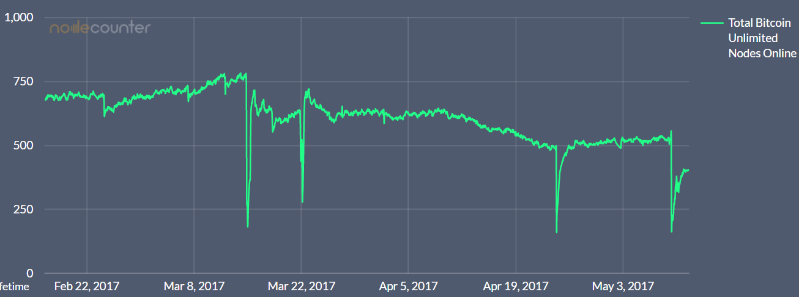

# Immutable, reliable, secure – A brief history of blockchain security

Blockchain technology is marketed as the Web 3.0 and because of it’s
distributed structure it wipes out single points of failure. But does
that mean there are no points of failures at all? Let’s look at some
important blockchain hacks / failures from the tech perspective.

\[*Remark: This is not about \$\$\$ Bitcoin hacks, where lousy DB
implementations, web applications, key handling or simply social
engineering let to hacked bitcoin exchanges or wallets.*\]

## 51% attack

From a technical point of view, the [51% attack](https://learncryptography.com/cryptocurrency/51-attack) is
probably the most famous one. It’s as simple as obvious – in theory you
need  50% of the networks hash rate to control the blockchain in the
long run. The estimated cost of such an attack against the Bitcoin
network today are [1.3 billion\$](https://gobitcoin.io/tools/cost-51-attack/?).

But for smaller proof-of-work blockchains with less hashrate this is a
potential threat. And this attack got successful executed on an Ethereum
like blockchain called
[Krypton](https://web.archive.org/web/20161101044659/http:/krypton.rocks:80/2016/08/27/krypton-recovers-from-a-new-type-of-51-network-attack/).
The attacker rented mining power at a cloudmining provider (NiceHash)
and at the same time started to DDoS existing Krypton ming nodes. Now he
was able to [double spend](https://en.bitcoin.it/wiki/Double-spending)
Krypton Tokens by simple redoing the proof-of-work.

Krypton’s Founder
[stated](https://cointelegraph.com/news/test-attack-on-krypton-ethereum-classic-might-be-next):

*“This attack may be a “dry run” intended as proof of concept before
targeting other Ethereum based blockchains. \[…\] Ethereum based
blockchains are being targeted predominantly because they’re easy to
fork and manipulate offline, while being used in conjunction with DDoS
attacks.”*

After the hack Krypton changed to a “bitcoin-based proof-of-work”,
before the core devs dropped the project.

## Smart contract bug

The infamous multimillion DAO hack was enabled due to a smart contract
bug. The DAO (decentralized autonomous organization) was a [smart contract construct](https://github.com/slockit/DAO/) written in
solidity, a JavaScript similar language. The DAO was basically an
investment fund where the business logic was written in code. So the
investors aka token holders can vote for business projects and get their
return on invest.

One of the features as a token holder was to propose a split of the DAO.
This is the way the hacker started his attack. After the voting period
for the proposal expired, the split executed and a new DAO got created,
nothing special. While the splitDAO function runs, the tokens of the
curator (attacker) get sent towards the new DAO. The func
withdrawRewardFor gets called during the func splitDAO as well and tries
to pay out any available investment returns. **Now the critical part!**
The hacker called the splitDAO func again **before** the balances got
updated, meaning before the function terminated. Like this the old DAO
again sent tokens towards the new DAO. The hacker repeats this step over
and over again.

This way he drained the DAO and captured 3.6 million ether an equivalent
of \$50 million at this time. The hack led to a [hard fork and a split of Ethereum](https://www.cryptocompare.com/coins/guides/the-dao-the-hack-the-soft-fork-and-the-hard-fork/)
into Ethereum Classic and Ethereum

[Phil Daian did a real good technical analysis of the hack.](http://hackingdistributed.com/2016/06/18/analysis-of-the-dao-exploit/)

## Blockchain Protocol Attack

The Bitcoin network is seen as the original blockchain. But since quite
a while the community is struggling to get consensus over the scaling
problem. One solution is Bitcoin Unlimited (BU), which is a fork of the
Bitcoin Core protocol, to increase the block size.

Recently the Bitcoin Unlimited network suffered from a critical bug that
got exploited. Besides increasing the block size, BU introduced [Xtreme Thinblocks](https://medium.com/@peter_r/towards-massive-on-chain-scaling-presenting-our-block-propagation-results-with-xthin-da54e55dc0e4),
which helps reduce block size by filtering transactions, which initially
got into the mempool. However this feature has had at least [two critical bugs](https://bitcoinmagazine.com/articles/security-researcher-found-bug-knocked-out-bitcoin-unlimited/),
which got detected and fixed. With the development happening publicly on
github, somebody took notice of [the commit](https://github.com/BitcoinUnlimited/BitcoinUnlimited/pull/371/commits/99d4062c570471d43b36b2ad0d416f36817a1743)
and exploited this bug. The bug was a reachable assertion in C++, see
the simplified code below.
```
    void SendXThinBlock(CBlock &block, CNode* pfrom, const CInv &inv)
    {
        if (inv.type == MSG_XTHINBLOCK)
        {
            // code
        }
        else if (inv.type == MSG_THINBLOCK)
        {
            // code
        }
        else
        {
            assert(0);
        }
        // more code
    }
```
The exploit was just to send a GET_XTHIN with an invalid message type
[(see python code)](https://ghostbin.com/paste/36hhq). At the time of
the attack 774 of 6415 nodes where running BU, the attack took around
500 down. The xthin block feature is probably to blame for even more
downtime in BU nodes, see picture below.

This low code quality inside BU gives the scaling discussion new fire
and could possible decide it.



Bitcoin Unlimited nodes online. Attack occured on 14.March – first drop
in the chart.

## Antbleed: Hardware Backdoor

In Bitcoin mining the use of ASICS is the only economically reasonable
way to go. Bitmain is the biggest producer of mining ASICS. It is
estimated that around 70% of the global Bitcoin hashrate comes from
Bitmain’s Antminers. At the same time they are operating the biggest
[mining pool](https://blockchain.info/de/pools) AntPool with around 20%
of the global hashrate.

Recently a backdoor in the Antminer firmware has been discovered. The
firmware regularly connects to a server controlled by Bitmain and
transmits information including the device’s serial number, MAC address
and IP address. Nothing special, since this could just track the
distribution of Bitmain’s sales, but the response of the server can
disable the requesting miner, see the code below [or on pastebin](https://pastebin.com/jREuwQ8b) (since it got deleted on
github). Easiest solution is to edit your etc/hosts file and dissolve
auth.minerlink.com to localhost.

[Bitmain stated](https://twitter.com/Excellion/status/857362078725578752), they
built a “remote shutdown backdoor” only for test purposes and won’t use
it. More info on [antbleed](http://www.antbleed.com/).
```
    #define AUTH_URL    "auth.minerlink.com"
        //code
    void send_mac() {
        //code
        get_mac("eth0",&mac);
        while(need_send)
           {   // code
               stop_mining = setup_send_mac_socket(s);
               if(stop_mining)
               {
               applog(LOG_NOTICE,"Stop mining!!!");
               break;
               }     // code
           }       }
```
## Webapplication Attack

Despite claiming not to mention webapplication flaws, this one led to a
hard fork, so it’s maybe worth mentioning.

[Steemit](https://steemit.com/) is a social media platform based on a
blockchain with it’s one currency called steem, to encourage
high-quality content. They want to avoid censorship and any
“facebook-like” middle-man, by being decentralized. Nevertheless there
was a central vulnerability regarding the facebook and reddit login
integration on the frontend, [said CEO Ned Scott](http://news.softpedia.com/news/steem-social-network-hacked-user-funds-stolen-ddos-attack-followed-after-506417.shtml).
This way the hacker got access to around 260 accounts and drained
\$85,000. All the money got refunded, as mentioned, due to a hard fork,
which is quite easy to implement in steemit because of their witnesses
consensus mechanism.

## Conclusion

Blockchain technology is an ongoing beta test and you shouldn’t believe
the promise of salvation that blockchain can’t be hacked. There hasn’t
been any major flaw / hack that dismisses the core technology as a
whole. But usually nobody sees the black swan coming.
