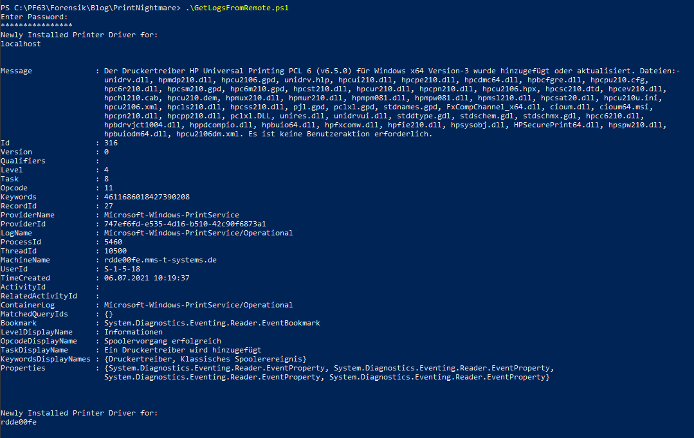

# PrintNightmare/CVE-2021-34527 Search the Domain with PowerShell

In my latest blog post “[Vulnerability advisory: PrintNightmare/CVE-2021-34527 Zero-day Exploit Code Available – What to do now?](../index.html@p=896.html "https://no-sec.net/vulnerability-advisory-printnightmare-cve-2021-34527-zero-day-exploit-code-available-what-to-do-now/")”
I’ve recommended enabling monitoring with Windows EventLogs or Sysmon
logging. Since many small to medium business leak the possibility to
aggregate, search and alert on Windows EventLogs, I want to propose a
simple yet effective manual way for these businesses until a patch is
available.

## Recap: Utilizing Powershell to enable the “Microsoft-Windows-PrintService/Operational” Log

The `Microsoft-Windows-PrintService/Operational` EventLog can be used to
track newly installed print drivers on a system. Since this EventLog is
not enabled by default, we have to do so beforehand. The following
snippet can be used to enable the EventLog.

``` brush:
#Check whether the PrintServer Operational Log is enabled:
Get-LogProperties 'Microsoft-Windows-PrintService/Operational'

#Enable the PrintServer Operational Log:
$logDeets= Get-LogProperties 'Microsoft-Windows-PrintService/Operational'
$logDeets.Enabled = $true
Set-LogProperties -LogDetails $logDeets

#Check whether the PrintServer Operational Log is enabled now:
Get-LogProperties 'Microsoft-Windows-PrintService/Operational'
```

To run this command on remote systems, you can use the Powershell
[Invoke-Command](https://docs.microsoft.com/en-us/powershell/module/microsoft.powershell.core/invoke-command?view=powershell-7.1 "https://docs.microsoft.com/en-us/powershell/module/microsoft.powershell.core/invoke-command?view=powershell-7.1")
cmdlet. (You need to have WINRM allowed on your network to do this,
which is also heavilyutilized by threat actors)

## Using Powershell to collect remote EventLogs

When you followed the above step you have information about all newly
installed printing drivers on your machines but yet no way to easily
review them. We are here to help. The following PowerShellsnippet will
connect to remote machines specified at `$Servers` and go through the
`Microsoft-Windows-PrintService/Operational`, search for Event ID `316`
and print the output to console. The `$Begin` Variable specifies the
time from which to search on. If you do this each hour in a loop, make
sure to adapt it accordingly. The `$user` Variable is your user with
permissions to login on the remote machines.

``` brush:
# Europe Time Format
$Begin = Get-Date -Date '28.06.2021 00:00:00'
# American Time Format 
#$Begin = Get-Date -Date '06/28/2021 00:00:00'

$Servers = 'localhost', 'server02', 'server03'
$user = "user01" 
Write-Host "Enter Password:"
$secure_pwd = Read-Host -AsSecureString 
$cred = New-Object System.Management.Automation.PSCredential -ArgumentList $user, $secure_pwd

ForEach ($Server in $Servers) {
    Write-Output "Newly Installed Printer Driver for: " $Server
    Get-WinEvent -ComputerName $Server -Credential $cred -LogName Microsoft-Windows-PrintService/Operational | 
    Where-Object { $_.Id -eq '316' } | 
    Where-Object { $_.TimeCreated -ge $Begin } | 
    Format-List -Property *
}
```

You can save the snippet to a file and invoke it from a PowerShell
console via: `>./scriptname.ps`. The output should be reviewed on a
regular basis. In general, there shouldn’t be to many changes to the
printer drivers after all. When you want to print to a file simply do
\>`./scriptname.ps > output.txt`.

When using Sysmon you can adopt this script to the Sysmon EventLog Name
and the according EventIDs.

The sample output will look like this:



## Alternatives

The above solutions is a more manual approach for all businesses, not
utilizing any means of central log management. And not planning to do so
in the near future.

If you are planning to implement a more sophisticated and extensible
solution regarding log management and monitoring, you may want to take a
look at
[Syslog-NG](https://github.com/syslog-ng/syslog-ng "https://github.com/syslog-ng/syslog-ng"),
[Open Greylog](https://www.graylog.org/products/open-source#download-open "https://www.graylog.org/products/open-source#download-open"),
or
[Elastic](https://www.elastic.co/de/beats/ "https://www.elastic.co/de/beats/")
with its Beats collection.
