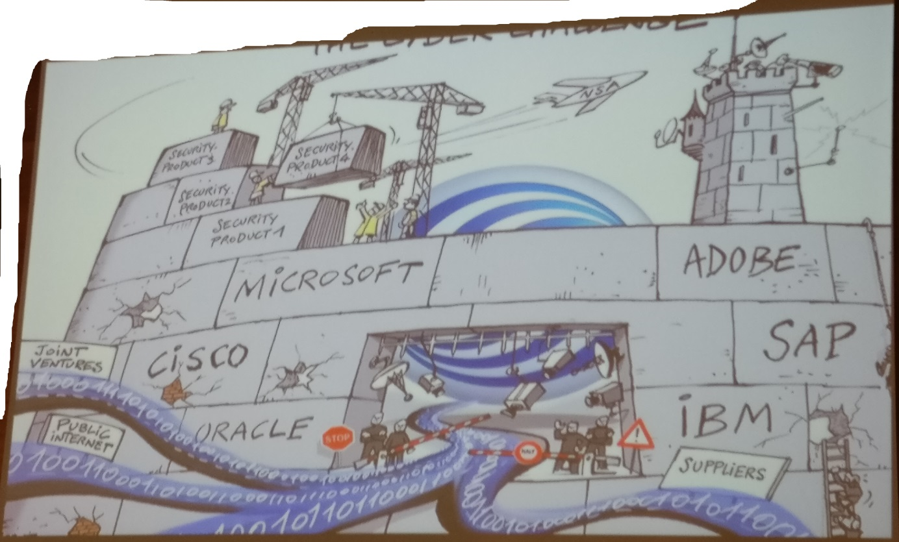

# Security of Things – World Conference

High level atmosphere. High level management. High level topics.

The companies represented came from nearly every industry sector:
banking, energy, telecommunication, government, manufacturing & 
chemical industry as well as retail, entertainment, transportation,
automotive and of course IT security. The delegates and speakers were
all C-level management and mostly CIO / CISO.

So what are the hottest topics? Where is the industry in terms of IoT
Security at the moment?

## Enterprises are aware of IT and OT Security

They want to build the IoT, but they don’t want to compromise on
security. With more and more devices being connected and hackers making
news nearly daily, the risk to lose reputation & real assets through a
security issue is real. The problem is not new architecture / technology
/ devices. Problem is the old heritage.

## Security Updates – everybody’s pain in the ass

- Hard to code without vulnerabilities.
- Hard to deploy without breaking the system.
- Hard to reach a high level of patched systems.
- Life Cycle Management of IoT devices: Best-before date for Software &
  Firmware. As a supplier think up until the end of life.

## Hardware Security

With the “Things” of different industries being connected, the need for
secure Hardware gets crucial, cause you won’t be able to lock your
Things up in a secure garden. New on the HSM market: Google. They
presented their new project called [Android Things](https://developer.android.com/things/index.html), which enables
the developer to program their IoT device. Google takes care of the
kernel and provides the dev with an Android framework API that gives
access to low level I/O.

## Standardization

Nearly everyone agreed that the IoT security is in lack of standards.
Beau Woods from The Atlantic Council proposed “Minimum Hygiene
Standards” which read as follows:

- No known vulnerabilities (without justification)
- Software updateable
- Lifetime security updates (advertised product lifetime)
- Vulnerability Disclosure Policy
- No default credentials

Furthermore the idea of nutrition facts for software came up. Which
should describe all dependencies, open source code, cryptography etc.
used inside any software product available.

Not only a missing legal framework gives the companies a headache but as
well the missing global enforcement. Without a political consent, cheap
IoT products without any security are flooding the market and form a
real thread, for example inside the mirai botnet.

## Collaboration instead of Competition

In a lot of keynotes and in most dialogues delegates agreed, that in
terms of security the industry has to collaborate instead of compete.
Cause a successful attack can hit and damage everyone. The penetration
testers and open source communities that attended the conference pointed
out, that companies should share their mistakes and learnings. Black and
white hats have already a vivid sharing community. IT managers should
follow this example in terms of best practice architecture.

Lot of other topics were discussed, like data privacy in IoT,
implementing critical infrastructure regulations and blockchain as an
IoT security solution.
