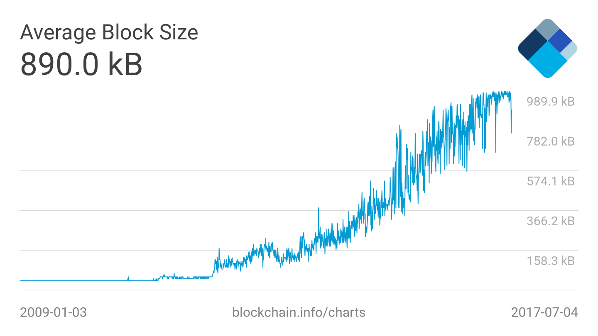
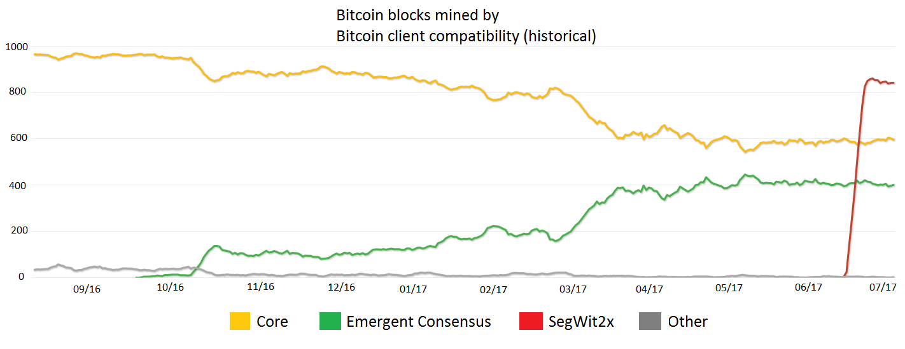
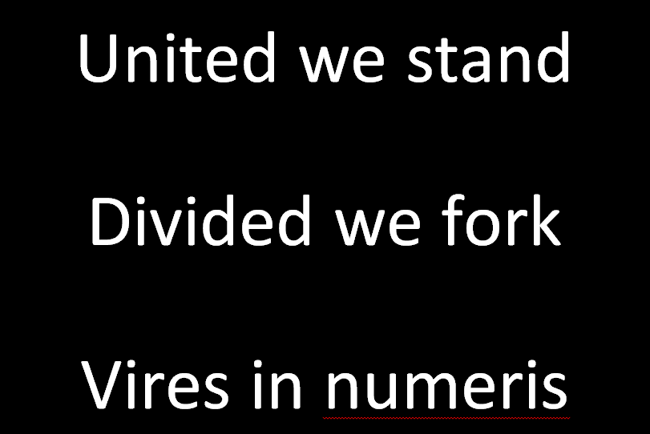

# The Future of Bitcoin

Bitcoin is getting traction and attention by mainstream media. Price
hits all time high at 3000\$ and stays above the gold price. At the same
time the Bitcoin community is meeting their biggest challenge so far.
The question of: ‘How to scale Bitcoin?’ This was discussed for two days
at the [Future of Bitcoin
conference](https://www.thefutureofbitcoin.com/) in Arnheim /
Netherlands, with developers, researchers and miners.

The scaling is needed desperately, because the blocks of the bitcoin
blockchain reach the 1MB limit (see chart 1). Why? Because one single
transaction has an average size of 400 – 500 bytes and nearly every 10
minutes a new block is found by the network. Therefore, 3-4 transactions
/ sec can be processed at a max, with 1 MB blocksize. (As compared to
VISA with 56.000 transactions /sec at a max.) The more bitcoin users the
more transactions reach the network and therefore to get a single
transaction processed takes longer or the user pays a higher fee to get
his transaction picked by a miner.

Chart 1: blockchain.info

This problem is known since the early days of Bitcoin and solutions are
discussed since 2015. Now that the blocks are actually full a scaling
solution has to happen, otherwise people won’t use Bitcoin anymore
(because of the high fees) and the miners will loose their business
model. There are a couple of scaling solutions on the table, but
**problem is**: You need the majority of the network hashing power to
agree on a scaling solution to actually change the protocol and
implement a scaling solution.

The two main opposing parties are [‘Bitcoin
Core’](https://bitcoin.org/en/bitcoin-core/) and [‘Bitcoin
Unlimited’](https://www.bitcoinunlimited.info/). Core wants to implement
a second layer called [SegWit](https://segwit.org/) which segregates the
witness, i.e., the signatures of the transactions are off-chain. This
would make more transactions fit into one block. Unlimited on the other
hand wants bigger blocks which would fit more transactions into one
block as well, but without the technical complexity of SegWit. A
distribution of the respective blocks (see chart 2) shows that Core has
around 60% and Emergent Consensus around 40% of the hash power. SegWit2x
originated from an [Agreement signed in New
York](https://medium.com/@DCGco/bitcoin-scaling-agreement-at-consensus-2017-133521fe9a77)
in May 2017.

Chart 2: coin.dance

The Future of Bitcoin Conference was visited mainly by the emergent
consensus fraction of Bitcoin, although Core people where invited.

It was a lot of high quality content. Raw data, code and research got
revealed and discussed on stage. A new scaling solution (FSH Extension
Blocks) and a new bitcoin implementation
([bitcoinabc.org](https://www.bitcoinabc.org/)) got presented. As well
as some business and ideologically perspective on the Bitcoin ecosystem.
There were a couple of points made throughout the speeches:

- **100% Bitcoin:** Lot of Bitcoin maximalists were at the conference,
  which see Bitcoin as the one and only cryptocurrency. They don’t want
  Altcoins, they want coopetition on Bitcoin.
- **We need to scale now:** Scaling on-chain and off-chain is needed
  immediately.
- **SegWit ain’t scale:** SegWit is not Bitcoin and it is not a good
  scaling solution. They see bigger blocks as the only right solution to
  go forward.
- **[Ethereum](https://www.ethereum.org/) is just about ICO Scams:**
  Most of the contracts running on Ethereum are there for ICOs. And ICOs
  are seen as scams.
- **Bitcoin might be [turing
  complete: ](https://en.wikipedia.org/wiki/Turing_completeness)**Ryan X.
  Charles  and [Craig Wright
  announced](http://www.bitsonline.com/craig-wright-threatens-bitcoin/)
  independently a paper to prove, that Bitcoin script is turing
  complete.
- **[Hard fork](https://bitcoin.org/en/glossary/hard-fork) is
  coming:** People are not afraid of a hard fork anymore. The fork might
  not be SegWit2x.

Slide from Jameson Lopp

A further detailed summary of the conference can be found at
[bitsonline](http://bitsonline.com/future-bitcoin-conference-surprise/).
