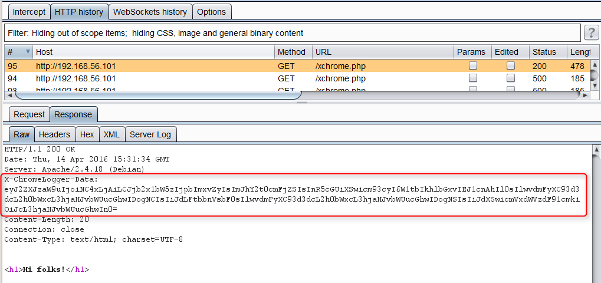
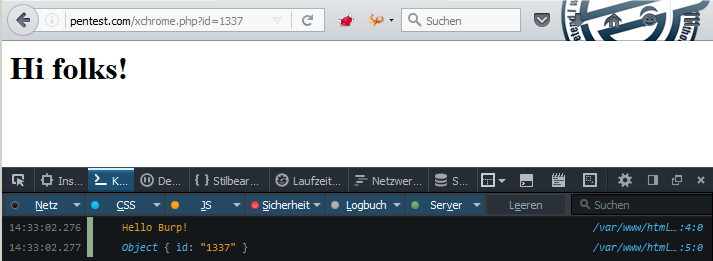
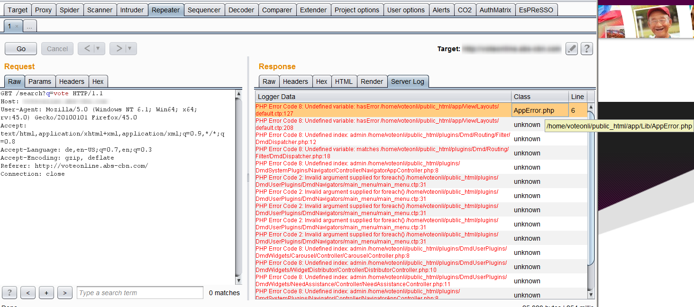

# Using Chrome Logger in BurpSuite

In February of this year, a blog post by the [OWASP ZAP
newsletter](http://zaproxy.blogspot.de/2016/01/zap-newsletter-2016-january.html) has
pointed us towards an interesting technology called Chrome
Logger. Chrome Logger can be used to display server side debugging
information into the web console (e.g. in Firefox) at runtime.

## How it works

First, download and import the server side library which is available
for different languages like Python, PHP or Java (see
<https://craig.is/writing/chrome-logger>). In the sample below, you can
find the PHP server lib include from
<http://github.com/ccampbell/chromephp> in line 2.
```
    <?php
     include 'ChromePhp.php';

     ChromePhp::log('Hello Burp!');
     ChromePhp::log(json_decode($_GET));
    ?>

    <h1>Hi folks!</h1>
```
The code snippet adds a new HTTP Response Header called
`X-ChromeLogger-Data` (see figure below) which transfers the input of
the `ChromePhp::log` method in base64 encoded form. Thus, it is possible
to debug server variables or data flow controls at runtime in a fast
way. In addition, Firefox provides native support of Chrome Logger since
version 43.



Chrome Logger data in HTTP response



Firefox native support of Chrome Logger

## Why is this useful?

The Chome Logger feature directly aimed towards developers but might
also be interesting for security auditors who have access to the source
code of the test object (e.g. WordPress Plugin or other open source
projects). The output of the debugging information can improve the
results by reviewing complex functions or validating rules in white box
audit.

As web penetration testers, we are interested to view the decoded debug
information in the HTTP message editor of the BurpSuite tool to combine
the received data with other components like Burp Repeater or Intruder.
As you can see below, the base64 decoded data is not really readable
with larger debug output.
```
    {"version":"4.1.0","columns":["log","backtrace","type"],"rows":[[["Hello Burp!"],"\/var\/www\/html\/xchrome.php : 4",""],[[{"id":"1337"}],"\/var\/www\/html\/xchrome.php : 5",""]],"request_uri":"\/xchrome.php?id=1337"}
```
That’s the reason to write a small Burp Plugin which performs the
transformation of the received data and display the data in a human
readable format. Now, the debugging information can be reviewed in the
Repeater or Intruder tab. You can find the code on
GitHub: <https://github.com/no-sec/burputils-XChromeLogger-decoder>



Encoded Chrome Logger data in repeater tab of the BurpSuite

## Keep in mind

As already mentioned in the ZAP blog post, please keep in mind that an
active debug interface like Chrome Logger represents a security risk
(Kingthorin calls it “*XCOLD Information Leak*“) and should be used only
in test environments.
