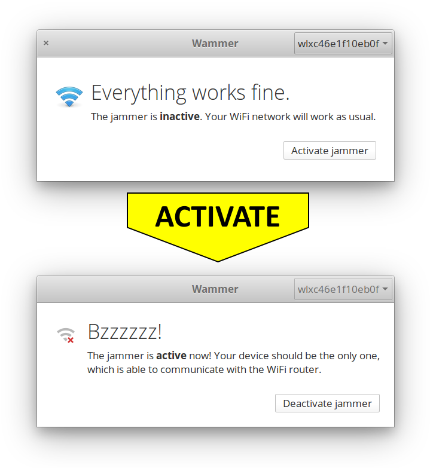

# Wammer – WiFi jamming made easy

Since years the IEEE 802.11 WiFi protocol has a well-known [design flaw](https://en.wikipedia.org/wiki/Wi-Fi_deauthentication_attack) which
allows attackers to disconnected clients from the WiFi access point
they’re connected to.

All he has to do, is to send “dauthentication frames” to the WiFi access
point. Because the IEEE 802.11 WiFi standard doesn’t require encryption
for such frames, an attacker is able to perform the attack even though
he isn’t connected with that access point.

The vulnerability often gets exploited when running an Evil Twin attack
or capturing WPA-handshakes. Even [hotels got caught](https://motherboard.vice.com/en_us/article/jp57qp/fcc-fines-freedom-hating-hotel-wi-fi-provider-for-blocking-personal-hotpsots)
performing deauthentication attacks against their own guests, in order
to force them using the on-site (fee-based) WiFi.

Deauthentication attacks, or more generally “jamming”, might violate
certain laws or regulations, depending on the country. However it is
often hard to identify the jamming source, because it can be
[small](https://www.youtube.com/watch?v=oQQhBdCQOTM) and easily hidden.

## The old-school way

To perform a deauthentication attack, the
[aircrack-ng](https://www.aircrack-ng.org/) suite is widely used.
Aircrack-ng is a set of WiFi (hacking) tools, containing programs to
monitor, attack, test and crack WiFi networks. To run a deauthentication
attack against all clients of an access point, 3 steps are needed:

1\. Put your network interface into monitor mode:

`airmon-ng start wlan0`

2\. Get the access points MAC address:

`airodump mon0`

3\. Send deauthentication packages:

`aireplay-ng -0 0 -a [ACCESS_POINT_MAC] mon0`

These 3 steps are far from being complex, but you still have to know the
syntax and go through the process all the time. So hold your breath
while the following tool is going to save your worthful time …

## Introducing Wammer

**Wammer**, short for Wifi Jammer, bundles all steps behind a
drastically simple but effective UI. To start an attack, the user just
has to press the “Activate jammer” button. That’s all! Seconds after the
jamming starts and the users device will be the only one connected with
the WiFi access point.

 

Wammer is designed to fit into the
[elementaryOS](https://elementary.io/) It can be directly installed from
the [AppCenter appstore](https://appcenter.elementary.io/com.github.ronnydo.wammer).
Even though you aren’t running elementaryOS you can just clone its
[GitHub repository](https://github.com/RonnyDo/Wammer) and compile it on
your Linux distro.
