# Write-up: Flare-On 6

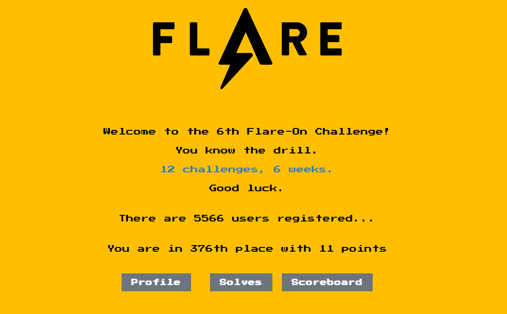

From August 16 to September 27, FireEye’s FLARE team ran the Flare-On
challenge for the 6th straight year (see announcement,
[here](https://www.fireeye.com/blog/threat-research/2019/07/announcing-the-sixth-annual-flare-on-challenge.html)).
This CTF-style challenge is comprised of 12 reverse-engineering tasks
for different architectures. Like the past years, it was a great event
with so much new things learned.  
TL;DR: I started a tad bit late, but managed to solve 11 out of those 12
challenges (after solving “vv_max”, I had 4 hours left to break the last
challenge – a malicious Windows driver – which was way too little time
😉

## 1 – Memecat Battlestation

> Welcome to the Sixth Flare-On Challenge!  
> This is a simple game. Reverse engineer it to figure out what “weapon
> codes” you need to enter to defeat each of the two enemies and the
> victory screen will reveal the flag. Enter the flag here on this site
> to score and move on to the next level.  
> \* This challenge is written in .NET. If you don’t already have a
> favorite .NET reverse engineering tool I recommend dnSpy  
> \*\* If you already solved the full version of this game at our booth
> at BlackHat or the subsequent release on twitter, congratulations,
> enter the flag from the victory screen now to bypass this level.

Loading the binary into ILspy, one will quickly spot the mentioned
“VictoryForm”. Inside its Load function a byte array is XORed with a
public string member:

[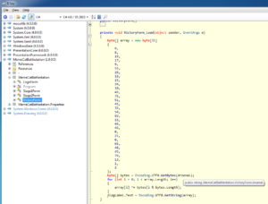](./memcat_00.png)

Since a .NET binaries’ main function is usually located inside the
“Program.cs” file, one should get an overview of the program’s general
data flow. From there, one can see that the “Arsenal” member (the XOR
key) is built from the 2 stages’ launch codes:

[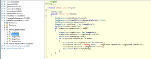](./memcat_01.png)

While the first stage’s launch is provided in plain-text:

[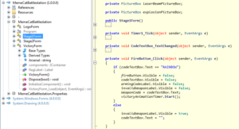](./memcat_02.png)

the second stage’s launch code is (again) XOR-encrypted with the static
key “A”:

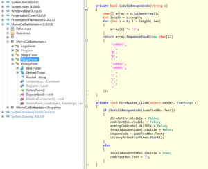

From that information, one can easily write a script to solve this
challenge:

``` brush:
#!/usr/bin/env python

def xor(text, key):
  k = key
  while len(k) < len(text):
    k += key
  m = ''
  for a,b in zip(text,k):
    m += chr(ord(a)^ord(b))
  return m

bytes1 = [9, 8, 19, 17, 9, 55, 28, 18, 15, 24, 10, 49, 75, 51, 45, 32, 54, 59, 15, 49, 46, 0, 21, 0, 65, 48, 45, 79, 13, 1, 2]
weaponCode1 = 'RAINBOW'
code2 = '\x03 &$-\x1E\x02 //./'
key2 = 'A'

weaponCode2 = xor(code2, key2)
print('Weapon Code 2: %s' % weaponCode2)

cipher = ''
for b in bytes1:
  cipher += chr(b)

flag = xor(cipher, weaponCode2 + ',' + weaponCode1)
print('Flag: %s' % flag)
```

and find the first flag:

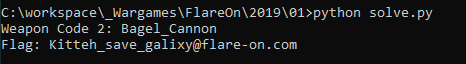

## 2 – Overlong

> The secret of this next challenge is cleverly hidden. However, with
> the right approach, finding the solution will not take an **overlong**
> amount of time.

Inspecting the binary in BinjaNinja, one can see that it loads some
static data, decodes 0x1c bytes and finally prints the decoded data in a
message box:

[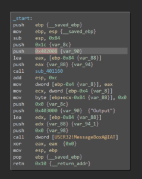](./overlong_00.png)

Checking the according data location and manually converting it to a
NULL-terminated ASCII string (move the cursor to the start of the buffer
and press “A”), one can see that the data is actually 176 bytes long:

[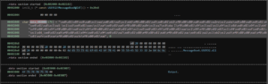](./overlong_01.png)

After loading the binary into x32dbg, a breakpoint at the function call
was set:

[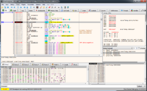](./overlong_02.png)

Once execution reaches the breakpoint, the length parameter can be
adjusted on the stack by simply double-clicking the according value:

[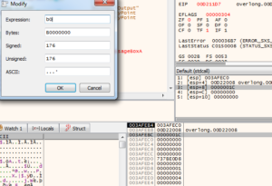](./overlong_03.png)

Additionally, the target buffer (1st parameter) can be investigated
inside the memory dump windows. After skipping over the function call
(press F8), the flag gets revealed at said memory location:

[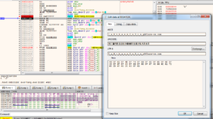](./overlong_04.png)

## 3 – Flarebear

> We at Flare have created our own Tamagotchi pet, the flarebear. He is
> very fussy. Keep him alive and happy and he will give you the flag.

The provided APK file can be viewed with jadx, though it has some issues
with decompiling certain functions. But one one clearly see the goal:
make the bear ecstatic:

[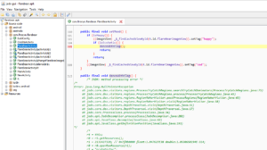](./flarebear_00.png)

In order to make the bear ecstatic, the following criteria have to be
met:

[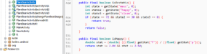](./flarebear_01.png)

The vital values are affected by the 3 actions feed, play and clean:

``` brush:
public final void feed(@NotNull View view) {
    Intrinsics.checkParameterIsNotNull(view, "view");
    saveActivity("f");
    changeMass(10);
    changeHappy(2);
    changeClean(-1);
    incrementPooCount();
    feedUi();
}

public final void play(@NotNull View view) {
    Intrinsics.checkParameterIsNotNull(view, "view");
    saveActivity("p");
    changeMass(-2);
    changeHappy(4);
    changeClean(-1);
    playUi();
}

public final void clean(@NotNull View view) {
    Intrinsics.checkParameterIsNotNull(view, "view");
    saveActivity("c");
    removePoo();
    cleanUi();
    changeMass(null);
    changeHappy(-1);
    changeClean(6);
    setMood();
}
```

Equipped with that knowledge, one can derive a set of linear equations
to find the correct amount of feed/play/clean actions:

``` brush:
72 =   10*f - 2*p           p = 5*f - 36                                = 4
30 =    2*f + 4*p -   c     c = 2*f + 4*p - 30            = 22*f - 174  = 2
 0 = (-1)*f +   p + 6*c     f = 5*f - 36 + 132*f - 1044   = 1080 / 136  = 8
```

which can then be solved by hand as follows:

``` brush:
p = 5 * f - 36                                    = 4
c = 2 * f + 4 * p - 30            = 22 * f - 174  = 2
f = 5 * f - 36 + 132 * f - 1044   = 1080 / 136    = 8
```

Performing the calculated amount of actions makes the bear dance
ecstatically with the flag:

[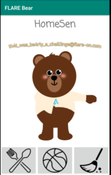](./flarebear_02.png)

## 4 – Dnschess

> Some suspicious network traffic led us to this unauthorized chess
> program running on an Ubuntu desktop. This appears to be the work of
> cyberspace computer hackers. You’ll need to make the right moves to
> solve this one. Good luck!

Provided are a packet capture and 2 ELF binaries (a GTK application and
an accompanying shared object file). Looking at the “ChessUI” (the main
application) with Ghidra shows that, besides dynamically loading the
“ChessAI.so” (the provided ELF shared object), it indeed is only
responsible for the fancy UI stuff:

[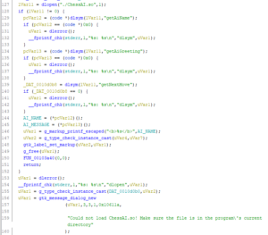](./chess_00.png)

The most interesting function inside the shared object is “getNextMove”:

[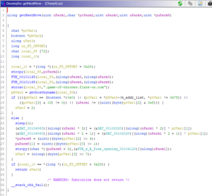](./chess_01.png)

Most of the function arguments can be easily guessed by their usage in
combination with the traffic capture:

[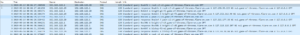](./chess_03.png)

1.  some sort of index
2.  chessman
3.  starting position
4.  target position
5.  pointer to a response message string

From the first 3 parameters, the function generates an FQDN which then
gets resolved via DNS. The resolved IP address is checked to be in the
localnet range (127.0.0.0/8), with the third octet being equal to the
first parameter and the last octet being larger than 0. The last 3
octets are then used to decrypt some buffer:

[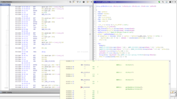](./chess_02.png)

And that’s basically all that’s needed to resemble the functionality
with a Python script for processing the provided packet capture:

``` brush:
#!/usr/bin/env python

from scapy.all import *
from scapy.layers.dns import DNS, DNSRR

data = {}
flag = [b'\x00']*30
cipher = b'\x79\x5a\xb8\xbc\xec\xd3\xdf\xdd\x99\xa5\xb6\xac\x15\x36\x85\x8d\x09\x08\x77\x52\x4d\x71\x54\x7d\xa7\xa7\x08\x16\xfd\xd7'

packets = rdpcap('capture.pcap')
for p in packets:
  if p.haslayer(DNS):
    if p.haslayer(DNSRR):
      host = p[DNSRR].rrname[:-1]
      ip = p[DNSRR].rdata
      data[host] = ip

for k in data.keys():
  parts = data[k].split('.')
  a = int(parts[0])
  b = int(parts[1])
  c = int(parts[2])
  d = int(parts[3])
  
  if a != 0x7f:
    continue
  if d & 1 != 0:
    continue
  idx = c & 0xf
  flag[idx*2] = cipher[idx*2] ^ b
  flag[idx*2 + 1] = cipher[idx*2 + 1] ^ b
  
result = ''
for i in flag:
  result += chr(i)
  
print(result + '@flare-on.com')
```

Running the above script will yield the next flag:

[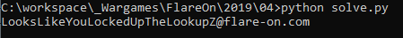](./chess_04.png)

## 5 – demo

> Someone on the Flare team tried to impress us with their demoscene
> skills. It seems blank. See if you can figure it out or maybe we will
> have to fire them. No pressure.

Provided is a highly packed Windows binary that shows a rotating logo on
a blank background:

[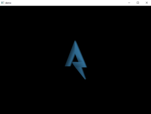](./demo_00.png)

From the challenge description and blank background, one can conclude
that a z-index is probably way off. One approach could now be to dig
into the DirectX API and try to debug the code (after the executable
unpacked itself). Another, much easier, approach would be using
NinjaRipper to export all meshes/objects from the running process:

[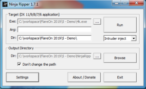](./demo_01.png)

Once NinjaRipper started the target executable, one can press the
“Capture” shortcut (default: F10) to rip all currently drawn objects to
the configured output directory:

[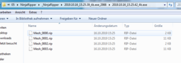](./demo_02.png)

With the help of the according plugin, the .rip files can then be loaded
into Noesis, revealing the “missing” object:

[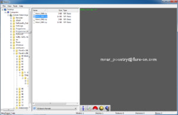](./demo_03.png)

## 6 – bmphide

> Tyler Dean hiked up Mt. Elbert (Colorado’s tallest mountain) at 2am to
> capture this picture at the perfect time. Never skip leg day. We found
> this picture and executable on a thumb drive he left at the trail
> head. Can he be trusted?

The provided .NET binary can be loaded into ILspy for inspection.
Starting from the Main() function, one can see that the binary loads 2
files, (potentially) encrypts the second file and then hides the
encrypted data inside the first image file:

[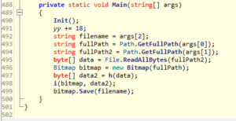](./bmphide_00.png)

The Init() method is a lot more complex than that:

[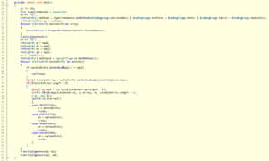](./bmphide_01.png)

At first, it loads all methods of class A, initializes some values and
performs some “stack calculations”:

[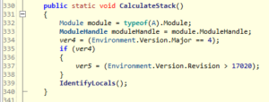](./bmphide_02.png)

Basically, it just checks the target framework, and attempts to
“identify locals”:

[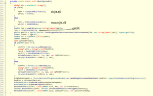](./bmphide_03.png)

Depending on the runtime environment, it either loads “clrjit.dll” or
“mscorjit.dll” and gets a reference to the “getJit()” function.
Afterwards, uses that reference, and overwrites the function’s binary
code.

The Init() function then attempts to identify 4 methods inside the
Program class by their hash value, and then “verifies their signatures”:

[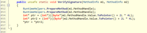](./bmphide_04.png)

This function basically swaps the 2 provided functions with each other.
Debugging the decompiled code reveals, that functions a() and b(); and
c() and d() are swapped.

Encryption of the data takes place inside function h(). The function
utilizes a 256byte S-box inside function f() and some simple arithmetic
operations. Function i() finally hides the encrypted data inside the
original image (each data byte is split into 3, 3 and 2 bit chunks and
saved in the respective least significant bits of the the red, green and
blue color channel):

[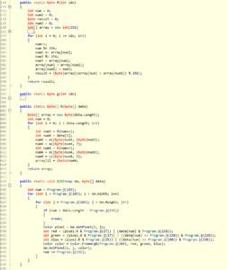](./bmphide_05.png)

Most of the other functions are pretty straight forward without any
attempts to obfuscate their functionality. The only exception is
function j() where the control was mangled into a while loop and a
switch statement:

[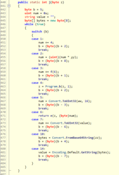](./bmphide_06.png)

Simply following the value of b, a more readable form can be restored:

``` brush:
public static int j(byte z)
{
    byte b = 5;
    uint num = 0u;
    string value = "";
    byte[] bytes = new byte[8];
    
    num = Convert.ToUInt32(ww, 16);
    num = (uint)(num * yy);
    bytes = Convert.FromBase64String(zz);
    value = Encoding.Default.GetString(bytes);
    num += Convert.ToUInt32(value);
    num += 4;
    num += f(6);
    z = Program.b(z, 1);
    
    return e(z, (byte)num);
}
```

In order to reveal the hidden data from the bitmap, each involved
function has to either be reversed, or a “lookup function” has to be
created. The full code of a thus created “bmpunhide” can be found on
[Github](https://github.com/HomeSen/CTFs/tree/master/Flare-On%206/6%20-%20bmphide).

Feeding the originally provided image into bmpunhide reveals a new
image, which then has to be processed again, finally revealing the flag:

[](./bmphide_07.png)

## 7 – wopr

> We used our own computer hacking skills to “find” this AI on a
> military supercomputer. It does strongly resemble the classic 1983
> movie WarGames. Perhaps life imitates art? If you can find the launch
> codes for us, we’ll let you pass to the next challenge. We promise not
> to start a thermonuclear war.

Inspecting the provided binary with BinaryNinja revealed that it might
be packed in some form. Thus, it was decided to run the binary inside a
VM and dump the process memory via TaskManager. Skimming over the dump
revealed the following Python code:

``` brush:
GREETINGS = ["HI", "HELLO", "'SUP", "AHOY", "ALOHA", "HOWDY", "GREETINGS", "ZDRAVSTVUYTE"]
STRATEGIES = ['U.S. FIRST STRIKE', 'USSR FIRST STRIKE', 'NATO / WARSAW PACT', 'FAR EAST STRATEGY', 'US USSR ESCALATION', 'MIDDLE EAST WAR', 'USSR CHINA ATTACK', 'INDIA PAKISTAN WAR', 'MEDITERRANEAN WAR', 'HONGKONG VARIANT', 'SEATO DECAPITATING', 'CUBAN PROVOCATION', 'ATLANTIC HEAVY', 'CUBAN PARAMILITARY', 'NICARAGUAN PREEMPTIVE', 'PACIFIC TERRITORIAL', 'BURMESE THEATERWIDE', 'TURKISH DECOY', 'ARGENTINA ESCALATION', 'ICELAND MAXIMUM', 'ARABIAN THEATERWIDE', 'U.S. SUBVERSION', 'AUSTRALIAN MANEUVER', 'SUDAN SURPRISE', 'NATO TERRITORIAL', 'ZAIRE ALLIANCE', 'ICELAND INCIDENT', 'ENGLISH ESCALATION', 'MIDDLE EAST HEAVY', 'MEXICAN TAKEOVER', 'CHAD ALERT', 'SAUDI MANEUVER', 'AFRICAN TERRITORIAL', 'ETHIOPIAN ESCALATION', 'TURKISH HEAVY', 'NATO INCURSION', 'U.S. DEFENSE', 'CAMBODIAN HEAVY', 'PACT MEDIUM', 'ARCTIC MINIMAL', 'MEXICAN DOMESTIC', 'TAIWAN THEATERWIDE', 'PACIFIC MANEUVER', 'PORTUGAL REVOLUTION', 'ALBANIAN DECOY', 'PALESTINIAN LOCAL', 'MOROCCAN MINIMAL', 'BAVARIAN DIVERSITY', 'CZECH OPTION', 'FRENCH ALLIANCE', 'ARABIAN CLANDESTINE', 'GABON REBELLION', 'NORTHERN MAXIMUM', 'DANISH PARAMILITARY', 'SEATO TAKEOVER', 'HAWAIIAN ESCALATION', 'IRANIAN MANEUVER', 'NATO CONTAINMENT', 'SWISS INCIDENT', 'CUBAN MINIMAL', 'CHAD ALERT', 'ICELAND ESCALATION', 'VIETNAMESE RETALIATION', 'SYRIAN PROVOCATION', 'LIBYAN LOCAL', 'GABON TAKEOVER', 'ROMANIAN WAR', 'MIDDLE EAST OFFENSIVE', 'DENMARK MASSIVE', 'CHILE CONFRONTATION', 'S.AFRICAN SUBVERSION', 'USSR ALERT', 'NICARAGUAN THRUST', 'GREENLAND DOMESTIC', 'ICELAND HEAVY', 'KENYA OPTION', 'PACIFIC DEFENSE', 'UGANDA MAXIMUM', 'THAI SUBVERSION', 'ROMANIAN STRIKE', 'PAKISTAN SOVEREIGNTY', 'AFGHAN MISDIRECTION', 'ETHIOPIAN LOCAL', 'ITALIAN TAKEOVER', 'VIETNAMESE INCIDENT', 'ENGLISH PREEMPTIVE', 'DENMARK ALTERNATE', 'THAI CONFRONTATION', 'TAIWAN SURPRISE', 'BRAZILIAN STRIKE', 'VENEZUELA SUDDEN', 'MALAYSIAN ALERT', 'ISREAL DISCRETIONARY', 'LIBYAN ACTION', 'PALESTINIAN TACTICAL', 'NATO ALTERNATE', 'CYPRESS MANEUVER', 'EGYPT MISDIRECTION', 'BANGLADESH THRUST', 'KENYA DEFENSE', 'BANGLADESH CONTAINMENT', 'VIETNAMESE STRIKE', 'ALBANIAN CONTAINMENT', 'GABON SURPRISE', 'IRAQ SOVEREIGNTY', 'VIETNAMESE SUDDEN', 'LEBANON INTERDICTION', 'TAIWAN DOMESTIC', 'ALGERIAN SOVEREIGNTY', 'ARABIAN STRIKE', 'ATLANTIC SUDDEN', 'MONGOLIAN THRUST', 'POLISH DECOY', 'ALASKAN DISCRETIONARY', 'CANADIAN THRUST', 'ARABIAN LIGHT', 'S.AFRICAN DOMESTIC', 'TUNISIAN INCIDENT', 'MALAYSIAN MANEUVER', 'JAMAICA DECOY', 'MALAYSIAN MINIMAL', 'RUSSIAN SOVEREIGNTY', 'CHAD OPTION', 'BANGLADESH WAR', 'BURMESE CONTAINMENT', 'ASIAN THEATERWIDE', 'BULGARIAN CLANDESTINE', 'GREENLAND INCURSION', 'EGYPT SURGICAL', 'CZECH HEAVY', 'TAIWAN CONFRONTATION', 'GREENLAND MAXIMUM', 'UGANDA OFFENSIVE', 'CASPIAN DEFENSE', 'CRIMEAN GAMBIT', 'BRITISH ANTICS', 'HUNGARIAN EXPULSION', 'VENEZUELAN COLLAPSE']

def wrong():
    trust = windll.kernel32.GetModuleHandleW(None)
    computer = string_at(trust, 1024)
    dirty, = struct.unpack_from('=I', computer, 60)
    _, _, organize, _, _, _, variety, _ =  struct.unpack_from('=IHHIIIHH', computer, dirty)
    assert variety >= 144
    participate, = struct.unpack_from('=I', computer, dirty + 40)
    for insurance in range(organize):
        name, tropical, inhabitant, reader, chalk, _, _, _, _, _ = struct.unpack_from('=8sIIIIIIHHI', computer, 40 * insurance + dirty + variety + 24)
        if inhabitant <= participate < inhabitant + tropical:
            break
    spare = bytearray(string_at(trust + inhabitant, tropical))
    
    issue, digital = struct.unpack_from('=II', computer, dirty + 0xa0)
    truth = string_at(trust + issue, digital)
    expertise = 0
    while expertise <= len(truth) - 8:
        nuance, seem = struct.unpack_from('=II', truth, expertise)
        if nuance == 0 and seem == 0:
            break
        slot = truth[expertise + 8:expertise + seem]
        for i in range(len(slot) >> 1):
            diet, = struct.unpack_from('=H', slot, 2 * i)
            fabricate = diet >> 12
            if fabricate != 3: continue
            diet = diet & 4095
            ready = nuance + diet - inhabitant
            if 0 <= ready < len(spare): 
                struct.pack_into('=I', spare, ready, struct.unpack_from('=I', spare, ready)[0] - trust)
        expertise += seem
    return hashlib.md5(spare).digest()
    
    
class Terminal(object):
        
    DELAY = 0.02
    def write(self, text):
        for line in text.splitlines(True):
            sys.stdout.write(line)
            sys.stdout.flush()
            time.sleep(self.DELAY)     
    def typewrite(self, text):
        for char in text:
            if char == '\n':
                sys.stdout.write(char)
                sys.stdout.flush()
                time.sleep(self.DELAY)
            else:
                sys.stdout.write(char.lower())
                sys.stdout.flush()
                time.sleep(self.DELAY)
                sys.stdout.write('\b' + char)
                sys.stdout.flush()
        
    def typewriteln(self, text):
        self.typewrite(text + '\n')
        
    def read(self):
        return ' '.join(''.join(_ for _ in input().upper() if _ in ' 0123456789ABCDEFGHIJKLMNOPQRSTUVWXZY?').split())

if __name__ == '__main__':        
  t = Terminal()
  xor = [212, 162, 242, 218, 101, 109, 50, 31, 125, 112, 249, 83, 55, 187, 131, 206]

  h = list(wrong())
  h = [h[i] ^ xor[i] for i in range(16)]
  print(h)

  t.write('''
        _/\/\______/\/\____/\/\/\/\____/\/\/\/\/\____/\/\/\/\/\___
       _/\/\__/\__/\/\__/\/\____/\/\__/\/\____/\/\__/\/\____/\/\_
      _/\/\/\/\/\/\/\__/\/\____/\/\__/\/\/\/\/\____/\/\/\/\/\___
     _/\/\/\__/\/\/\__/\/\____/\/\__/\/\__________/\/\__/\/\___
    _/\/\______/\/\____/\/\/\/\____/\/\__________/\/\____/\/\_
   __________________________________________________________
  ''')
  t.typewrite('GREETINGS PROFESSOR FALKEN.\n')
  while True:
      t.typewrite('\n> ')
      cmd = t.read()
      if cmd.rstrip('!?') in GREETINGS:
          t.typewriteln(random.choice(GREETINGS))
      elif cmd == 'HELP GAMES':
          t.typewriteln("'GAMES' REFERS TO MODELS, SIMULATIONS AND GAMES\nWHICH HAVE TACTICAL AND STRATEGIC APPLICATIONS.")
      elif cmd == 'LIST GAMES':
          t.typewriteln('FALKEN\'S MAZE\nTIC-TAC-TOE\nGLOBAL THERMONUCLEAR WAR')
      elif cmd in ('HELP', '?'):
          t.typewriteln('AVAILABLE COMMANDS:\nHELP\nHELP GAMES\nLIST GAMES\nPLAY <game>')
      elif cmd.startswith('HELP '):
          t.typewriteln('HELP NOT AVAILABLE')
      elif cmd == 'PLAY':
          t.typewriteln('WHICH GAME?')
      elif cmd.startswith('PLAY F') or cmd == 'PLAY 1':
          t.typewriteln('GAME IS TEMPORARILY UNAVAILABLE DUE TO MAINTENANCE')
      elif cmd.startswith('PLAY T') or cmd == 'PLAY 2':
          t.typewriteln('GAME IS TEMPORARILY UNAVAILABLE DUE TO MAINTENANCE')
      elif cmd.startswith('PLAY G') or cmd in ('PLAY ARMAGEDDON', 'PLAY 3'):
          t.typewriteln('*** GAME ROUTINE RUNNING ***')
          break
      elif cmd.startswith('PLAY '):
          t.typewriteln('THAT GAME IS NOT AVAILABLE')
      else:
          t.typewriteln('COMMAND NOT RECOGNIZED')
          
  t.write('''
  r"""""""""""""""""""7ooooo"""oooooo"""""""""""""""""""""""""""""""""""""""""""7
  |           .__Looooooo ""7oooooooo`     'ooo"   ""._,    .JooL_,    .___     |
  o  __L______oLoooooooo7o_, |oooor""       ._____,,Jo__JoooooooooooooJoooL_____J
  r7._ooooooooooooooo"JoJoo|  oor   'o`   .Jooo7oooooooooooooooooooooooooooo"oo"7
  | '`"'`   ooooooooooL,Jooo_,         _oL.ooLoooooooooooooooooooooooooo_  |r`  |
  |         ''ooooooooooooooJo         ""oooooooooor"ooooooooooooooooooo7       |
  |           7oooooooooo"             |or`oo'ooJoJo |ooooooooooooooro ./       |
  |            "oooooo7o`              JooooJ_JLJoooLJoooooooooooooo, or        |
  |             '"oo|  oo            .oooooooooooroooJo"7oooooooooo7,           |
  |   ""          ""`oorL|L,         |ooooooooooooooo"`  7or` 7ooo |,           |
  |                   '\_oL__         7ooooooooooooLr     7|   L"` |o|          |
  |                    .Jooooo|            7ooooooo"       `  'o|_oL"L          |
  |                    |oooooooooL         'oooooo|            'o_J7Lrooo_J_,   |
  |                     7oooooooo`          Jooooo|._            "`"7LJ/7r  "`, |
  |                       oooooor           7oooo|.o|             __oooooo_  _| 7
  |                      |ooooo             'ooor  "              7oooooooo|    |
  |                      Jooor               |o|                  '""  "oor    .J
  |                      oo|                                            "o|   _oo
  |                     'or _                           |                     " |
  |                      ""`                                                    |
  |                       .,'                       ___.   .______________      |
  |        ______________ooo`        ._JLooooooooooooooooooooooooooooooooooooo" |
  |  |L7ooooooooooooooooL___,.Jo_Jooooooooooooooooooooooooooooooooooooooooooor` |
  ooooooooooooooooooooooooooooooooooooooooooooooooooooooooooooooooooooooooooooooo
  AWAITING FIRST STRIKE COMMAND
  -----------------------------
                  
  PLEASE SPECIFY PRIMARY TARGET
  BY CITY AND/OR COUNTRY NAME:
  ''')
  target = input()
  t.typewriteln("\nPREPARING NUCLEAR STRIKE FOR " + target.upper())
  t.typewrite("ENTER LAUNCH CODE: ")
  launch_code = input().encode()
  # encoding map coordinates
  x = list(launch_code.ljust(16, b'\0'))
  b = 16 * [None]
  # calculate missile trajectory
  b[0] = x[2] ^ x[3] ^ x[4] ^ x[8] ^ x[11] ^ x[14]
  b[1] = x[0] ^ x[1] ^ x[8] ^ x[11] ^ x[13] ^ x[14]
  b[2] = x[0] ^ x[1] ^ x[2] ^ x[4] ^ x[5] ^ x[8] ^ x[9] ^ x[10] ^ x[13] ^ x[14] ^ x[15]
  b[3] = x[5] ^ x[6] ^ x[8] ^ x[9] ^ x[10] ^ x[12] ^ x[15]
  b[4] = x[1] ^ x[6] ^ x[7] ^ x[8] ^ x[12] ^ x[13] ^ x[14] ^ x[15]
  b[5] = x[0] ^ x[4] ^ x[7] ^ x[8] ^ x[9] ^ x[10] ^ x[12] ^ x[13] ^ x[14] ^ x[15]
  b[6] = x[1] ^ x[3] ^ x[7] ^ x[9] ^ x[10] ^ x[11] ^ x[12] ^ x[13] ^ x[15]
  b[7] = x[0] ^ x[1] ^ x[2] ^ x[3] ^ x[4] ^ x[8] ^ x[10] ^ x[11] ^ x[14]
  b[8] = x[1] ^ x[2] ^ x[3] ^ x[5] ^ x[9] ^ x[10] ^ x[11] ^ x[12]
  b[9] = x[6] ^ x[7] ^ x[8] ^ x[10] ^ x[11] ^ x[12] ^ x[15]
  b[10] = x[0] ^ x[3] ^ x[4] ^ x[7] ^ x[8] ^ x[10] ^ x[11] ^ x[12] ^ x[13] ^ x[14] ^ x[15]
  b[11] = x[0] ^ x[2] ^ x[4] ^ x[6] ^ x[13]
  b[12] = x[0] ^ x[3] ^ x[6] ^ x[7] ^ x[10] ^ x[12] ^ x[15]
  b[13] = x[2] ^ x[3] ^ x[4] ^ x[5] ^ x[6] ^ x[7] ^ x[11] ^ x[12] ^ x[13] ^ x[14]
  b[14] = x[1] ^ x[2] ^ x[3] ^ x[5] ^ x[7] ^ x[11] ^ x[13] ^ x[14] ^ x[15]
  b[15] = x[1] ^ x[3] ^ x[5] ^ x[9] ^ x[10] ^ x[11] ^ x[13] ^ x[15]
  
  print(b)

  if b == h:
      t.typewriteln("LAUNCH CODE ACCEPTED.\n\n*** RUNNING SIMULATION ***\n")
      random.shuffle(STRATEGIES)
      for i in range(0, len(STRATEGIES), 6):
          t.write('\n'.join('{:24} {:8}'.format(k, v) for k, v in ([('STRATEGY:', 'WINNER:'), ('-' * 24, '-' * 8)] + [(_, 'NONE') for _ in STRATEGIES[i:i+6]])) + '\n\n')
          time.sleep(0.5)
      t.typewriteln("*** SIMULATION COMPLETED ***\n")
      t.typewriteln('\nA STRANGE GAME.\nTHE ONLY WINNING MOVE IS\nNOT TO PLAY.\n')
      eye = [219, 232, 81, 150, 126, 54, 116, 129, 3, 61, 204, 119, 252, 122, 3, 209, 196, 15, 148, 173, 206, 246, 242, 200, 201, 167, 2, 102, 59, 122, 81, 6, 24, 23]
      flag = fire(eye, launch_code).decode()
      t.typewrite(f"CONGRATULATIONS! YOU FOUND THE FLAG:\n\n{flag}\n")
  else:
      t.typewrite("\nIDENTIFICATION NOT RECOGNIZED BY SYSTEM\n--CONNECTION TERMINATED--\n")
```

It was found that the binary is actually PyInstaller packed script.
Additionally, some poem was found inside the memory dump which seems to
contain
[Whitespace](https://en.wikipedia.org/wiki/Whitespace_(programming_language))
code. Since the above Python code was enough to find the correct launch
code, the poem’s secret wasn’t investigated any further.

From the above code, one can see that the entered launch code is checked
against a pre-calculated (and XOR’d) hash value. The hash value is
basically calculated from the process’ memory content
(windll.kernel32.GetModuleHandleW(None) returns the currently running
executable’s base address in memory). This value can be retrieved by
running the binary inside a debugger and investigating the memory map:

[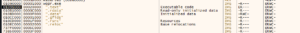](./wopr_00.png)

With the help of a Python console, the original code can be rewritten to
rather read the data from files than process memory. At the beginning,
1024 bytes are read from the start of the executable. Using x32dgb’s
dump view, this data (“computer” inside the Python code) can easily be
copied to a file:

[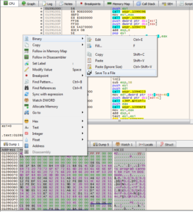](./wopr_01.png)

Copying the according parts from the original Python code, the next
offset and length can be calculated:

[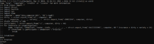](./wopr_02.png)

So, the next part (“spare”) is the .text section of the binary. Copying
the next few lines of the Python code into a code, reveals the next
offset, pointing to the .reloc section:

[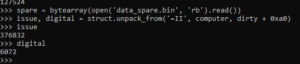](./wopr_03.png)

With all 3 parts retrieved and the value for “trust” (the image’s base
address) known, the final hash can be calculated. The launch code can
now be calculated from the rather complex linear system of equations
with the help the Z3 SMT solver:

``` brush:
from z3 import *
from ctypes import *
import struct
import hashlib
import sys
import time

def wrong():
    trust = 0x00020000
    computer = open('data_computer.bin', 'rb').read()
    dirty, = struct.unpack_from('=I', computer, 60)
    _, _, organize, _, _, _, variety, _ =  struct.unpack_from('=IHHIIIHH', computer, dirty)
    assert variety >= 144
    participate, = struct.unpack_from('=I', computer, dirty + 40)
    for insurance in range(organize):
        name, tropical, inhabitant, reader, chalk, _, _, _, _, _ = struct.unpack_from('=8sIIIIIIHHI', computer, 40 * insurance + dirty + variety + 24)
        if inhabitant <= participate < inhabitant + tropical:
            break
    spare = bytearray(open('data_spare.bin', 'rb').read())
    
    issue, digital = struct.unpack_from('=II', computer, dirty + 0xa0)
    truth = open('data_truth.bin', 'rb').read()
    expertise = 0
    while expertise <= len(truth) - 8:
        nuance, seem = struct.unpack_from('=II', truth, expertise)
        if nuance == 0 and seem == 0:
            break
        slot = truth[expertise + 8:expertise + seem]
        for i in range(len(slot) >> 1):
            diet, = struct.unpack_from('=H', slot, 2 * i)
            fabricate = diet >> 12
            if fabricate != 3: continue
            diet = diet & 4095
            ready = nuance + diet - inhabitant
            if 0 <= ready < len(spare): 
                struct.pack_into('=I', spare, ready, struct.unpack_from('=I', spare, ready)[0] - trust)
        expertise += seem
    return hashlib.md5(spare).digest()

xor = [212, 162, 242, 218, 101, 109, 50, 31, 125, 112, 249, 83, 55, 187, 131, 206]
h = list(wrong())
h = [h[i] ^ xor[i] for i in range(16)]

x0 = BitVec('x0', 32)
x1 = BitVec('x1', 32)
x2 = BitVec('x2', 32)
x3 = BitVec('x3', 32)
x4 = BitVec('x4', 32)
x5 = BitVec('x5', 32)
x6 = BitVec('x6', 32)
x7 = BitVec('x7', 32)
x8 = BitVec('x8', 32)
x9 = BitVec('x9', 32)
x10 = BitVec('x10', 32)
x11 = BitVec('x11', 32)
x12 = BitVec('x12', 32)
x13 = BitVec('x13', 32)
x14 = BitVec('x14', 32)
x15 = BitVec('x15', 32)

s = Solver()
s.add(h[0] == x2 ^ x3 ^ x4 ^ x8 ^ x11 ^ x14)
s.add(h[1] == x0 ^ x1 ^ x8 ^ x11 ^ x13 ^ x14)
s.add(h[2] == x0 ^ x1 ^ x2 ^ x4 ^ x5 ^ x8 ^ x9 ^ x10 ^ x13 ^ x14 ^ x15)
s.add(h[3] == x5 ^ x6 ^ x8 ^ x9 ^ x10 ^ x12 ^ x15)
s.add(h[4] == x1 ^ x6 ^ x7 ^ x8 ^ x12 ^ x13 ^ x14 ^ x15)
s.add(h[5] == x0 ^ x4 ^ x7 ^ x8 ^ x9 ^ x10 ^ x12 ^ x13 ^ x14 ^ x15)
s.add(h[6] == x1 ^ x3 ^ x7 ^ x9 ^ x10 ^ x11 ^ x12 ^ x13 ^ x15)
s.add(h[7] == x0 ^ x1 ^ x2 ^ x3 ^ x4 ^ x8 ^ x10 ^ x11 ^ x14)
s.add(h[8] == x1 ^ x2 ^ x3 ^ x5 ^ x9 ^ x10 ^ x11 ^ x12)
s.add(h[9] == x6 ^ x7 ^ x8 ^ x10 ^ x11 ^ x12 ^ x15)
s.add(h[10] == x0 ^ x3 ^ x4 ^ x7 ^ x8 ^ x10 ^ x11 ^ x12 ^ x13 ^ x14 ^ x15)
s.add(h[11] == x0 ^ x2 ^ x4 ^ x6 ^ x13)
s.add(h[12] == x0 ^ x3 ^ x6 ^ x7 ^ x10 ^ x12 ^ x15)
s.add(h[13] == x2 ^ x3 ^ x4 ^ x5 ^ x6 ^ x7 ^ x11 ^ x12 ^ x13 ^ x14)
s.add(h[14] == x1 ^ x2 ^ x3 ^ x5 ^ x7 ^ x11 ^ x13 ^ x14 ^ x15)
s.add(h[15] == x1 ^ x3 ^ x5 ^ x9 ^ x10 ^ x11 ^ x13 ^ x15)

if s.check() == sat:
  m = s.model()
  code = []
  for i in range(16):
    code.append(eval('m[x%d].as_long()' % i))
  print(code)
  print(bytes(code))
else:
  print('unsat')
```

Running the above Python script reveals the launch code:

[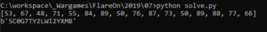](./wopr_04.png)

Entering the launch code finally reveals the next flag:

[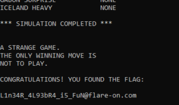](./wopr_05.png)

## 8 – snake

> The Flare team is attempting to pivot to full-time twitch streaming
> video games instead of reverse engineering computer software all day.
> We wrote our own classic NES game to stream content that nobody else
> has seen and watch those subscribers flow in. It turned out to be too
> hard for us to beat so we gave up. See if you can beat it and capture
> the internet points that we failed to collect.

The provided NES ROM can be loaded into fceux, a NES emulator featuring
all kinds of debugging tools:

[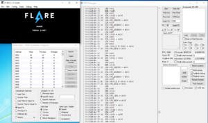](./snake_00.png)

Inside the “RAM Search” tool, the memory bank values can be viewed.
Watching the various variables change during the game, the most
important memory locations can derived:

- 0007 holds the snake head’s x value
- 0008 holds the snake head’s y value
- 000a holds the snake’s new target length (e.g. after eating an apple)
- 000b holds the snake’s current length
- 0025 holds the number of apples collected
- 0027 holds the current level

Tracing through the debugger’s assembly, one can see that \$apples is
assigned at address 0xc82e and then checked against 51. If the test
succeeds, the \$level is incremented by 1 and then checked against 4:

[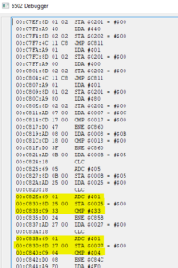](./snake_01.png)

At the beginning of the game, both values are 0. Thus, starting the game
and immediately pausing execution (using the debugger), the values can
be set to 50 and 3, respectively, from inside the hex editor:

[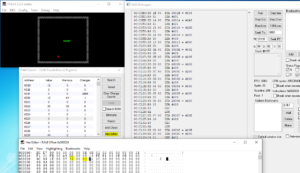](./snake_02.png)

Resuming the game via the debugger and heading to the next apple (in
normal speed) will then reveal the victory screen with the flag:

[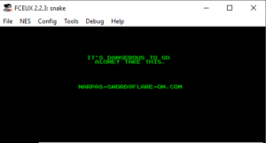](./snake_03.png)

## 9 – reloadered

> This is a simple challenge, enter the password, receive the key. I
> hear that it caused problems when trying to analyze it with ghidra.

Loading the provided binary into Ghidra resulted in the promised error
message. Thus, the binary was rather loaded into Cutter (a GUI frontend
for radare2) which features 2 decompilers: ret2dec and the Ghidra
engine. Looking for interesting strings, one can find the message “Here
is your prize:” which is referenced from only one function:

[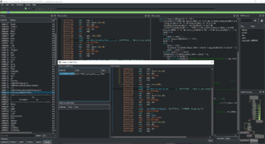](./reloadered_00.png)

From the “Graph Overview”, one can see that several checks on the
provided key are performed:

[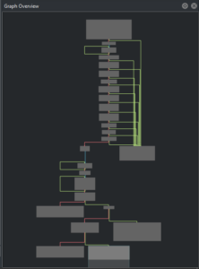](./reloadered_01.png)

Inside the (Ghidra) Decompiler view, those checks can be easily spotted:

[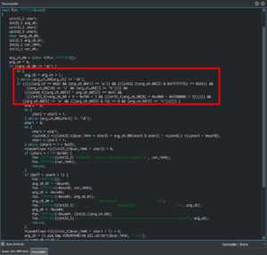](./reloadered_02.png)

- The length should be 11 bytes (including the NULL-terminator)
- key\[1\] should be ‘o’
- key\[2\] should be ‘T’
- key\[10\] should be ‘G’
- key\[7\] should be ‘R’
- key\[4\] XOR key\[3\] should equal 0x41 (‘A’) -\> so, one of the 2
  needs to be a number and the other a lower-case letter
- key\[0\] \* 3 – 0xf6 \< 2 -\> so, probably an ‘R’
- key\[8\] \* 0xc800 – 0x520800 \< 3 -\> so, probably an ‘i’
- key\[6\] = ‘e’
- key\[5\] AND 0x1 = 0
- key\[9\] = ‘n’

This yields the following partial key: RoT\_\_\_eRinG. Staring at it and
the potential characters, this leads to the key “RoT3rHeRinG” which is
German for “red herring”, and it indeed was:

[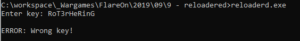](./reloadered_03b.png)

Running the binary inside a debugger (to see what went wrong), yields
the following output:

[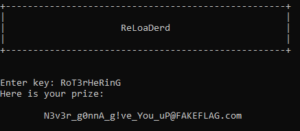](./reloadered_03.png)

So, looks like there are some anti-reversing and anti-debug measures in
place. Using the ScyllaHide plugin for x64dgb, the anti-debug measures
can be circumvented, and the dynamically created checks against the key
can be investigated by setting a breakpoint after the fgets() call
inside the “Enter key” function:

[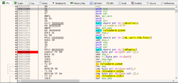](./reloadered_04.png)

Unfortunately, this breakpoint never gets hit, once the debugger is
hidden from the executable. By setting a hardware breakpoint for when
the message is loaded (a read access to the address occurs), the
appropriate function should be found:

[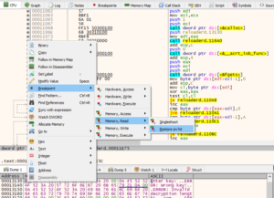](./reloadered_05.png)

It turns out that this memory address is accessed quite often from
different functions. But eventually, the desired location is found after
some F9 presses. Setting a breakpoint after that function and continuing
execution, shows the expected prompt:

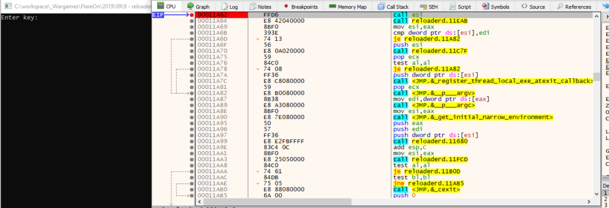

Single stepping through the calls from there reveals the new “Enter key”
function, followed by the same length checks:

[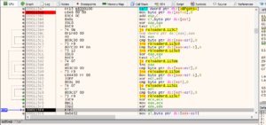](./reloadered_07.png)

This time, there is no key validation, though, but it starts right away
with decrypting a certain buffer:

[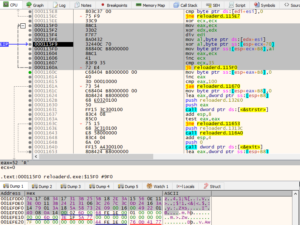](./reloadered_08.png)

Since the flag always ends with “@flare-on.com”, the key can be derived
from the ciphertext, allowing to completely decrypt the flag:

[](./reloadered_09.png)

## 10 – Mugatu

> Hello,  
> I’m working an incident response case for Derek Zoolander. He clicked
> a link and was infected with MugatuWare! As a result, his new headshot
> compilation GIF was encrypted.  
> To secure an upcoming runway show, Derek needs this GIF decrypted;
> however, he refuses to pay the ransom.  
> We received an additional encrypted GIF from an anonymous informant.
> The informant told us the GIF should help in our decryption efforts,
> but we were unable to figure it out.  
> We’re reaching out to you, our best malware analyst, in hopes that you
> can reverse engineer this malware and decrypt Derek’s GIF.  
> I’ve included a directory full of files containing:
>
> MugatuWare malware  
> Ransom note (GIFtToDerek.txt)  
> Encrypted headshot GIF (best.gif.Mugatu)  
> Encrypted informant GIF (the_key_to_success_0000.gif.Mugatu)
>
> Thanks,  
> Roy

Analyzing the provided malware with BinaryNinja quickly shows that the
import table seems to be mangled since rather uncommon external
functions are called:

[](./mugatuware_00.png)

Running the malware inside x64dbg (with ScyllaHide in VMProtect mode)
shows the correct imports, though:

[](./mugatuware_01.png)

This is a common technique used by malware authors to hinder static
analysis. So, in order to fully understand the malware’s inner workings,
a dynamic analysis approach had been chosen, and the imports have been
annotated accordingly in BinaryNinja, whenever they were encountered.

In sub_4010c3, the malware fixes the ImportTable. It then proceeds with
creating a unique ID for the system in sub_402093 which consists of
hostname, internal IP address, Windows Version, username, path to the
Windows directory and a current timestamp. These values are concatenated
and separated by the pipe symbol (e.g.
“Win7-Pentest\|192.168.150.128\|6-1-7601\|user\|C:\Windows\|09/16/2019-20:23:43”).
In sub_40198f, this ID is XORd with a key that gets retrieved via HTTP
from a Twitter timeline to RSS proxy service. Afterwards, the encrypted
ID gets base64 encoded and is sent via HTTP POST to
“mugatu.flare-on.com”:

[](./mugatuware_02.png)

The HTTP response is retrieved in sub_401894:

[](./mugatuware_03.png)

The response body is checked to be at least 59 bytes long and the base64
decoded. Afterwards, the first 24 bytes of the decoded data are XORd
with the key 0x4d and checked if they are equal to the string “orange
mocha frappuccino”:

[](./mugatuware_04.png)

If the received data passes all these checks, an RPC thread for
sub_4017b7 is started that will later send the key to a mailslot (where
it can be retrieved from by the file encryption function):

[](./mugatuware_05.png)

While the new thread is running in the background, the binary loads the
2 embedded images and combines them using a SRCINVERT raster operation
(basically, an XOR of the color values). A new window with that Image is
then displayed:

[](./mugatuware_06.png)

The random pixels at the lower part of the image suggest that there is
some data hidden. And indeed, during that process a DLL file is created
and loaded into the process memory. The DLL also has its ImportTable
mangled:

[](./mugatuware_07.png)

Once the according memory region has been marked as read-, write- and
executable, the DllMain function is called:

[](./mugatuware_08.png)

From there, the DLL’s only export “BlueSteel” is called. In sub_100015a6
a mailstore is created and the encryption key (that gets sent by the RPC
thread mentioned above) is read from that mailslot (for some reason,
BinaryNinja split the function into 2 functions):

[](./mugatuware_09.png)

In sub_10001229 the malware enumerates all logical, fixed drives and
tries to find a folder named “really, really, really, ridiculously good
looking gifs”. Once this folder is found, the ransom note (which also
was provided along with the challenge’s files) is placed inside that
folder:

[](./mugatuware_10.png)

Afterwards, in sub_100012b0, the folder is checked for GIF images. Once
a GIF file is found it is being loaded in sub_10001000:

[](./mugatuware_11.png)

The file content is split into 8 byte blocks and block-wise encrypted
with a function that gets dynamically calculated:

[](./mugatuware_12.png)

The algorithm looks fairly simple and the used constant suggests that
it’s an algorithm of the TEA family:

[](./mugatuware_13.png)

In fact, it is the [XTEA](https://en.wikipedia.org/wiki/XTEA) algorithm
with one tiny flaw:

[](./mugatuware_14.png)

While XTEA uses a key of 4 DWORDS, the malware authors “accidentally”
only use 1 byte of each DWORD. So, instead of a 128bit it effectively
uses a 32bit key which is prone to brute-force attacks. Using the
following C code, the correct key was found within a few minutes on an
average laptop:

``` brush:
#include <stdio.h>
#include <stdlib.h>
#include <memory.h>
#include <stdint.h>

void decryptData(unsigned int rounds, uint32_t v[2], uint32_t const k[4])
{
    uint32_t v0, v1;
    uint32_t sum;
    const uint32_t delta = 0x9E3779B9;

    v0 = v[0];
    v1 = v[1];
    sum = delta * rounds;
    do {
        v1 -= ((((v0 << 4) ^ (v0 >> 5)) + v0) ^ (k[(sum >> 0xb) & 3] + sum));
        sum -= delta;
        v0 -= (((v1 << 4) ^ (v1 >> 5)) + v1) ^ (k[sum & 3] + sum);

        rounds--;
    } while (rounds != 0);
    v[0] = v0;
    v[1] = v1;

    return;
}

void long_to_string(uint32_t v[2], unsigned char buffer[8])
{
    buffer[0] = (v[0] >> 0) & 0xff;
    buffer[1] = (v[0] >> 8) & 0xff;
    buffer[2] = (v[0] >> 16) & 0xff;
    buffer[3] = (v[0] >> 24) & 0xff;
    buffer[4] = (v[1] >> 0) & 0xff;
    buffer[5] = (v[1] >> 8) & 0xff;
    buffer[6] = (v[1] >> 16) & 0xff;
    buffer[7] = (v[1] >> 24) & 0xff;
}

int findKey(unsigned char *buffer, uint32_t k[4])
{
    unsigned char result[8];
    char *target = "GIF8";
    int found = 0;
    uint32_t v[2];

    while (found == 0)
    {
        for (k[0]=0x31; k[0] < 256; k[0]++)
        {
            for (k[1]=0x73; k[1] < 256; k[1]++)
            {
                for (k[2]=0x35; k[2] < 256; k[2]++)
                {
                    for (k[3]=0xb1; k[3] < 256; k[3]++)
                    {
                        v[0] = (buffer[3] << 24) | (buffer[2] << 16) | (buffer[1] << 8) | buffer[0];
                        v[1] = (buffer[7] << 24) | (buffer[6] << 16) | (buffer[5] << 8) | buffer[4];

                        decryptData(32, v, k);
                        long_to_string(v, result);
                        found = 1;
                        for (int i = 0; i < 4; i++)
                        {
                            if (result[i] != target[i])
                            {
                                found = 0;
                                break;
                            }
                        }
                        if (found == 1)
                            break;
                    }
                    if (found == 1)
                        break;
                }
                if (found == 1)
                    break;
            }
            if (found == 1)
                break;
        }
    }

    return found;
}

int main(int argc, char *argv[])
{
    if (argc != 3)
    {
        printf("Usage: %s input_file output_file\n", argv[0]);
        return 1;
    }

    unsigned char buffer[8];
    uint32_t v[2];
    uint32_t key[4];

    FILE *hInputFile, *hOutputFile;
    fopen_s(&hInputFile, argv[1], "rb");
    
    fread(buffer, sizeof(buffer), 1, hInputFile);
    if (findKey(buffer, key) == 0)
    {
        printf("Failed to find key!\n");
        fclose(hInputFile);
        return 2;
    }

    printf("Found key: ");
    for (int i = 0; i < 4; i++)
        printf("%08x", key[i]);
    printf("\n");
    fseek(hInputFile, 0, 0);
    
    fopen_s(&hOutputFile, argv[2], "wb");
    do
    {
        memset(buffer, 0, sizeof(buffer));
        fread(buffer, sizeof(buffer), 1, hInputFile);
        v[0] = (buffer[3] << 24) | (buffer[2] << 16) | (buffer[1] << 8) | buffer[0];
        v[1] = (buffer[7] << 24) | (buffer[6] << 16) | (buffer[5] << 8) | buffer[4];
        decryptData(32, v, key);
        long_to_string(v, buffer);
        fwrite(buffer, sizeof(buffer), 1, hOutputFile);
    } while (!feof(hInputFile));

    fclose(hInputFile);
    fclose(hOutputFile);
    
    return 0;
}
```

(Since the blog engine decided to mess with the code, the full
VisualStudio solution can be downloaded from
[Github](https://github.com/HomeSen/CTFs/tree/master/Flare-On%206/10%20-%20Mugatu/DecryptGIF))

[](./mugatuware_15.png)

And the file could be successfully decrypted:

[](./mugatuware_16.png)

## 11 – vv_max

> Hey, at least its not subleq.

Loading the binary into BinaryNinja quickly reveals that it expects
certain CPU (checked in sub_140001000) features to be present (the AVX2
instruction set). If not, it bails with an according message. It also
checks whether 2 command line arguments have been supplied:

[](./vv_max_00.png)

It then checks whether the first argument is between 4 and 32
characters, and the second exactly 32 characters long:

[](./vv_max_01.png)

Next, a buffer is being prepared with some kind of lookup&jump table and
a lot “scratch space”:

[](./vv_max_02.png)

The binary then performs some calculations on the supplied command line
arguments and the prepared buffer. Contrary to the x86 calling
convention, the [x64 calling
convention](https://docs.microsoft.com/en-us/cpp/build/x64-calling-convention?view=vs-2019#parameter-passing)
(on Windows) dictates that function parameters aren’t provided via the
stack, but the first 4 arguments are passed through the registers RCX,
RDX, R8, R9 and all further via stack. After a huge amount of
calculations, the result is checked and the flag gets printed to the
screen:

[](./vv_max_03.png)

Inside sub_140001830, the binary iterates over the lookup table and
jumps to the according dynamically resolved function:

[](./vv_max_04.png)

Once the calculations are done, the result is compared against the value
0x00000000000000001ea1f3b229c845e81a861c08a82aa70a615ed201acb27070 using
several AVX2-specific masking functions:

[](./vv_max_05.png)

The first command line argument is then checked against the string
“FLARE2019”:

[](./vv_max_06.png)

Finally, the second command line argument is XORd with a certain 256bit
value from inside the above prepared lookup table and the flag gets
printed to the screen:

[](./vv_max_07.png)

Since the according dynamically resolved functions can’t be easily
derived with static analysis, the binary was loaded into x64dbg with a
breakpoint set at the location the function gets called:

[](./vv_max_08.png)

After several iterations, it became apparent that a lot “unnecessary
function calls” are performed, where no values inside the buffer (the
above-mentioned scratch space) are affected. Thus, only function calls
where command line arguments are processed (or a buffer containing
results of a previous processing) with their effective arguments,
operation and result offset are noted, and the buffer’s content was
dumped to disk (for further “offline” analysis):

[](./vv_max_09.png)

In the end, the program’s functionality could be reduced to the
following function calls:

``` brush:
sub_140002010: store argv[1] at buffer+0x800
sub_140002010: store argv[2] at buffer+0x820
sub_140002860: store "FLARFLAR..." at buffer+0xa80
sub_140002860: store "E201E201..." at buffer+0xaa0
sub_140002860: store "9\x00\x00\00..." at buffer+0xac0
sub_140002860: store "\x00\x00..." at buffer+0xae0
... (repeated 4 more times)
sub_140002980: store vpsrld(argv[2], 4) at buffer+0x8e0
sub_140001dd0: store vpand(buffer+0x8e0, 0x2f2f...) at buffer+0x8e0
sub_140001ef0: store vpcmpeqb(argv[2], buffer+0x8c0) at buffer+0x900
sub_140001cb0: store vpaddb(buffer+0x8e0, buffer+0x900) at buffer+0x8e0
sub_140002a90: store vpshufb(buffer+0x8a0, buffer+0x8e0) at buffer+0x8e0
sub_140001cb0: store vpaddb(argv[2], buffer+0x8e0) at buffer+0x840
sub_140002300: store vpmaddubsw(buffer+0x840, buffer+0x940) at buffer+0x8e0
sub_1400021e0: store vpmaddwd(buffer+0x8e0, buffer+0x960) at buffer+0x840
sub_140002a90: store vpshufb(buffer+0x840, buffer+0x980) at buffer+0x840
sub_140002860: store vpermd(buffer+0x840, buffer+0x9a0) at buffer+0x840
sub_140001610: compare buffer[0x840] with buffer[0xa80]
               compare argv[1] with "FLARE2019"
               vpxor(argv[2], 0x2176620c3a5c0f290b583618734f07102e332623780e59150c05172d4b1b1e22)
               append "@flare-on.com" to result and print flag
```

Reversing the above list of operations and adding the according values,
one should be able to retrieve the original input. Unfortunately, not
all commands are “loss-less” and thus can’t be completely reversed (at
least, not right away). Thus, the “\_” (underscore) denotes “missing”
values inside the hex values:

``` brush:
0x00000000000000001ea1f3b229c845e81a861c08a82aa70a615ed201acb27070 = vpermd(LOC_40, 0xffffffffffffffff000000060000000500000004000000020000000100000000)
LOC_40 = 0x0000000000000007A87CEC853908BD01A861C082A0AA9C28C2BDA402acb27070

0x0000000000000007a87cec853908bd01a861c082a0aa9c28c2bda402acb27070 = vpshufb(LOC_40, 0xffffffff0c0d0e08090a040506000102ffffffff0c0d0e08090a040506000102)
LOC_40 = 0x__000000__7ca807__3985ec__01bd08__9caaa0__bdc228__ac02a4__7070b2

0x__000000__7ca807__3985ec__01bd08__9caaa0__bdc228__ac02a4__7070b2 = vpmaddwd(LOC_E0, 0x0001100000011000000110000001100000011000000110000001100000011000

LOC_E0 = vpmaddubsw(LOC_40, 0x0140014001400140014001400140014001400140014001400140014001400140)
LOC_40 = vpaddb(ARG_2, LOC_E0)
LOC_E0 = vpshufb(0x0000000000000000b9b9bfbf041310000000000000000000b9b9bfbf04131000, LOC_E0)
LOC_E0 = vpaddb(LOC_E0, ???)  // ??? is the result from a byte-wise comparison
LOC_E0 = vpand(LOC_E0, 0x2f2f2f2f2f2f2f2f2f2f2f2f2f2f2f2f2f2f2f2f2f2f2f2f2f2f2f2f2f2f2f2f)
LOC_E0 = vpsrld(ARG_2, 4)
```

Starting with line \#7 (the vmaddwd), it became impractical to try and
revert the functions (by hand) with so many gaps. Thus, it was attempted
to first find an inverse function for “vpshufb”. Instead of finding an
inverse, a paper called “[Faster Base64 Encoding and Decoding using AVX2
Instructions](https://arxiv.org/pdf/1704.00605.pdf)” was found. In that
paper on page 16, some of the AVX2 instructions have been found
organized in a very similar order. Making an educated guess, the “target
hash” was converted to a string (reversing the byte order), base64
encoded and fed into the vv_max binary, finally revealing the flag (4h
before Flare-On 6 was closing):

[](./vv_max_10.png)

## 12 – help

> You’re my only hope FLARE-On player! One of our developers was hacked
> and we’re not sure what they took. We managed to set up a packet
> capture on the network once we found out but they were definitely
> already on the system. I think whatever they installed must be buggy –
> it looks like they crashed our developer box. We saved off the dump
> file but I can’t make heads or tails of it – PLEASE HELP!!!!!!

A write-up will follow in a separate blog post, once the time for
solving that challenge was found. So, stay tuned 😉
